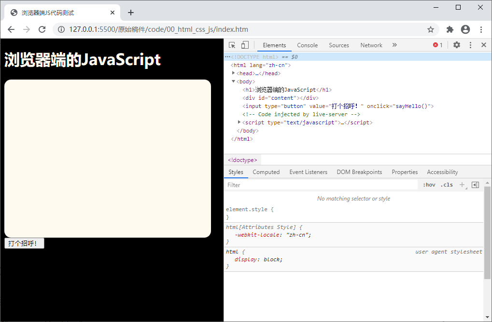
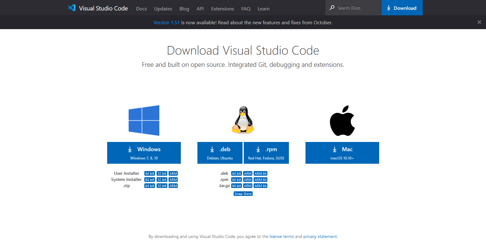
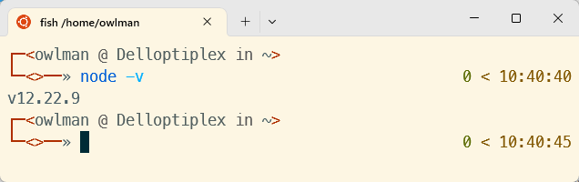

# 项目1 将企业网站重构为Web服务

将企业现有的静态网站重构并部署为可编程的互联网服务，在Web应用开发领域中属于最为基础的服务构建类项目。此类项目的开发目的是：让企业能够摆脱对Apache、Nginx等传统服务器软件的依赖，转而直接利用Node.js、Python等运行时环境的编程模块来部署他们的软件产品。这样做不仅能在软件开发的过程中赋予企业更大的灵活性和扩展性，在定制和优化服务方面提供了更多可能性，同时也能大幅简化软件部署和维护的流程，降低企业在运维方面的成本。另外，这种开发与部署软件的方式也可以使企业更高效地响应市场变化和业务需求，快速迭代产品功能，提升用户体验。同时，编程模块的引入也为企业带来了更高的性能和更好的安全性，确保他们所提供Web服务在高并发场景下能够稳定运行，保护用户数据的安全。

综上所述，将企业网站重构为Web服务是一项既符合技术发展趋势又具备实际意义的项目，它将为企业带来长远的发展优势和竞争优势。掌握此类项目的开发能力被认为是软件工程师在互联网时代所必须拥有的基础技能。

## 【学习目标】

本章将会致力于演示如何将企业的现有网站部署为可编程的互联网服务，以便该企业日后可以逐步地将该网站升级为一个可为用户提供线上服务的Web应用。通过本章项目的实践，读者将会初步了解构建一个企业级Web应用所需执行的基本步骤，以及执行这些步骤所需使用的工具与技术。总而言之，在阅读完本章之后，我们希望读者能够：

- 了解Web应用的开发所使用的浏览器-服务器架构；
- 了解Web应用中前后端的概念以及它们各自的职责；
- 了解Node.js运行平台及其在服务器上的安装方法；
- 掌握如何基于Node.js运行平台来构建Web服务；

## 【学习场景描述】

现在你是一位刚刚入职到“凌雪冰熊”这家连锁饮料店的软件工程师。该连锁店的领导层正在考虑将线下实体店中的部分业务扩展到线上，因此要求你先将其现有网站重构为一个基于Node.js运行平台的Web服务，以便为日后要逐步提供的用户注册、用户登录、用户信息编辑、线上点餐、餐后评价、投票评选等线上服务奠定基础。

## 【任务书】

- **项目名**：将凌雪冰熊网站部署为Web服务。
- **委托方**：凌雪冰熊股份有限公司互联网部门
- **项目资料**：
  - 网站的官方域名：`snowbear.com`；
  - 网站服务器设备：一台安装了Ubuntu 22.04系统的云服务器；
  - 网站的现有代码：保存在本教材附带资料包的`Exmples/oldcode`目录下，目前为基于HTML+CSS技术实现的静态网站；
- **项目要求**：将凌雪冰熊官方网站重构为一个可编程的Web服务，该服务应符合以下要求。
  - 该服务应被部署在项目组提供的云服务器上，并且基于Node.js运行时环境来发布；
  - 该服务应能被任意一台可上网的。安装了网页浏览器的计算机设备通过`snowbear.com`这个域名访问到；
- 时间要求：在5个工作日内完成；

## 【任务拆解】

整个项目的开发可以划分为以下三个小任务：

- 将项目组提供的现有网站源码升级为Web应用的开发项目；
- 使用Node.js运行时环境提供的HTTP模块来构建Web服务；
- 在客户端设备的网页浏览器中确认该Web服务可被正常访问；

## 【工作准备】

在正式开始本章项目的工作之前，读者需要先完成一些相关的准备工作。首先在知识准备方面，读者需要了解开发Web应用所使用的浏览器-服务器架构，分清楚应用的前端与后端以及它们各自所承担的分工，然后再根据这些分工所要执行的任务来选择要使用的技术，并根据这些技术配置好开发项目所需的开发工具与运行环境。当然了，如果读者自认为已经完成了这部分的工作准备，也可以选择跳过本节内容，直接进入本章项目的【工作实施与交付】环节。

### 知识点1：浏览器-服务器架构

正如之前所说，本章项目是基于浏览器-服务器（即Browser/Server，简称B/S）架构来开发的。在这种架构之下，应用软件的开发者们可以将应用中需要保障数据安全或者进行高速运算的那一部分部署在服务器上，以便享用服务器的高性能配置以及能就近维护的便利。然后根据客户使用的网页浏览器来设计基于Web技术的用户界面（即Web UI），让它来执行应用中需要与用户交互的那一部分任务。这样做既降低了企业在应用软件部署与维护上所需要支付的成本，也让应用软件可以在无需购买特定客户端软硬件环境的情况下被使用，浙江有助于提高用户的使用意愿。虽然，在连眼镜、手表这类终端设备上都搭载了多核处理器的今天，各类型计算设备的性能事实上已经日渐趋同，用户所持终端与服务器之间的界线有时候也并非是绝对的，但从项目开发与维护的角度来说，做某种程度上的任务分工还是非常有必要的。以笔者个人的经验，B/S架构之下的任务分工通常是这样的：

- Web UI在B/S架构下所承担的工作主要是与客户进行交互，其角色类似于银行的前台接待员，所以在术语上往往被称之为该应用软件的“前端”。在通常情况下，前端的任务是负责渲染应用软件的用户操作界面、处理用户的操作、向服务器发送请求数据并接收来自服务器的响应数据、维持应用软件的运行状态，以求提供良好的用户体验。总而言之，这部分的开发与维护还将在很大程度上依赖于用户所持设备的软硬件环境。

- 服务器部分在B/S架构下所承担的工作主要是数据的处理和维护，其角色类似银行金库的管理人员，所以在术语上往往被称之为应用软件的“后端”。在通常情况下，后端的任务是为用户提供只有大型计算机才具备的运算能力以及安全可靠的数据库服务，它会负责存储并处理来自应用软件客户端的请求数据，然后把响应数据返回给客户端，一般用于处理较为复杂的业务逻辑，例如执行与天体物理相关的计算任务、存储海量数据等。这部分的开发和维护通常可以不依赖于用户所持设备的软硬件环境。

当然，所有的事情都是一体两面的，B/S架构作为建构与部署应用软件的一种解决方案，在除了提供上述分工带来的便利之外，同时也存在着一些可能的隐患。

- 首先，由于应用软件的后端与前端之间通常是一对多的关系，这意味着后端可能会需要同时处理成千上万个前端请求，这对服务器的负载能力提出了较高的要求，因此维持后端在服务器上运行的稳定性将会成为项目维护阶段的一大难题。

- 其次，采用分布式架构的应用软件在运营过程中也会严重依赖于用户所在的网络环境，一旦网络中的某个节点出了问题，例如遇到防火墙屏蔽、域名劫持等不可控的因素，整个程序就会立即陷入无法运行的尴尬境地。所以，开发者在使用该架构来构建应用软件时必须要想好应对这些劣势的预先安排，例如制定服务器的负载策略、设置备用服务器或备用域名等。

### 知识点2：配置项目运行环境

为了避免要求读者再多掌握一门编程语言，笔者打算在本书的所有项目中统一基于JavaScript语言的运行环境与相关的前后端开发框架来构建应用软件。因此，本着“工欲善其事必先利其器”的思想，在进入具体的项目实践之前，读者需要先将项目的运行环境搭建起来。众所周知，Web项目的运行环境主要分为前端的网页浏览器和后端的Node.js运行平台两种，下面，本章就来具体介绍一下如何搭建这两种项目运行环境。

#### 网页浏览器

让我们先从用于前端用户界面的网页浏览器开始。目前，大部分开发者都会将Google Chrome或Mozilla Firefox设为自己默认的网页浏览器，因为它们不仅对HTML5、CSS3以及ECMAScript6等最新的Web技术标准提供了最大限度的支持，其本身也都还自带了功能非常齐全的JavaScript执行/调试环境。其中Google Chrome是目前最为主流的网页浏览器，我们只需到它的官方网站上去下载并安装它，然后其主菜单中依次单击「更多工具」→「开发者工具」，就可以看到如图1-1中所示的JavaScript执行/调试环境了：



**图1-1**：Google Chrome的JavaScript执行/调试环境

Mozilla Firefox则是另一款具有庞大用户群的网页浏览器，由于它采用了不同于Google Chrome的浏览器引擎，所以在前端领域中也具有一定的代表性。读者可根据自身所在的操作系统到Mozilla Firefox的官方网站上去下载并安装它。安装完成之后，我们可以在任何网页下按 「F12」 键或在菜单栏中依次单击「工具」→「Web开发者」→「查看器」，就可以看到如图1-2中所示的JavaScript执行/调试环境了：


**图1-2**：Mozilla Firefox的JavaScript执行/调试环境

当然，如果读者打算在Windows 10或macOS系统中使用它们自带的网页浏览器来充当JavaScript的执行/调试环境，也是可以找到类似工具的。例如，微软最近用于取代Internet Explorer的Microsoft Edge，这款网页浏览器是基于Google Chromium开源项目来开发的，其使用方式与Google Chrome浏览器大同小异。

#### Node.js运行平台

接下来是用于在后端运行HTTP服务的Node.js运行环境。该运行环境主要有两种安装方式：在Windows和macOS这类以图形化操作为主的系统中，人们通常会选择先从Node.js的官方网站上下载到`.msi`或`.dmg`格式的二进制安装包，然后使用该安装包提供的图形化向导来进行安装。而在Linux和FreeBSD这一类以命令行操作为主的系统中，我们则往往会使用APT和YUM这一类基于命令行界面的包管理器来安装。由于本章项目的后端设备是一台安装了Ubuntu 22.04系统的云服务器，它主要是基于命令行界面来进行操作的，所以，本章在这里就以命令行操作的方式来读者演示Node.js的安装。

在Ubuntu这样的类UNIX操作系统中，人们安装软件往往都会选择使用APT这一类基于命令行界面的包管理器，他的使用方式非常地简单，读者只需在Bash Shell这类命令行终端中依次执行以下命令即可完成Node.js的安装：

```bash
 sudo apt update
 sudo apt install nodejs
```

如果一切顺利，当读者继续在命令行终端中输入`node -v`命令并按下回车键之后，应该就会看到如图1-3中所示的版本信息：


**图1-3**：在Bash Shell中检查版本

另外，在基于Node.js开发Web应用的过程中，开发者们通常会使用NPM（Node Package Management）这款内置在Node.js运行环境中的包管理器来管理项目中会用到的自动化工具、第三方库和框架。该管理器背后连接着一个全世界最大的JavaScript软件仓库（即npmjs.com），通过该包管理器，我们不仅可以将自己的项目打包发布到该软件仓库中，也可以将别人发布到该仓库中的包引入到自己项目中，同时还可以直接用它来安装一些在项目开发过程中会的自动化工具。下面是该包管理器的一些常用命令。

- `npm init`命令：该命令用于初始化新的JavaScript项目（以包为单位），它会在项目的根目录下自动生成一个新的`package.json`文件，以便用于管理项目中所有的依赖关系。
- `npm search`命令：该命令用于在包管理器所连接的软件仓库（默认为`npmjs.com`）中搜索指定的自动化工具、第三方库或框架。
- `npm install`命令：该命令用于在包管理器所连接的软件仓库（默认为`npmjs.com`）中下载指定的自动化工具、第三方库或框架，并将它们安装到当前项目中。
- `npm list`命令： 该命令用于查看当前项目中已安装的所有自动化工具、第三方库或框架。
- `npm uninstall`命令：该命令用于卸载当前项目中指定名称的、已被安装的自动化工具、第三方库或框架。
- `npm update`命令：该命令用于更新当前项目中指定名称的、已被安装的自动化工具、第三方库或框架。

例如，如果读者想对自己所安装的Node.js运行平台本身进行版本管理，就可以通过安装一个名叫`n`的版本管理器来实现，该管理器的安装命令如下：

```bash
sudo npm install -g n
```

如果一切顺利，读者之后就可以通过下列命令来切换自己要使用的Node.js版本了：

```bash
sudo n lts               # 切换至最新的长期支持版本
sudo n stable         # 切换至最新的稳定版
sudo n latest          # 切换至最新的版本
sudo n 12.4.0         # 切换至直接指定的版本
sudo n                    # 该命令执行之后，用户可使用上下键切换已有版本
```

当然，对NPM不熟悉的读者也不必担心，本书后续还会结合具体项目的构建过程逐步为你演示该包管理器的使用方法。

### 知识点3：配置项目开发工具

从理论的角度上来说，如果读者想要编写一个Web应用软件，在工具上只需要使用Windows系统中的“记事本”这一类纯文本编辑器就足够了。但在实际的项目实践中，为了在工作过程中获得代码的语法高亮与智能补全等功能以提高编码体验，并能方便地使用各种强大的程序调试工具和版本控制工具，我们通常还是会选择使用一款专用的代码编辑器或集成开发环境来完成项目开发。在这本书中，笔者个人会倾向于推荐读者使用Visual Studio Code编辑器（以下简称VS Code编辑器）来构建所有的项目。下面就来简单介绍一下这款编辑器的安装方法，以及如何将其打造成一款用于开发Web应用软件的工具吧。

VS Code是一款微软公司于2015年推出的现代化代码编辑器，由于它本身就是一个基于Electron框架的开源项目，所以在Windows、macOS、Linux系统上均可使用（这也是我选择它作为主编辑器的原因之一）。VS Code编辑器的安装非常简单，在网页浏览器中打开它的官方下载页面之后，就会看到如图1-4中所示的内容：



**图1-6**：VS Code编辑器的下载页面

然后，大家需要根据自己所在的操作系统来下载相应的安装包。待下载完成之后，我们就可以打开安装包来启动它的图形化安装向导了。在安装的开始阶段，安装向导会要求用户设置一些选项，例如选择程序的安装目录，是否添加相应的环境变量（如果读者想从命令行终端中启动VS Code编辑器，就需要激活这个选项）等，大多数时候只需采用默认选项，直接一路点击「Next」就可以完成安装了。接下来的任务就是要将其打造成可用于开发Web应用软件的工具。

VS Code编辑器的最强大之处在于它有一个非常完善的插件生态系统，我们可以通过安装插件的方式将其打造成面向不同编程语言与开发框架的集成开发环境。在VS Code编辑器中安装插件的方式非常简单，只需要打开该编辑器的主界面，然后在其左侧纵向排列的图标按钮中找到「扩展」按钮并单击它，或直接在键盘上敲击快捷键「Ctrl + Shift + X」，就会看到如图1-5所示的插件安装界面：



**图1-5**：VS Code编辑器的插件安装

根据本书中要开发的项目需要，这里会推荐读者安装以下插件（但并不局限于这些插件）：

- **Chinese (Simplified) Language Pack**：简体中文语言包，用于将VS Code界面变成中文。
- **vscode-icons**：该插件用于为不同类型的文件加上不同的图标，以方便文件管理。
- **HTML Snippets**：该插件用于在编写HTML代码时执行一些常见代码片段的自动生成。
- **HTML CSS Support**：该插件用于在编写样式表时执行自动补全功能。
- **JavaScript Snippet Pack**：该插件用于在编写JavaScript代码时执行自动补全功能。
- **JavaScript (ES6) Code Snippet**：该插件用于在编写符合ES6标准的代码时执行自动补全功能。
- **ESlint**：该插件用于检测JavaScript代码的语法问题与格式问题。
- **vetur**：该插件可实现针对`.vue`文件中的代码进行语法错误检查、代码高亮与码自动补全（配合ESLint插件使用效果更佳）。
- **npm**：该插件可用`package.json`来校验安装的npm包，确保安装包的版本正确。
- **Node.js Modules IntelliSense**：该插件可用于在JavaScript和TypeScript导入声明时执行自动补全功能。
- **Node.js Exec**：该插件可用Node命令执行当前文件或被我们选中的代码。
- **Node Debug**：该插件可实现直接在VS Code编辑器中调试后端的JavaScript代码。
- **Path Intellisense**：该插件用于在编写文件路径时执行自动补全功能。
- **GitLens**：该插件用于查看git的提交记录。
- **View In Browser**：该插件用于在浏览器中查看静态的HTML文档。
- **Live Server**：该插件可在本地自动构建一个简单的HTTP服务器，是前端开发的一大利器。
- **Debugger for Chrome**：该插件可实现直接在VS Code编辑器中调试前端的JavaScript代码，而不必借助浏览器的开发工具。

当然，VS Code编辑器的插件浩若繁星，读者也可以根据自己的喜好来安装其他功能类似的插件，只要这些插件后面的项目实践需求即可。除此之外，Atom与Sublime Text这两款编辑器也与VS Code编辑器有着类似的插件生态系统和使用方式，如果读者喜欢的话，也可以使用它们来打造属于自己的项目开发工具。

## 【工作实施和交付】

在完成了上述知识准备之后，读者现在就可以根据之前【任务书】中的要求来着手将凌雪冰熊网站重构为一个基于Node运行环境部署的Web服务了，该项目的实施过程可以分为以下步骤来进行。

### 第1步：重构现有网站并创建Web应用项目

在这一步骤中，软件工程师的主要任务是对凌雪冰熊官方提供的现有网站项目进行重构，将其改造成一个Web应用的开发项目。为此，读者需要执行以下操作。

1. 先在计算机中的任意自己喜欢的位置上创建一个名为`Examples`的目录，以便用于存放在学习本教程过程中要实现的所有项目（笔者也会将这些项目的示例源码存放在本教程配套资源包中的同名目录下，以便通过给读者参考），然后在该目录下继续创建一个名为`01_snowbear`的目录。

2. 使用Powershell或Bash Shell这类命令行终端环境打开`01_snowbear`目录，并通过执行`npm init -y`命令来将该目录初始化为一个Node.js项目的根目录。

3. 如果一切顺利，读者就会在`01_snowbear`目录下看到一个名为`package.json`的文件，这是Node.js项目的配置文件，我们日后需要通过它来配置Web服务的启动事宜，目前其默认生成的配置选项如下。

    ```json
    {
        "name": "01_snowbear",
        "version": "1.0.0",
        "description": "",
        "main": "index.js",
        "scripts": {
            "test": "echo \"Error: no test specified\" && exit 1"
        },
        "keywords": [],
        "author": "",
        "license": "ISC"
    }
    ```

4. 接下来，读者需要继续在`01_snowbear`目录下分别创建名为`frontend`和`backend`的目录，以便用于存放Web服务的前端源码和后端源码。

5. 将凌雪冰熊官方提供的现有网站源码所在的目录（即本章【任务书】中提到的`oldcode`目录）复制到`frontend`目录下，然后将其更名为`static`目录，以便用于存放当前Web应用中可被网页浏览器直接访问的静态资源。

6. 在本书项目的每个操作步骤执行完之后，本笔者都会建议读者将项目的变更提交给git版本控制系统进行源码管理，以便日后回溯自己在该项目中所执行的操作，为此，读者需要继续在`01_snowbear`目录下执行以下命令。

    ```bash
    git init
    git add .
    git commit -m "项目1：创建Web应用项目"
    ```

### 第2步：基于Node.js运行环境创建Web服务

### 第3步：设置域名并确认Web服务运行正常

## 【拓展知识】

### 知识点1：基于Python运行环境部署的Web服务

### 知识点2：基于Java运行环境部署的Web服务

## 【作业】

## 【作业评价】
