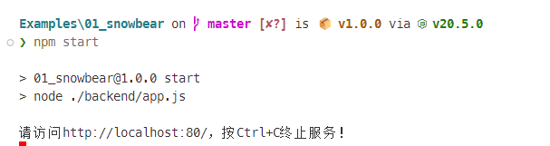
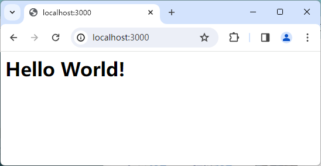

# 项目1. 将企业官网重构为互联网服务

将企业现有的静态网站重构并部署为可编程的互联网服务，在Web应用开发领域中属于最基础的后端应用构建类项目。此类项目的开发目的是：让企业能够摆脱对Apache、Nginx等传统服务器软件的依赖，并转而直接利用Node.js、Python等运行时环境的编程模块来部署他们的软件产品。这样做不仅能让企业在软件开发的过程中获得更大的灵活性和扩展性，同时也能大幅简化软件部署和维护的流程，降低企业在运维方面的成本。另外，这种开发与部署软件的方式也可以使企业更高效地响应市场变化和业务需求，快速迭代产品功能，提升用户体验。最后，编程模块的引入也为企业带来了更高的性能和更好的安全性，确保他们所提供Web服务在高并发场景下能够稳定运行，保护用户数据的安全。

综上所述，将企业网站重构为Web服务是一项既符合技术发展趋势又具备实际意义的项目，它将为企业带来长远的发展优势和竞争优势。掌握此类项目的开发能力被认为是软件工程师在互联网时代所必须拥有的基础技能。

## 【学习目标】

本章项目将会致力于演示如何将一个传统的企业官方网站重构为可编程的互联网服务，以便该企业日后可以逐步地将该网站升级为一个可为用户提供线上服务的Web应用。通过本章项目的实践，读者将会初步了解构建一个企业级Web应用所需执行的基本步骤，以及执行这些步骤所需使用的工具与技术。总而言之，在阅读完本章之后，我们希望读者能够：

- 了解Web应用的开发所使用的浏览器-服务器架构；
- 了解Web应用中前后端的概念以及它们各自的职责；
- 了解Node.js运行平台及其在服务器上的安装方法；
- 掌握如何基于Node.js运行平台来构建Web服务；

## 【学习场景描述】

现在你是一位刚刚入职到“凌雪冰熊”这家连锁饮料店的软件工程师。该连锁店的领导层正在考虑将线下实体店中的部分业务扩展到线上，因此要求你先将其现有网站重构为一个基于Node.js运行平台的Web服务，以便为日后要逐步提供的用户注册、用户登录、用户信息编辑、线上点餐、餐后评价、投票评选等线上服务奠定基础。

## 【任务书】

- **项目名**：将凌雪冰熊网站部署为Web服务。
- **委托方**：凌雪冰熊股份有限公司互联网部门
- **项目资料**：
  - 网站的官方域名：`snowbear.com`；
  - 网站服务器设备：一台安装了Ubuntu 22.04系统的云服务器；
  - 网站的现有代码：保存在本教材附带资料包的`Exmples/00_oldcode`目录下，目前为基于HTML+CSS技术实现的静态网站；
- **项目要求**：将凌雪冰熊官方网站重构为一个可编程的Web服务，该服务应符合以下要求。
  - 该服务应被部署在项目组提供的云服务器上，并且基于Node.js运行时环境来发布；
  - 该服务应能被任意一台可上网的。安装了网页浏览器的计算机设备通过`snowbear.com`这个域名访问到；
- **时间要求**：在5个工作日内完成；

## 【任务拆解】

整个项目的开发可以划分为以下三个小任务。

- 将项目组提供的现有网站源码升级为Web应用的开发项目；
- 使用Node.js运行时环境提供的HTTP模块来构建Web服务；
- 在客户端设备的网页浏览器中确认该Web服务可被正常访问；

## 【工作准备】

在正式开始本章项目的工作之前，读者需要先完成一些相关的准备工作。首先在知识准备方面，读者需要了解开发Web应用所使用的浏览器-服务器架构，分清楚应用的前端与后端以及它们各自所承担的分工，然后再根据这些分工所要执行的任务来选择要使用的技术，并根据这些技术配置好开发项目所需的开发工具与运行环境。当然了，如果读者自认为已经完成了这部分的工作准备，也可以选择跳过本节内容，直接进入本章项目的【工作实施与交付】环节。

### 知识点1：浏览器-服务器架构

正如之前所说，本章项目是基于浏览器-服务器（Browser/Server，简称B/S）架构来开发的。在这种架构之下，应用软件的开发者们可以将应用中需要保障数据安全或者进行高速运算的那一部分部署在服务器上，以便享用服务器的高性能配置以及能就近维护的便利。然后根据客户使用的网页浏览器来设计基于Web技术的用户界面（即Web UI），让它来执行应用中需要与用户交互的那一部分任务。这样做既降低了企业在应用软件部署与维护上所需要支付的成本，也让应用软件可以在无需购买特定客户端软硬件环境的情况下被使用，浙江有助于提高用户的使用意愿。虽然，在连眼镜、手表这类终端设备上都搭载了多核处理器的今天，各类型计算设备的性能事实上已经日渐趋同，用户所持终端与服务器之间的界线有时候也并非是绝对的，但从项目开发与维护的角度来说，做某种程度上的任务分工还是非常有必要的。以笔者个人的经验，B/S架构之下的任务分工通常如下所述。

- Web UI在B/S架构下所承担的工作主要是与客户进行交互，其角色类似于银行的前台接待员，所以在术语上往往被称之为该应用软件的“前端”。在通常情况下，前端的任务是负责渲染应用软件的用户操作界面、处理用户的操作、向服务器发送请求数据并接收来自服务器的响应数据、维持应用软件的运行状态，以求提供良好的用户体验。总而言之，这部分的开发与维护还将在很大程度上依赖于用户所持设备的软硬件环境。

- 服务器部分在B/S架构下所承担的工作主要是数据的处理和维护，其角色类似银行金库的管理人员，所以在术语上往往被称之为应用软件的“后端”。在通常情况下，后端的任务是为用户提供只有大型计算机才具备的运算能力以及安全可靠的数据库服务，它会负责存储并处理来自应用软件客户端的请求数据，然后把响应数据返回给客户端，一般用于处理较为复杂的业务逻辑，例如执行与天体物理相关的计算任务、存储海量数据等。这部分的开发和维护通常可以不依赖于用户所持设备的软硬件环境。

当然，所有的事情都是一体两面的，B/S架构作为建构与部署应用软件的一种解决方案，在除了提供上述分工带来的便利之外，同时也存在着一些可能的隐患。

- 首先，由于应用软件的后端与前端之间通常是一对多的关系，这意味着后端可能会需要同时处理成千上万个前端请求，这对服务器的负载能力提出了较高的要求，因此维持后端在服务器上运行的稳定性将会成为项目维护阶段的一大难题。

- 其次，采用分布式架构的应用软件在运营过程中也会严重依赖于用户所在的网络环境，一旦网络中的某个节点出了问题，例如遇到防火墙屏蔽、域名劫持等不可控的因素，整个程序就会立即陷入无法运行的尴尬境地。所以，开发者在使用该架构来构建应用软件时必须要想好应对这些劣势的预先安排，例如制定服务器的负载策略、设置备用服务器或备用域名等。

### 知识点2：配置项目运行环境

为了避免要求读者再多掌握一门编程语言，笔者打算在本书的所有项目中统一基于JavaScript语言的运行环境与相关的前后端开发框架来构建应用软件。因此，本着“工欲善其事必先利其器”的思想，在进入具体的项目实践之前，读者需要先将项目的运行环境搭建起来。众所周知，Web项目的运行环境主要分为前端的网页浏览器和后端的Node.js运行平台两种，下面，本章就来具体介绍一下如何搭建这两种项目运行环境。

#### 网页浏览器

让我们先从用于前端用户界面的网页浏览器开始。目前，大部分开发者都会将Google Chrome或Mozilla Firefox设为自己默认的网页浏览器，因为它们不仅对HTML5、CSS3以及ECMAScript6等最新的Web技术标准提供了最大限度的支持，其本身也都还自带了功能非常齐全的JavaScript执行/调试环境。其中Google Chrome是目前最为主流的网页浏览器，我们只需到它的官方网站上去下载并安装它，然后其主菜单中依次单击「更多工具」→「开发者工具」，就可以看到如图1-1中所示的JavaScript执行/调试环境了。


**图1-1** Google Chrome的JavaScript执行/调试环境

Mozilla Firefox则是另一款具有庞大用户群的网页浏览器，由于它采用了不同于Google Chrome的浏览器引擎，所以在前端领域中也具有一定的代表性。读者可根据自身所在的操作系统到Mozilla Firefox的官方网站上去下载并安装它。安装完成之后，我们可以在任何网页下按 「F12」 键或在菜单栏中依次单击「工具」→「Web开发者」→「查看器」，就可以看到如图1-2中所示的JavaScript执行/调试环境了。


**图1-2** Mozilla Firefox的JavaScript执行/调试环境

当然，如果读者打算在Windows 10或macOS系统中使用它们自带的网页浏览器来充当JavaScript的执行/调试环境，也是可以找到类似工具的。例如，微软最近用于取代Internet Explorer的Microsoft Edge，这款网页浏览器是基于Google Chromium开源项目来开发的，其使用方式与Google Chrome浏览器大同小异。

#### Node.js运行平台

接下来是用于在后端运行HTTP服务的Node.js运行环境。该运行环境主要有两种安装方式：在Windows和macOS这类以图形化操作为主的系统中，人们通常会选择先从Node.js的官方网站上下载到`.msi`或`.dmg`格式的二进制安装包，然后使用该安装包提供的图形化向导来进行安装。而在Linux和FreeBSD这一类以命令行操作为主的系统中，我们则往往会使用APT和YUM这一类基于命令行界面的包管理器来安装。由于本章项目的后端设备是一台安装了Ubuntu 22.04系统的云服务器，它主要是基于命令行界面来进行操作的，所以，本章在这里就以命令行操作的方式来读者演示Node.js的安装。

在Ubuntu这样的类UNIX操作系统中，人们安装软件往往都会选择使用APT这一类基于命令行界面的包管理器，他的使用方式非常地简单，读者只需在Bash Shell这类命令行终端中依次执行以下命令即可完成Node.js的安装。

```bash
sudo apt update
sudo apt install nodejs
```

如果一切顺利，当读者继续在命令行终端中输入`node -v`命令并按下回车键之后，应该就会看到如图1-3中所示的版本信息。


**图1-3** 在Bash Shell中检查版本

另外，在基于Node.js开发Web应用的过程中，开发者们通常会使用NPM（Node Package Management）这款内置在Node.js运行环境中的包管理器来管理项目中会用到的自动化工具、第三方库和框架。该管理器背后连接着一个全世界最大的JavaScript软件仓库（即npmjs.com），通过该包管理器，我们不仅可以将自己的项目打包发布到该软件仓库中，也可以将别人发布到该仓库中的包引入到自己项目中，同时还可以直接用它来安装一些在项目开发过程中会的自动化工具。下面来介绍一些该包管理器的常用命令。

- `npm init`命令：用于初始化新的JavaScript项目（以包为单位），它会在项目的根目录下自动生成一个新的`package.json`文件，以便用于管理项目中所有的依赖关系。
- `npm search`命令：用于在包管理器所连接的软件仓库（默认为`npmjs.com`）中搜索指定的自动化工具、第三方库或框架。
- `npm install`命令：用于在包管理器所连接的软件仓库（默认为`npmjs.com`）中下载指定的自动化工具、第三方库或框架，并将它们安装到当前项目中。
- `npm list`命令： 用于查看当前项目中已安装的所有自动化工具、第三方库或框架。
- `npm uninstall`命令：用于卸载当前项目中指定名称的、已被安装的自动化工具、第三方库或框架。
- `npm update`命令：用于更新当前项目中指定名称的、已被安装的自动化工具、第三方库或框架。

例如，如果读者想对自己所安装的Node.js运行平台本身进行版本管理，就可以通过安装一个名叫`n`的版本管理器来实现，该管理器的安装命令如下：

```bash
sudo npm install n --global
```

如果一切顺利，读者之后就可以通过下列命令来切换自己要使用的Node.js版本了。

```bash
sudo n lts               # 切换至最新的长期支持版本
sudo n stable         # 切换至最新的稳定版
sudo n latest          # 切换至最新的版本
sudo n 12.4.0         # 切换至直接指定的版本
sudo n                    # 该命令执行之后，用户可使用上下键切换已有版本
```

当然，对NPM不熟悉的读者也不必担心，本书后续还会结合具体项目的构建过程逐步为你演示该包管理器的使用方法。

### 知识点3：配置项目开发工具

从理论的角度上来说，如果读者想要编写一个Web应用软件，在工具上只需要使用Windows系统中的“记事本”这一类纯文本编辑器就足够了。但在实际的项目实践中，为了在工作过程中获得代码的语法高亮与智能补全等功能以提高编码体验，并能方便地使用各种强大的程序调试工具和版本控制工具，我们通常还是会选择使用一款专用的代码编辑器或集成开发环境来完成项目开发。在这本书中，笔者个人会倾向于推荐读者使用Visual Studio Code编辑器（以下简称VS Code编辑器）来构建所有的项目。下面就来简单介绍一下这款编辑器的安装方法，以及如何将其打造成一款用于开发Web应用软件的工具吧。

VS Code是一款微软公司于2015年推出的现代化代码编辑器，由于它本身就是一个基于Electron框架的开源项目，所以在Windows、macOS、Linux系统上均可使用（这也是我选择它作为主编辑器的原因之一）。VS Code编辑器的安装非常简单，在网页浏览器中打开它的官方下载页面之后，就会看到如图1-4中所示的内容：


**图1-4** VS Code编辑器的下载页面

然后，大家需要根据自己所在的操作系统来下载相应的安装包。待下载完成之后，我们就可以打开安装包来启动它的图形化安装向导了。在安装的开始阶段，安装向导会要求用户设置一些选项，例如选择程序的安装目录，是否添加相应的环境变量（如果读者想从命令行终端中启动VS Code编辑器，就需要激活这个选项）等，大多数时候只需采用默认选项，直接一路点击「Next」就可以完成安装了。接下来的任务就是要将其打造成可用于开发Web应用软件的工具。

VS Code编辑器的最强大之处在于它有一个非常完善的插件生态系统，我们可以通过安装插件的方式将其打造成面向不同编程语言与开发框架的集成开发环境。在VS Code编辑器中安装插件的方式非常简单，只需要打开该编辑器的主界面，然后在其左侧纵向排列的图标按钮中找到「扩展」按钮并单击它，或直接在键盘上敲击快捷键「Ctrl + Shift + X」，就会看到如图1-5所示的插件安装界面：


**图1-5** VS Code编辑器的插件安装

根据本书中要开发的项目需要，这里会推荐读者安装以下插件（但并不局限于这些插件）：

- **Chinese (Simplified) Language Pack**：简体中文语言包，用于将VS Code界面变成中文。
- **vscode-icons**：文件图标插件，用于为不同类型的文件加上不同的图标，以方便文件管理。
- **HTML Snippets**：编码辅助插件，用于在编写HTML代码时执行一些常见代码片段的自动生成。
- **HTML CSS Support**：编码辅助插件，用于在编写样式表时执行自动补全功能。
- **JavaScript Snippet Pack**：编码辅助插件，用于在编写JavaScript代码时执行自动补全功能。
- **JavaScript (ES6) Code Snippet**：编码辅助插件，用于在编写符合ES6标准的代码时执行自动补全功能。
- **ESlint**：编码辅助插件，用于检测JavaScript代码的语法问题与格式问题。
- **vetur**：编码辅助插件，用于实现针对`.vue`文件中的代码进行语法错误检查、代码高亮与码自动补全（配合ESLint插件使用效果更佳）。
- **Node.js Modules IntelliSense**：编码辅助插件，用于在JavaScript和TypeScript导入声明时执行自动补全功能。
- **Path Intellisense**：编码辅助插件，用于在编写文件路径时执行自动补全功能。
- **npm**：项目管理插件，用于根据当前项目中的`package.json`文件来校验项目所依赖的npm包，并确保安装包的版本正确。
- **GitLens**：项目管理插件，用于查看当前项目在Git版本控制系统中的提交记录。
- **Node.js Exec**：项目调试插件，可用Node命令执行当前文件或被我们选中的代码。
- **Node Debug**：：项目调试插件，用于实现直接在VS Code编辑器中调试后端的JavaScript代码。
- **View In Browser**：项目调试插件，用于打开网页浏览器并查看静态的HTML文档。
- **Live Server**：项目调试插件，可在本地自动构建一个简单的HTTP服务器，是前端开发的一大利器。
- **Debugger for Chrome**：项目调试插件，可用于实现直接在VS Code编辑器中调试前端的JavaScript代码，而不必借助网页浏览器的开发工具。

当然，VS Code编辑器的插件浩若繁星，读者也可以根据自己的喜好来安装其他功能类似的插件，只要这些插件后面的项目实践需求即可。除此之外，Atom与Sublime Text这两款编辑器也与VS Code编辑器有着类似的插件生态系统和使用方式，如果读者喜欢的话，也可以使用它们来打造属于自己的项目开发工具。

### 知识点4：Node.js编程的快速入门

对于网页浏览器这一类的、传统的JavaScript脚本运行环境来说，Node.js这个运行环境的本质就是在ECMAScript标准所定义的语言核心接口之外定义了一组用于执行非阻塞性I/O操作的异步接口。这些异步接口被按照功能划分成了几个不同的模块，它们被称为Node.js的核心模块。在很大程度上，学习在Node.js这个平台上编程，就是从了解如何使用这些核心模块开始的。所以在正式开始本章项目之前，读者需要先来简单学习一下Node.js中模块的组织规范，以及与本章项目相关的核心模块。

#### CommonJS规范

正如大家所知，Node.js运行平台的第一个版本正式发布于2009年5月，届时ECMAScript还没有定义标准的模块化规范（ES6发布于2015年），所以它采用了CommonJS这个第三方规范来构建自己的模块机制。下面，让我们来具体介绍一下该模块机制的使用方式。

在CommonJS规范的定义下，在Node.js平台中运行的所有JavaScript文件都可以被视为是一个模块。如果我们想将某一文 件中定义的对象（包括函数和变量）暴露给该文件以外的代码使用，就可以将该对象动态挂载在一个名为`module`对象的`exports`属性下面（当然，也可以使用该属性的全局引用`exports`），在专业术语中，这个动作被称之为"导出"。例如，如果读者想在一个名为`tools.js`的文件中导出一个函数，就可以按照以下步骤来实现。

- 在正式开启接下来的学习旅程之前，本教程会建议读者先在自己所用计算机中任意喜欢的位置上创建一个名为`Examples`的目录，以便用于存放在学习本教程过程中要实现的所有项目（笔者也会将这些项目的示例源码存放在本教程配套资源包中的同名目录下，以便提供给读者参考），然后在该目录下创建一个名为`02_studynodejs`的项目，该项目将用于读者接下来在学习Node.js编程过程中编写一些演示性的代码。

- 首先，读者需要在`Examples/02_studynodejs`目录下创建一个名为`tools.js`的模块文件，并在其中输入如下代码。

    ```JavaScript
    module.exports.add = function(num1, num2) {
        return num1 + num2;
    };
    ```

- 接下来，读者只需要在另一个文件中使用`require()`函数来"导入"这个模块，就可以使用该模块导出的函数了。例如，我们可以在同一目录下创建一个名为`test.js`的测试文件，并在其中输入如下代码。

    ```JavaScript
    const tools = require(`./tools`);
    console.log(tools.add(4,5));      // 输出：9
    ```

从上述代码可以看出，如果人们在某一模块中使用挂载的方式导出其中定义的对象，那么尔后再用`require()`函数导入该模块时，模块所在的文件会被实例化成一个对象，而模块导出的函数和变量都将成为该对象的成员。当然，读者也可以让某个模块在被导入时直接被实例化为其指定的对象，具体做法就是直接让`module.exports`指向被该模块指定的导出对象。例如，如果读者想在一个名为`hero.js`的文件中导出一个`Hero`类，就可以按照以下步骤来实现。

1. 在`Examples/02_studynodejs`目录下创建另一个名为`hero.js`的模块文件，并输入如下代码：

    ```JavaScript
    class Hero {
        constructor(name) {
            this.name = name;
        }

        sayhello() {
            console.log('Hello', this.name);
        }
    }

    module.exports = Hero;
    ```

2. 在`Examples/02_studynodejs/test.js`测试文件中添加如下代码：

  ```JavaScript
  const Hero = require(`./hero`);
  const owl = new Hero('owlman');
  owl.sayhello();           // 输出：Hello owlman
  ```

到目前为止，我们演示的都是单文件的模块构建方式。但随着应用程序日益复杂的实现需求，我们很多时候需要将多个 JavaScript 文件组织成单个模块提供给代码的调用方，这就涉及到了多文件模块的构建。下面，我们就来具体演示一下如何创建一个多文件模块，其基本步骤如下。

1. 在`Examples/02_studynodejs`目录下创建一个名为`batman`的目录，并用命令行终端进入到该目录中执行`npm init -yes`命令。该命令会将其初始化成一个Node.js可识别的模块目录，并将该目录的初始配置保持在一个名为`package.json`的文件中，其具体内容如下。

    ```JSON
    {
        "name": "batman",
        "version": "1.0.0",
        "description": "",
        "main": "index.js",
        "scripts": {
            "test": "echo \"Error: no test specified\" && exit 1"
        },
        "keywords": [],
        "author": "",
        "license": "ISC"
    }
    ```

   这里显示的都是该模块的默认配置，读者日后可以根据自己的需要修改这些配置项。但在当前示例中，读者只需要特别关注一下`main`这项配置，它指定的是该模块入口文件的名称，该文件将用于具体指定当前模块要导出的内容。当然，即使没有指定这项配置，Node.js运行平台在发现它载入的模块是一个目录时，默认情况下也会自动查找该目录中是否存在一个名为`index.js`的模块入口文件。

2. 在完成模块的配置之后，读者接下来需要在`Examples/02_studynodejs/batman`目录下创建一个名为`functions.js`的脚本文件，并在其中输入如下代码。

    ```JavaScript
    module.exports.sayHello = function() {
        console.log([this.name, this.age].join(':'));
    };
    ```

3. 然后，读者需要再继续在`Examples/02_studynodejs/batman`目录下创建一个名为`data.js`的脚本文件，并在其中输入如下代码。

    ```JavaScript
    module.exports.name = 'batman';
    module.exports.age = '45';
    ```

4. 最后，读者需要再在`Examples/02_studynodejs/batman`目录下创建一个名为`index.js`或其他由`main`配置项指定文件名的模块入口文件，并在其中输入如下代码。

    ```JavaScript
    const func = require(`./functions`);
    const data = require(`./data`);
    const bat = {
        name : data.name,
        age  : data.age,
        sayHello : func.sayHello
    };

    module.exports = bat;
    ```

- 在完成了上述模块创建步骤之后，读者现在就可以在`Examples/02_studynodejs/04-test.js`文件中添加如下代码，并查看测试结果了。

  ```JavaScript
  const bat = require(`./batman`);
  bat.sayHello();          // 输出： batman：45
  ```

正如读者所见，上述示例将`batman`目录下所有的文件组织成了一个单一的模块，为此需要特别创建一个模块入口文件。这个文件默认情况下位于其所在模块的顶层目录下，名称为`index.js`（如有需要，我们也可以通过`package.json`文件中的`main`配置项来指定自己需要的模块入口文件及其路径），用于指定当前多文件模块要导出到外部的内容。当然，在多文件模块内部，单个文件之间的相互引用依然遵守的是单文件模块规则。而在外部引用该模块，就只需要将该模块所在的目录路径作为实参传递给`require()`函数即可。除此之外，相信细心的读者也发现了，多文件的模块不仅有利于实现更复杂的业务逻辑，也便于做到接口定义与其实现细节的分离。这样做既可以对外隐藏细节，增加安全性，又可以随时更换接口的实现模块，增加灵活性。

#### Node.js模块导入规则

正如读者在上一节示例中所看到的，在Node.js项目中导入模块是通过调用`require()`函数来完成的。该函数接收一个字符串类型的实参，用于指定要导入的模块，我们将其称之为"模块标识符"。Node.js运行平台会基于这些模块标识符来判断模块的类型及其它们查找方式，主要可分为以下三种模块类型。

首先是 **Node.js平台的核心模块**。这一类型的模块中提供的就是我们之前讨论的执行非阻塞性I/O操作的异步接口，其设计者按照功能将它们划分成了以下若干个不同的模块。

- **assert**：该模块提供了一组简单的断言测试接口，用于确保程序运行过程中所遇到的状态符合预期。
- **Buffer**：该模块提供了一种能以字节序列的形式处理二进制数据的数据类型。
- **crypto**：该模块提供了一整套与加密/解密功能相关的接口，用于实现安全通信，
- **dgram**：该模块提供了一组与UDP套接字功能相关的接口，用于实现UDP套接字通信。
- **domain**：该模块提供了一组用于创建独立运行环境的接口，用于实现多线程编程。
- **http**：该模块提供了一组与HTTP服务器功能相关的接口，用于实现HTTP服务器通信。
- **https**：该模块提供了一组与HTTPS服务器功能相关的接口，用于实现HTTPS服务器通信。
- **net**：该模块提供了一组与TCP/IP套接字功能相关的接口，用于实现TCP/IP套接字通信。
- **os**：该模块提供了一组与本地操作系统进行交互的接口，用于实现与操作系统相关的功能。
- **path**：该模块提供了一组与文件（或目录）路径处理相关的接口，用于实现文件（或目录）路径处理功能。
- **punycode**：该模块提供了一组用于处理Unicode编码的接口，用于实现Unicode编码处理功能。
- **querystring**：该模块提供了一组用于解析和格式化URL查询字符串的接口，用于实现URL查询字符串处理功能。
- **readline**：该模块提供了一组用于一次读取一行可读流数据的接口，用于实现一次读取一行可读流数据的处理功能。
- **repl_server**：该模块提供了一组用于创建一个REPL服务器的接口，用于实现创建一个REPL服务器的功能。
- **stream**：该模块提供了一组用于处理流式数据的接口，用于实现流式数据处理功能。
- **string_decoder**：该模块提供了一组用于将Buffer对象解码为字符串的接口，用于实现将Buffer对象解码为字符串的功能。
- **timers**：该模块提供了一组用于实现定时器的接口，用于实现定时器功能。
- **tls**：该模块提供了一组与安全传输层（TLS）及安全套接层（SSL）协议相关的接口，用于实现安全通信。
- **url**：该模块提供了一组用于处理和解析URL的接口，用于实现URL处理功能。
- **util**：该模块提供了一组在开发过程中经常会用到的实用工具。
- **v8**：该模块提供了一组的与V8虚拟机相关的接口，用于实现与V8虚拟机相关的功能。
- **vm**：该模块提供了一组用于实现虚拟机相关的接口，用于实现虚拟机相关的功能。
- **zlib**：该模块提供了一整套与压缩/解压相关的接口，用于实现与文件压缩/解压相关的功能。
- **child_process**：该模块提供了一组用于创建子进程的接口，用于实现创建子进程的功能。
- **cluster**： 模块可用于创建共享同一服务器端口的子进程，用于实现创建子进程的功能。
- **worker_threads**：该模块允许使用并行地执行JavaScript的线程，用于实现与并行相关的功能。

当然，上面列出的模块还不包括一些由Node.js运行平台提供的全局对象，它们通常也被认为是核心模块的一部分。另外，核心模块的加载速度也是所有类型的模块里最快的，这是因为这些模块通常都已经以二进制的形式被编译进Node.js这个平台中了，所以加载它们时是不需要查找定位的。而我们在模块标识符中只需要指定要导入的模块名称即可，例如像下面这样。

```JavaScript
// 载入 fs 模块：
const fs = require(`fs`);
// 载入 path 模块：
const path = require(`path`);
// 载入 http 模块：
const http = require(`http`);
```

第二种是 **单独发布的Node.js模块**。这一类型的模块通常是开发者们提供给别人使用的模块，它们既可能是同一开发团队内同事提供的模块，也可能是我们从NPM这类资源仓库中获取到的第三方模块。按照Node.js的模块规则，这些模块不能与核心模块重名，并被存储在某一级别的`node_modules`目录中。读者在导入这类模块时，也只需要在模块标识符中指定模块的名称即可。而当Node.js检测到要导入的模块不属于核心模块时，它就会按照以下顺序在各级`node_modules`目录中查找该模块。

- 当前文件所在目录下的`node_modules`目录。
- 父目录下的`node_modules`目录。
- 父目录的父目录下的`node_modules`目录。
- 沿着上述方向逐级向上的各级目录下的`node_modules`目录。
- 最后是根目录下的`node_modules`目录。

由于要查找的`node_modules`目录是不确定的，所以这类模块的导入速度可能是三种模块中最慢的。

 最后一种是 **Node.js项目内部自定义模块**。这一类型的模块就是本章在上一节中一直在演示的这种模块形态，通常只放在项目中供内部各模块之间彼此引用，项目之外通常就无法引用了。在导入这类模块时，模块标识符中通常需要在模块名称前面加上一个相对路径或绝对路径，用于指定要导入模块所在的位置，例如:

```JavaScript
// 导入当前目录下的 batman 模块：
const bat = require(`./batman`);
// 导入父目录下的 superman 模块：
const sup = require(`../superman`);
// 导入根目录下的 owlman 模块：
const owl = require(`/owlman`);
```

而在模块名称上，无论要导入模块是个单一文件还是多文件的目录，都不需要加上任何文件扩展名。Node.js平台会自行对导入的模块进行判断，如果目标是一个文件，它会自动为其加上`.js`、`.json`、`.node`等扩展名并尝试进行匹配。如果目标是一个目录，它也会自动在该目录下查找`index.js`或其他由`main`配置项指定的模块索引文件。

另外，Node.js平台还会将近期导入过的模块编译成二进制文件并缓存起来，所以当人们需要再次导入相同的模块，其加载速度通常要比第一次导入时快得多。

#### 让服务器说"Hello"

为了让读者能对基于Node.js平台构建Web服务有一个整体的概念，本章接下来会具体演示一下如何以Web服务的形式来构建一个"Hello World"应用。需要说明的是，该示例只负责演示在Node.js平台中构建Web服务的基本步骤，请读者在这里暂时请不要纠结于其中的实现细节，本章的教学的目的只是让读者对本书要实现的这一类应用开发项目有一个概念性的初步了解。

言归正传，由于在Node.js这个平台中创建Web服务需要用到`http`这个核心模块，所以我们接下来就重点演示一下该模块的使用步骤，具体如下。

- 在之前创建的`Examples/02_studynodejs`目录下新建一个名为`sayHello_webServer.js`的脚本文件，并在其中输入如下代码：

    ```JavaScript
    // 用Node.js脚本构建Web服务器

    const http = require('http');
    const server = http.createServer();

    server.on('request', function(req, res){
        res.end('<h1>Hello World!</h1>');
    });

    server.listen(8080, function(){
        console.log('请访问http://localhost:8080/，按Ctrl+C终止服务！');
    });
    ```

- 在保存上述文件之后，使用命令行终端环境进入到`Examples/02_studynodejs`目录下，并通过执行`node sayHello_webServer.js`命令来启动这个Web服务。

- 最后，使用网页浏览器访问`http://localhost:8080/`，就会看到如图1-6所示的结果。

    **图1-6** 以Web服务的形式说"Hello World"

    

从上述示例中可以看到，基于Node.js平台创建Web服务的基本步骤如下：

1. 导入Node.js中与Web服务相关的`http`核心模块，创建一个`http`实例。
2. 调用`http`实例的`createServer()`方法，创建一个代表Web服务器的`server`实例。
3. 在`server`实例上调用`on()`方法，注册`request`事件的处理函数，以便将响应数据返回给浏览器端。
4. 在`server`实例上调用`listen()`方法，让Web服务器监听指定的端口号以接收来自浏览器端的请求。
5. （可选步骤）可能的话，顺便在终端输出该服务的使用说明。

本书中接下来要实现的Web服务基本都将按照以上步骤来构建，它们之间大同小异，最大的区别就是在第3步，`request`事件处理函数的编写，如何根据不同的请求返回不同的数据才是整个后端应用中最为关键的部分。当然，我们可以在第4步中为该服务器指定不同的端口号，或在第5步中输出更为详细的使用说明。但总而言之，基于Node.js平台来构建Web服务的代码实现在大体结构上是相同的，它的代码重复率是偏高的。

## 【工作实施和交付】

在完成了上述工作准备之后，读者现在就可以根据之前【任务书】中的要求来着手将凌雪冰熊网站重构为一个基于Node.js运行平台部署的Web服务了，该项目的实施过程可以分为以下步骤来进行。

### 第1步：重构现有网站并创建Web应用项目

在这一步骤中，软件工程师的主要任务是对凌雪冰熊官方提供的现有网站项目进行重构，将其改造成一个Web应用的开发项目。为此，读者需要执行以下操作。

1. 在之前创建的`Examples`的目录下新建 一个名为`01_snowbear`的目录，然后使用Powershell或Bash Shell这类命令行终端环境进入到该目录下，并通过执行`npm init -yes`命令来将该目录初始化为一个Node.js项目的根目录。

2. 如果一切顺利，读者就会在`01_snowbear`目录下看到一个名为`package.json`的文件，这是Node.js项目的配置文件，我们日后需要通过它来配置Web服务的具体细项，目前该文件的内容是我们之前执行`npm init`命令时使用`--yes`生成的默认配置，具体如下。

    ```json
    {
        "name": "01_snowbear",
        "version": "1.0.0",
        "description": "",
        "main": "index.js",
        "scripts": {
            "test": "echo \"Error: no test specified\" && exit 1"
        },
        "keywords": [],
        "author": "",
        "license": "ISC"
    }
    ```

3. 接下来，继续在`01_snowbear`目录下分别创建两个名为`frontend`和`backend`的子目录，以便用于存放Web服务的前端源码和后端源码。

4. 将凌雪冰熊官方提供的现有网站源码所在的目录（即本章【任务书】中提到的`oldcode`目录）下的所有文件复制到`frontend`目录下，后者将用于存放当前Web应用中可被网页浏览器直接访问的静态资源。

5. 在本书项目的每个操作步骤执行完之后，本笔者都会建议读者将项目的变更提交给git版本控制系统进行源码管理，以便日后回溯自己在该项目中所执行的操作，为此，读者需要继续在`01_snowbear`目录下执行以下命令。

    ```bash
    git init
    git add .
    git commit -m "项目1：创建Web应用项目"
    ```

### 第2步：基于Node.js运行环境创建Web服务

在这一步骤中，软件工程师的主要任务是基于Node.js运行环境创建一个HTTP服务，并以静态资源的形式重新部署凌雪冰熊这家连锁店的官方网站。为此，读者需要执行以下步骤。

1. 使用VS Code编辑器打开之前创建的`01_snowbear`项目，然后在项目根目录下的`backend`目录中创建一个名为`app.js`的文件，并将在其中输入以下代码。

    ```javascript
    const http = require('http');
    const path = require('path');
    const fs = require('fs');

    // 设置服务器的端口号
    const port = 80;
    // 设置主机名
    const host = `http://localhost:${port}/`;

    // 定义静态的资源服务
    function staticServer(req, res) {
        const webroot = '/frontend';
        fs.readFile(`.${webroot + req.url}`, function (err, data) {
            if (err !== null) {
                res.writeHead(404, {
                    'Content-Type': 'text/html, charset=utf-8'
                });
                return res.end('相关页面不存在！');
            }
            if(path.extname(req.url) == '.js') {
                // 设置JavaScript脚本的MIME类型
                // 以便前端能以ES6模块的形式加载脚本  
                res.writeHead(200, {
                    'Content-Type': 'application/javascript'
                });
            } else {
                res.writeHead(200);
            }
            res.end(data);
        });
    }

    // 定义动态的 HTTP API 服务
    function apiServer(req, res) {
        // 相关内容留待下一章讨论
    }

    // 构建 HTTP 服务
    http.createServer(function (req, res) {
        req.url = (req.url == '/' ? '/index.htm' : req.url);
        // 设置服务允许访问的静态资源
        const extNames = [
            '.htm', '.js',
            '.css', '.jpg',
            '.png', '.ico'
        ];
        // 判断前端请求的服务类型
        if (extNames.includes(path.extname(req.url))) {
            staticServer(req, res);
        } else {
            apiServer(req, res);
        }
    }).listen(port, function () {
        console.log(`请访问${host}，按Ctrl+C终止服务！`);
    });
    ```

2. 继续在VS Code编辑器中重新打开项目根目录下的`package.json`文件，并将项目的默认配置修改如下。

    ```json
    {
        "name": "01_snowbear",
        "version": "1.0.0",
        "description": "",
        "main": "/backend/app.js",
        "scripts": {
            "start": "node ./backend/app.js"
        },
        "keywords": [],
        "author": "",
        "license": "ISC"
    }
    ```

3. 在上述配置文件中，笔者首先修改了`"main"`字段的值，将项目的入口文件设置成了刚刚创建的`/backend/app.js`文件。然后在`"scripts"`字段中添加了一条名为`"start"`的脚本指令，这样日后只需执行`npm start`这个命令就可以启动该Node.js项目定义的Web服务了。具体操作是：再次使用命令行终端环境进入到`01_snowbear`目录下，然后执行`npm start`命令，如果该命令输出了如图1-7所示的信息，就说明该Web服务被成功创建并启动了。

    

    **图1-7** 启动Node.js定义的Web服务

4. 如果上述操作一切顺利，读者接下来就可以将当前步骤所获得的进展提交给git版本控制系统了，具体命令如下。

    ```bash
    git add .
    git commit -m "项目1：创建并启动Node.js定义的Web服务"
    ```

### 第3步：部署Web服务并确认其运行正常

在之前的步骤中，我们已经基于Node.js运行平台在本地计算机上创建了一个Web服务。在接下来的这一步骤中，软件工程师要做的是将该服务部署到项目【任务书】书中指定的云服务器上，并确认它可以正常运行。为此，读者需要执行以下操作。

1. 在本地计算机中将`01_snowbear`项目推送到哦指定的git远程仓库中，这里假设我们使用的git远程仓库是`https://gitee.com/snowbear2024/01_snowbear.git`。具体操作是：在命令行终端环境进入到本章项目的根目录下，然后执行以下命令。

    ```bash
    git remote add origin https://gitee.com/snowbear2024/01_snowbear.git
    git push -u origin master
    ```

2. 继续在命令行环境中使用SSH等远程登录工具登录到项目【任务书】书中指定的云服务器上，并从指定的git远程仓库中将本项目源码下载到该服务器上，然后启动我们之前定义的Web服务。为此，读者需要在SSH所连接的服务器上执行以下命令。

    ```bash
    cd /home/wwwroot/
    git clone https://gitee.com/snowbear2024/01_snowbear.git
    npm install && npm start
    ```

3. 如果上述操作一切顺利，读者接下来只需要将`snowbear.com`这个域名解析到上面这台云服务器的IP地址上，然后就可以在本地计算机的网页浏览器中通过这个域名来访问我们所创建的这个Web服务了，目前，凌雪冰熊官方网站的首页如图1-8所示。

    

    **图1-8** 基于Web服务发布的凌雪冰熊官方网站

## 【拓展知识】

到目前为止，本章项目所演示的只是基于Node.js平台本身的核心模块来构建Web服务的方法。但Node.js平台真正的强大之处在于它所具备的扩展性以及庞大的社区支持，这可以使人们能通过引入丰富的第三方扩展（包括库和框架）来增强自己基于该平台的开发能力，以便用更轻松、高效的方式来构建应用软件。为了帮读者拓展这方面的知识，本章接下来将会为读者介绍一款名为Express.js的第三方Web开发框架，并演示如何使用该框架来构建Web服务。

### 知识点1：Express.js框架简介

目前，Express,js框架已经被业界公认为是面向Node.js平台的、标杆性的服务端应用框架，许多其他基于Node.js平台的应用程序和框架都是以它为基础来进行开发的。该框架的成功主要来自于其小巧而极富弹性的设计特性，这些特性为开发者们快速创建各种基于HTTP协议的服务端应用程序提供了一系列非常便利的条件。下面，就让我们来具体介绍一下Express.js框架的设计思路。

#### 小巧而富有弹性

为了帮助读者更好地理解Express,js框架的设计思路，我们需要先来一下该框架的起源故事。众所周知，虽然Node.js平台在2009年2月的横空出世将JavaScript语言的适用领域扩展到了服务器上，但这也随即带来了一个问题。那就是，如果开发者们只使用Node.js平台原生的应用程序接口（Application Programming Interface，以下简称API）来开发基于HTTP协议的Web应用程序，就只能调用一些非常底层API。这意味着，我们在编写应用程序的过程中必须亲手实现诸如处理表单、解析JSON数据等许多基本的Web功能，甚至在某些情况下还不得不重复实现一些大同小异的功能。这种低效率的、“重复发明轮子”的做法[^1]是非常不利于在生产环境中解决实际问题的。

为了解决上述问题，让基于Node.js平台的Web应用程序开发变得更高效、更便捷一些，一位名叫TJ. Holowaychuk[^2]的加拿大开发者在Node.js平台问世仅仅四个月之后，于2009年的6月启动了这个Express.js框架的开发工作，并在MIT许可证下将其作为开源项目提供给社会。根据该项目在GitHub上的提交历史，它首次发行于2010年5月22日，版本号为0.12.0。

在设计思路上，Express,js框架的最初灵感来自于Sinatra[^3]，基本上就是将Node.js平台中用于构建HTTP服务的API按开发Web应用程序的需求进行了封装。后来为了赋予Express,js框架良好的可扩展性，TJ. Holowaychuk又基于一个名为Connect的基础中间件框架[^4]对它进行了重构，并于2009年的9月正式发行了Express,js框架的1.0.0版本。总体而言，Express,js框架采用的是最小化设计原则，它本身只提供了开发一个Web应用程序所需的最基本功能，这些功能主要包括：

- 可针对客户端请求的不同URL路径及其使用HTTP动词来进行响应的路由功能。
- 可像PHP等传统动态页面技术一样在服务端动态生成HTML页面的渲染引擎。
- 可进行常见Web应用程序设置的方法，例如设置服务端口，渲染响应模板等。
- 可针对各种复杂的客户端请求或数据格式来引入相应功能的中间件的可扩展机制。

以上功能共同构成了Express.js框架的核心特性，是每个学习该框架的开发者必须要了解的。尤其是对于如何利用好可扩展机制所带来的弹性，更是Express.js框架的使用者需要重点解决的问题。下面，我们就趁热打铁地来具体介绍一下这一机制。

#### 使用中间件机制

正如上一节所说，对于我们在实际开发中可能需要实现的各种复杂功能，例如处理复杂客户端请求、解析特定的数据格式等，Express,js框架则为开发者提供了一套极富弹性的中间件可展机制，以便他们可以通过中间件的形式来对应用程序的功能进行扩展。这让它成为了一个开箱即用、学习曲线平缓的应用程序框架。

换而言之，尽管Express.js框架本身遵循的是最小化设计原则，但开发者们可以通过创建各种专用功能的中间件来解决几乎所有与Web应用程序开发相关的问题。这样一来，我们就可以选择在构建应用的初期先使用Express,js框架本身快速搭建一个最基本的Web应用程序项目，然后再根据该项目实际要采用的数据库、客户端框架以及客户端于服务端之间传输的数据格式来决定要加载的中间件。

当然了，这种基于中间件的可扩展机制所带来的弹性有时候也是一把双刃剑。虽然我们可以利用各种中间件来解决几乎所有问题，但如何在Node.js社区庞大的软件生态系统中找到适合于项目需求的中间件扩展包就成为了一个不小的挑战，对于这个问题，Express.js框架的开发团队在其官方网站上提供了一份由他们所推荐的中间件列表。在下面的表1-1中，我们列出了其中一些较为常用的中间件。

| 扩展包名称      | 中间件功能说明                  |
| --------------- | ---------------------------- |
| body-parser     | 用于解析HTTP请求体中的数据。            |
| cookie-parser   | 用于解析HTTP请求中附带的cookie消息。 |
| cookie-session  | 用于创建基于cookie机制的Session。            |
| morgan         | 用于记录服务器端接收到的HTTP请求。               |
| multer          | 用于处理客户端上传的各种文件并且保存到指定的位置。|
| response-time   | 用于记录服务器响应HTTP请求的时间。              |
| session         | 用于创建基于服务端的Session（仅在开发中使用）。 |
| timeout         | 用于设置HTTP请求处理超时的时间。                |
| connect-image-optimus  | 用于优化图片的存储，会尽可能将图片格式转换成`.webp`或`.jxr`。|
| express-debug    | 用于加载可往模板变量、当前Session等对象中添加信息的开发工具。|
| passport  | 用于使用使用OAuth、OpenID等“认证策略”进行身份验证。 |

**表1-1**：由Express.js官方团队推荐的常用中间件

需要强调的是，构建应用程序这项工作从来就没有“不二法门”，互联网上的推荐列表和演示实例通常也只能当作参考。如果想要真正地使用好Express.js框架及其中间件，开发者们最终还是需要到实际生存环境中去进行项目时间，以累积经验。接下来，就让我们结合本章的项目需求来演示一下如何基于Express.js框架及其中间件机制来构建并部署Web服务。

### 知识点2：使用Express.js框架部署Web服务

接下来，我们会带领读者使用Express.js框架来完成一个与本章项目相同的任务，即以Web服务的方式部署现有的静态网站。目的是介绍基于Express.js框架构建Web服务的基本步骤，并让读者自行与之前基于Node.js核心模块的实现方式进行比较，从而感受到框架所能带来的便利。因此在该示例中，读者的主要任务是了解如何在Node.js项目引入第三方扩展，并使用该扩展来部署静态网站，其主要步骤如下。

1. 在之前创建的`Examples/02_studynodejs`的目录下创建一个名为`helloExpress`的目录，并使用命令行终端环境进入到该目录下，通过执行`npm init --yes`命令将其初始化为一个Node.js项目。

2. 在`helloExpress`项目的根目录下创建一个名为`static`的目录，并在该目录下创建一个名为`index.htm`的文件，用以充当本示例中静态网站的首页，并在其中输入如下代码：

    ```html
    <!DOCTYPE html>
    <html lang="en">
        <head>
            <meta charset="UTF-8">
            <title>Hello World!</title>
        </head>
        <body>
            <h1>Hello World!</h1>
            <p>This is a static website.</p>
        </body>
    </html>
    ```

3. 回到`helloExpress`项目的根目录下，并执行`npm install express --save`命令将Express.js框架安装到示例项目中。

4. 在`helloExpress`目录下创建一个名为的`index.js`文件，以作为本示例的程序入口文件，并在其中编写如下代码：

    ```JavaScript
    // 引入用于操作文件路径的Node.js模块
    const path = require('path'); 
    // 引入 Express.js 框架文件
    const express = require('express');
    // 创建一个 Express 应用实例
    const app = express();
    // 设置当前 Web 服务的访问端口 
    const port = 3000;

    // 将 static 目录设置为静态资源目录
    // 该目录可以被前端直接访问，因此用于部署静态网站
    app.use(express.static(path.join(__dirname, 'static')));

    // 设置当前服务启动时要监听的端口以及要执行的动作
    app.listen(port, () => {
        console.log(`请访问http://localhost:${port}/，按Ctrl+C终止服务！`);
    })
    ```

5. 保存上述所有文件后，在`helloExpress`目录下执行`node index.js`命令启动Web服务，然后在浏览器中访问`http://localhost:3000/`这个URL，就会看到如图1-9所示的页面：

    

    **图1-9**：使用Express框架说Hello

在上述演示中，笔者首先在一个新建的Node.js项目中使用`npm install`命令将Express.js框架文件安装到了项目根目录下的`node_modules`目录中。想必读者还记得，笔者在【工作准备】部分中曾使用NPM安装Node.js平台的版本管理器`n`，当时是使用`--global`参数来执行`npm install`命令的，这意味着该命令安装的是一款可全局使用的自动化工具。换句话说，那一次的操作实际上是在计算机中安装了一款独立的Node.js应用软件。而这一次，笔者的任务是在当前项目中引入指定的第三方扩展，所以`npm install`命令使用的是`--save`参数，这样安装的对象只在当前项目中有效。

接下来，笔者基于Express.js框架创建了一个Web服务，该服务的功能与我们之前在`sayHello_webService.js`脚本中所实现的完全相同。现在，读者只需自行比较一下两者的实现源码，应该就不难体会到使用现有的第三方扩展来开发应用所能带来的便利性了。

## 【作业】

有一家名为“白熊前端”的程序员培训机构，刚刚完成了其官方网站的设计，现在希望你能将他们的网站以Web服务的形式部署到指定的云服务器上，以便在降低该网站运维成本的同时，保留未来将网站升级为线上培训应用的空间。

- **项目名**：将白熊前端网站部署为Web服务
- **委托方**：白熊前端的创始人：林宇一
- **项目资料**：
  - 网站的官方域名：`whitebear.com`；
  - 网站服务器设备：一台安装了Ubuntu 22.04系统的云服务器；
  - 网站的现有代码：目前为基于HTML+CSS技术实现的静态网站；
- **项目要求**：将白熊前端网站部署为一个可编程的Web服务，该服务应符合以下要求。
  - 该服务应被部署在项目组提供的云服务器上，并且基于Node.js运行时环境来发布；
  - 该服务应能被任意一台可上网的。安装了网页浏览器的计算机设备通过`whitebear.com`这个域名访问到；
- 时间要求：在5个工作日内完成；

## 【作业评价】

| 序号 | 评测内容 | 评分标准 | 分值 | 自评 | 互评 | 师评 | 综合得分 |
| ----- | --------- | ------------ | --- | ------ | ------ | ---- | --------- |
| 01 | 网站可否访问 | 模板网站能否通过甲方提供的域名进行访问？| 40 |  |  |  |  |  
| 02 | 网站整体呈现 | 网站所呈现的信息内容与外观样式是否符合甲方的预期？| 40 |  |  |  |   |
| 03 | 跨浏览器呈现 | 网站呈现效果在Chrome和Firefox这两款主流网页浏览器中是否一致？| 20   |  |  |  |  |
