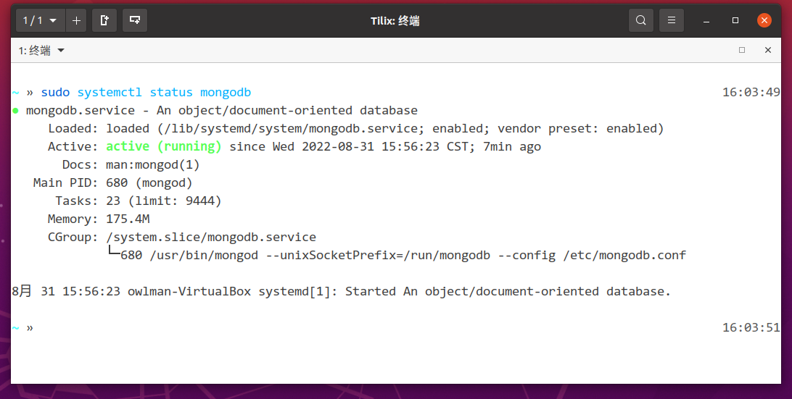
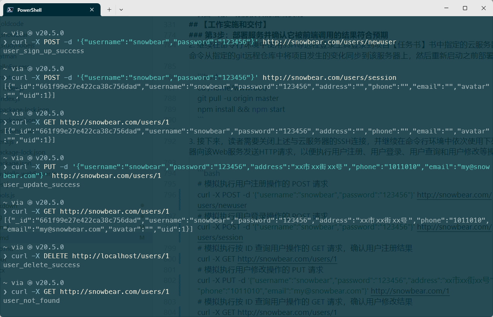
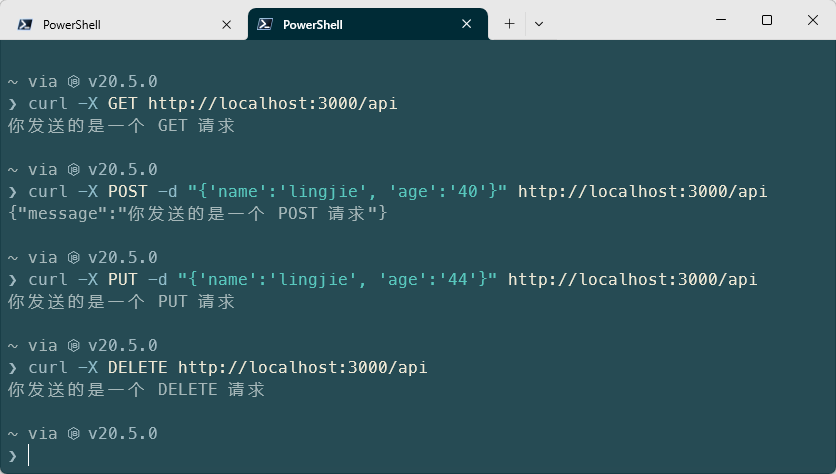

# 项目2 用户功能模块的后端实现

用户功能模块的后端实现在Web应用开发领域中属于最为简单的后端数据服务类项目，此类项目的开发目的是让企业的潜在客户可以通过互联网来申请并使用该企业服务的用户权限。这类项目一方面可以使企业以互联网的形式来向自己的用户提供软件服务，以便降低软件在开发与维护上所需要支付的成本；另一方面。由于以互联网形式部署的软件服务可以在很大程度上降低用户的使用门槛，提高他们的使用意愿。因此这类项目的开发也将有助于降低企业推广其业务的难度及其相关的广告费用。所以，此类项目通常被认为是软件工程师在进入到Web应用开发领域时在后端部分必须掌握的项目类型之一。

## 【学习目标】

本章项目将会致力于演示如何为一家企业的官方网站实现其用户功能模块的后端服务，以便网站的前端工程师后续可以这一后端服务来构建相应的Web UI，从而将网站升级成为一个允许用户执行注册、登录等操作的Web应用。通过本章项目的实践，读者将会初步了解为企业级网站开发用户功能模块的过程中所需要执行的基本步骤，以及执行这些步骤所需要掌握的技术以及相关的工具。总而言之，在阅读完本章之后，我们希望读者能够：

- 了解如何在服务器环境中安装并配置MongoDB数据库；
- 掌握如何在Web应用的后端部署数据库并完成数据读写；
- 掌握如何基于REST设计规范来实现Web应用的后端服务；

## 【学习场景描述】

现在你是一位刚刚入职到“凌雪冰熊”这家连锁饮料店的软件工程师。该连锁店的领导层正在考虑将线下实体店中的部分业务扩展到线上，因此需要在部署了现有网站的Web服务中新增一个用户功能模块，让人们可以通过其网站注册为该饮料店的用户并获取使用其线上服务的权限。在开发该功能模块的项目中，你的任务是设计并实现模块的后端服务部分，以便后续的前端工程师可以基于该后端服务来构建相应的Web UI。

## 【任务书】

- **项目名**：凌雪冰熊网站用户功能模块的后端部分
- **委托方**：凌雪冰熊股份有限公司互联网部门
- **项目资料**：
  - 网站的官方域名：`snowbear.com`；
  - 网站服务器设备：一台安装了Ubuntu操作系统的云服务器；
  - 网站的现有代码：即本书在上一章项目中所部署的Web服务；
- **项目要求**：为部署了凌雪冰熊官方网站的Web服务新增一个用户功能模块，该功能的实现应符合以下要求。
  - 该功能应允许人们通过网页浏览器提交新用户的注册申请，并将他们所提交的注册信息写入到后端数据库中；
  - 该功能应允许已注册用户通过登录操作获取到享用服务的权限，为后续要实现的线上点餐等功能奠定基础；
- **时间要求**：在5个工作日内完成；

## 【任务拆解】

整个项目的开发可以划分为以下三个小任务：

- 创建专用于执行MongoDB数据库操作的API；
- 以HTTP API的形式实现Web应用的后端服务；
- 部署服务并确认它被前端调用的结果符合预期；

## 【工作准备】

在正式开始本章项目的工作之前，读者照例需要先完成一些知识准备与软件配置方面的工作。在知识准备方面，由于本章项目打算以HTTP API的形式来实现Web应用的后端服务，所以读者很有必要先了解一下什么是HTTP API以及当前业界主流的几种解决方案，并重点掌握其中的RESTful API方案。另外，由于本章项目在实现Web后端服务的过程中会使用到MongoDB数据库，所以在【任务书】中指定的服务器上安装并配置好这款数据库软件也是读者必须要完成的准备工作。同样的，如果读者自认为已经掌握这些知识并能自行完成相关的软件配置，也可以选择跳过本节内容，直接进入本章项目的【工作实施与交付】环节。

### 知识点1：HTTP API方案

由于承担前端任务的Web UI通常是基于HTTP协议来向服务器发送请求的，所以与之对应的后端服务自然就必须得是一个基于HTTP协议服务了。但是，与大家在若干年前用ASP/PHP这类服务端动态页面技术构建的HTTP服务不同的是，如今的开发者们更倾向于将之前所谓的“动态页面”的构建动作移到了前端，后端通常已经不再直接参与HTML页面、即Web UI的构建了，它现在所要做的就是根据前端发来的HTTP请求进行增、删、改、查等数据操作，并返回其所需要的信息。在编程方法上，业界通常将构建这一类HTTP服务的解决方案称之为**HTTP API方案**。下面，让我们来简单介绍一下这个方案。

想必使用过PHP、JSP这一类服务器动态页面技术的读者应该都还记得，在基于这种技术构建Web应用的时候，用于描述用户界面的HTML页面通常都是在服务器上完成渲染的。在这种情况下，应用软件的用户界面通常是无法针对用户所使用的软硬件环境做出具体调整的，并且用户在绝大多数时候也只能通过网页浏览器来使用该应用。这个问题在互联网用户只能使用PC的时代是可以忽略不计的，但在如今这个大量使用平板电脑、智能手机以及手表、手环等各种穿戴式智能设备的时代，用户所在的软硬件环境是千差万别的，再继续这一传统的解决方案显然就有些难以为继了。为了解决这个问题，业界相继提出了SOAP、XML-RPC、REST等构建现代互联网服务的解决方案。由于本章项目接下来将采用其中的REST方案来完成后端服务的构建，因此笔者就以这一设计规范为例来具体介绍一下HTTP API的设计思路。

#### REST设计规范

下面，让我们先从REST这个专业术语本身开始解释吧！这个词是Representational State Transfer的英文缩写，在中文里通常会被翻译为**表现层状态转换**。其中，**表现层（Representational）**指的是互联网中各种资源实体的表现形式。例如，文本类型资源的表现形式既可以是TXT格式的文件，也可以是直接在网络中传递的字符串，图片类型资源的表现形式既可以是PNG格式的文件，也可以是存储在数据库中的一段二进制数据，简而言之，资源的表现层指的就是它在某个具体环境中的表现形式。具体到HTTP协议中，资源的表现层应该就是我们用来定位资源的URL了。但HTTP协议是一个无状态协议，这意味着，作为前端的Web UI在使用URL请求相关资源的时候，它并不知道，也无需知道目标资源在后端服务中的具体表现形式，例如我们在向服务器请求某个图片资源的时候，事实上是无法，也不需要知道这个图片资源在后端服务中是一个存储在服务器磁盘上的PNG文件，还是存储在数据库中的一个二进制数据。所有的这一切都需要应用软件的后端服务对 URI 这种表现形式执行**状态转换（State Transfer）**，将其转换成指定的资源在服务器上的表现形式，然后才能执行一系列响应前端请求的操作。这里所描述的、后端服务针对资源表现形式的整个转换过程及其衍生出来的程序设计思路，就是REST提出的解决方案。

换而言之，REST所提出的本质上只是一套开发者们在实现应用软件的后端服务时需要遵守的设计规范，它本身并没有定义任何新的网络协议和数据格式，相反，这套设计规范是建立在HTTP、URI、XML和JSON等一系列现有的网络协议和数据格式之上的。按照该设计规范的定义，一个应用软件的后端服务应该具备以下特征：

- 应用软件的前后端在业务逻辑上是各自独立的，它们的具体分工如下：
  - 前端负责的是应用软件的用户界面，它的主要任务是根据用户的操作向后端请求指定的数据资源，并利用后端返回的数据为用户提供良好的使用体验。
  - 后端负责的则是应用软件的数据存储和业务运算，它的主要任务是监听并响应前端的请求，并利用服务器资源为用户提供海量数据存储与大规模运算的服务。

- 应用软件的前后端之间只能通过HTTP协议来进行数据交互，并且在交互数据时应该使用XML或JSON这一类通用数据格式。在具体交互过程中：
  - 前端在响应用户操作时应该始终以 URI 的形式向其后端所在的服务器请求服务，并在请求时使用只使用HTTP协议提供的GET、POST、PUT和 DELETE方法来传递自己的请求信息。
  - 后端则只能根据其前端所使用的HTTP请求方法和URL来对存储在后端的数据执行增、删、改、查等操作，并将处理结果作为响应数据返回给前端。然后，由前端将响应数据以某种友好、可读的方式反馈给用户。

正因为基于REST规范设计而成的应用软件所具备了上述特征，人们在开发和部署它们时才能获得一系列明显的优势，从而让这套设计规范成为了当前开发互联网应用软件的主要解决方案之一。在这里，我们可以简单地将这些优势归纳如下：

- **接口统一**：这是REST这套设计规范被提出的初衷所在，它致力于让后端业务逻辑以统一接口的方式向前端提供服务，这样做不仅简化了应用软件的整体架构，也降低了前后端之间的耦合性，有助于开发者们在开发整个应用软件时的模块化分工。

- **分层系统**：REST设计规范允许在后端构建基于多台服务器的分层系统服务。这意味着，应用软件的前端通常不需要知道自己连接的是最终的服务器，还是某台资源请求路径上的中间服务器。这更有助于我们在部署和维护应用软件时设置更为稳妥的服务器负载策略和其他安全性策略。

- **便于缓存**：正是因为REST设计规范所主张的是一个分层系统，所以从前端到后端最后一台服务器上所有的节点都可以对一些特定的常用数据进行缓存，以前端界面与后端服务响应用户操作的速度。例如，开发者可以在前端对不经常变化的CSS样式文件进行缓存，以减少向后端服务发送的请求数量，提升用户界面的加载速度。也可以在后端服务中对经常要执行的数据库查询建立缓存，以提升其响应请求的速度。
  
- **易于重构**：正是由于REST设计规范实现了应用软件的前后端在业务逻辑上的分离，降低它们之间的耦合度，这意味着我们对前端业务逻辑所进行的任何重构都基本上不会对后端服务的实现产生影响，反之亦然。例如我们既可以根据智能手机，PC等不同类型的设备重构出不同的前端用户界面，也可以在用JavaScript基于Node.js运行环境编写的程序无法满足性能需求时，使用Python、Go等更适用于大规模科学运算的编程语言来重构后端服务。

当然了，REST设计规范的相关特征在应用软件开发中是呈现出优势还是劣势，最终还得取决于人们的具体使用方法。例如，REST设计规范是主张应用软件的前后端之间要基于HTTP这种无状态数据传输协议来进行通信的，这虽然有助于减低服务器的负担，并让后端服务的业务逻辑实现更为独立，但同时也意味着应用软件的后端服务无法记录前端的运行状态，前端必须自行利用相关机制（例如浏网页览器的会话机制）来记录应用软件的运行状态，以便在必要时将运行状态通报给后端，以减少一些不必要的响应数据，这算是在使用RESTful架构时需要会设法回避一个问题。

#### 设计RESTful API

通常情况下，我们会将基于REST规范设计而成的HTTP API称为**RESTful API**。根据之前对REST设计规范的描述，读者基本上可以认为RESTful API应该具备以下特性：

- 应用软件的前端应使用GET、POST、PUT或DELETE等HTTP方法向后端服务发送请求，这些请求方法的具体作用如下。
  - **GET**：用于向服务端请求获取由指定URL所标识的数据。
  - **POST**：主要用于向服务端请求创建新的数据，有时也用于修改数据。
  - **PUT**：用于向服务端请求修改数据。
  - **DELETE**：用于向服务端请求删除由指定 URL 所标识的数据。
- 应用软件的前端在发送请求时应统一使用直观简短的URL来表示自己要请求的资源。
- 应用软件的后端应对URL的表现形式进行状态转换，并根据前端使用的HTTP方法执行响应操作。
- 应用软件的前后端之间的数据传输应使用XML、JSON等通用的互联网媒体格式。

想必读者已经对上面这些概念性的长篇大论感到有些不耐烦了，下面，我们将结合与本章项目的需求来初步演示一下RESTful API的设计过程。在Web应用中，用户功能模块在后端要提供给前端的数据资源应该是一张包含用户信息的数据表（这里假设这张表在数据库中的名称为`users`），那么读者为该应用后端设计的RESTfu API应该如表2-1所示。

| HTTP 请求方法 | 请求路径                     | API 功能说明                     |
| ------------- | ---------------------------- | -------------------------------- |
| POST          | `/users/newuser`             | 用于实现新用户注册功能。         |
| POST          | `/users/session`             | 用于实现用户登录功能。           |
| GET           | `/users/<用户的ID>`          | 用于实现用户信息查看功能。       |
| PUT          | `/users/<用户的ID>`          | 用于实现用户信息修改功能。       |
| DELETE        | `/users/<用户的ID>`          | 用于实现用户信息删除功能。       |

**表2-1**：用户权限类功能命令的RESTfu API表

请注意，上述表格中列出的“请求路径”并非是一个完整的URL。按照REST设计规范，完整的URL还应该包含调用AP 所使用的通信协议（通常是HTTP或HTTPS），API 所在服务器的域名与端口号等相关信息。除此之外，如果我们还想兼顾API未来被重构之后可能引发的向后兼容问题，有时候也会选择在URL中加入版本信息。例如，如果我们将API部署在`snowbear.com`这个域名下，服务器端口为`3000`，那么前端想获取`<用户的ID>`值为`10`的个人信息，它使用GET方法发送HTTP请求的URL就应该是这样：

```bash
http://snowbear.com:3000/v1/users/10
```

需要特别说明的是，开发者们在设计RESTful API时常常会下意识地犯一个设计理念上的错误，那就是将前端发送的URL设计成一个调用服务器函数的“动作”，例如在要获取指定用户发表的所有帖子时，他们极有可能将URL中的请求路径写成类似于`/users/query?uid=10`这种形式，毕竟他们在PHP、JSP的时代一直都是这么做的。但在REST设计规范中，表达调用的动作通常是由HTTP请求方法来传递的，URL只用来指定前端需要后端服务提供的“资源”，所以它应该是一系列的名词，而非动词。

最后，当以上API向前端返回响应数据时，除了必须采用JSON、XML等通用数据格式之外，还应该尽可能地使用不同的HTTP状态码来清晰地表示后端服务器不同的响应状态。下面是一些最常用的HTTP状态码以及它们分别所代表的含义：

- **200 OK**：该状态码表示请求已成功，请求所希望获取的响应头或数据体将随此响应数据返回。
- **201 Created**：该状态码表示请求已被实现，后端已经依据请求创建了相关数据，并将这些数据的URL以`Location`头信息的形式返回给前端。
- **204 No Content**：该状态码表示后端成功处理了请求，但响应动作没有返回任何内容。
- **205 Reset Content**：该状态码也表示后端成功处理了请求，但没有返回任何内容。与204状态码不同的是，发送该状态码的响应动作会要求发送请求的前端重置文档视图。
- **400 Bad Request**：该状态码表示由于某种明显的前端错误，导致了后端无法处理或识别该请求。
- **403 Forbidden**：该状态码表示后端已经理解请求，但拒绝处理它。
- **404 Not Found**：该状态码表示当前请求所希望得到的数据在后端不存在，或对用户不可见。
- **408 Request Timeout**：该状态码表示前端发出的请求已超时。根据HTTP协议的规范，如果前端没有在后端预设的等待时间内完成一个请求的发送，就需要再次提交这一请求。
- **410 Gone**：该状态码表示前端所请求的数据已被后端有意删除或清理，不可再被使用。
- **415 Unsupported Media Type**：该状态码表示前端在请求时所用的互联网媒体类型并不属于后端所支持的数据格式，因此该请求被拒绝处理。
- **500 Internal Server Error**：该状态码代表的是通用错误消息，即后端遇到了一个未曾预料的状况，该状况导致了它无法完成对请求的处理。在这种情况下，后端也无法给出具体错误信息。
- **501 Not Implemented**：该状态码表示后端不支持前端请求的某个功能。
- **503 Service Unavailable**：该状态码表示后端正在维护或出现了临时过载的问题，无法处理来自前端的请求。这个状况是暂时的，通常过一段时间就会恢复。

### 知识点2：部署MongoDB数据库

众所周知，数据库服务通常被认为是后端服务的一个重要组成部分，毕竟在读者日常所能接触到的、基于B/S架构的Web应用中，其后端服务所要做的绝大部分业务都与数据的增、删、改、查操作密切相关。因此，关于数据库在实现Web后端服务过程中的使用方式，也是我们在学习Web应用开发时绕不开的重要课题之一。当然了，由于当前活跃于业界的数据库软件可谓是琳琅满目，读者在选择学习目标时还需要根据自己的需求来做决定。例如，如果读者想使用的是文件型数据库，通常就应该学习如何使用SQLite、Access这样的数据库软件；而如果想使用基于C/S或B/S架构的服务器型数据库，通常就应该选择学习如何使用MySQL、SQL Serve这样的数据库软件；另外，如果想使用的是NoSQL的非关系型数据库，人们通常就需要学习如何使用MongoDB、Redis等软件。

具体到本章项目，由于读者接下来要实现的是基于Node.js运行平台的Web后端服务，所以本教材会选择对JavaScript编程环境相对更为友好的MongoDB来展开展开这方面的教学，下面先来介绍一下这款数据库软件在Ubuntu系统+Node.js平台下的安装与使用方法。

#### MongoDB数据库的安装方法

在Ubuntu系统中安装MongoDB数据库，通常是利用APT包管理器的命令行工具来完成的，但在该包管理器所使用的软件仓库上，我们有以下两种选择。

- 使用Ubuntu的官方软件仓库来安装，这种方式不需要对APT包管理器进行额外的配置，但安装的通常不是最新版本的MongoDB。如果我们采用这种方式，需要在bash这样的命令行终端中执行以下操作。

    ```bash
    # 第 1步：将系统更新到最新状态：
    sudo apt update && sudo apt upgrade -y

    # 第 2 步：执行安装 MongoDB的命令：
    sudo apt install mongodb -y
    ```

- 使用MongoDB提供的官方仓库安装，这种方式一定可以安装到最新版本的MongoDB，但需要对APT包管理器进行额外的配置，过程会略微复杂一些。如果我们采用这种方式，需要在bash这样的命令行终端中执行以下操作。

    ```bash
    # 第 1 步。导入 MongoDB 官方的 APT 公钥
    sudo apt-key adv --keyserver hkp://keyserver.ubuntu.com:80 --recv 9DA31620334BD75D9DCB49F368818C72E52529D4

    # 第 2 步：向APT包管理器的软件列表中添加一个MongoDB的官方仓库
    echo "deb [ arch=amd64 ] https://repo.mongodb.org/apt/ubuntu $(lsb_release -cs)/mongodb-org/4.0 multiverse" | sudo tee /etc/apt/sources.list.d/mongodb-org-4.0.list

    # 第 3 步：更新包管理器的数据库
    sudo apt update

    # 第 4 步：执行安装命令，要安装的软件包名为 mongodb-org
    sudo apt install mongodb-org -y

    # 或者通过在 = 后面指定版本号来安装特定版本的MongoDB，例如
    sudo apt install -y mongodb-org=4.0.6 mongodb-org-server=4.0.6 mongodb-org-shell=4.0.6 mongodb-org-mongos=4.0.6 mongodb-org-tools=4.0.6
    ```

通常情况下，MongoDB的服务进程应该会在安装完成时自动启动，我们可以通过`sudo systemctl status mongodb`命令来检查该服务的状态，如果该命令返回如图2-1所示信息，就证明MongoDB数据库已经被成功地安装到了当前计算机中。



**图2-1**：检查MongoDB服务的状态

正如读者所见，MongoDB数据库目前是以一个systemd服务的形式运行在Ubuntu系统中的，所以我们在该数据库的日常维护中需要使用以下命令来操作它。

```bash
# 检查MongoDB服务的状态
sudo systemctl status mongodb
# 停止MongoDB服务
sudo systemctl stop mongodb
# 启动MongoDB服务
sudo systemctl start mongodb
# 重启MongoDB服务
sudo systemctl restart mongodb
# 将MongoDB服务设置为随系统启动
sudo systemctl disable mongodb
# 将MongoDB服务设置为不随系统启动
sudo systemctl enable mongodb
```

#### MongoDB数据库的使用方法

接下来，让我们通过一个简单示例来为读者具体演示一下MongoDB数据库在Ubuntu+Node.js开发环境中的使用方法。在按照之前的步骤完成MongoDB数据库的安装并启动该数据库的服务之后，读者可以通过执行以下步骤来创建这个示例项目。

1. 使用命令行终端环境进入到之前创建的`Examples/02_studynodejs`的目录下，并通过执行`npm install mongodb --save`命令来安装在Node.js平台中用来操作MongoDB数据库的第三方扩展（这里推荐安装`4.5.0`以上的版本）。

2. 在成功安装上述第三方扩展之后，读者需要继续在`02_studynodejs`目录下创建一个名为`testMongodb`的模块目录，并在该目录下创建一个名为`index.js`的文件，然后在该文件中使用`require()`方法将`mongodb`扩展加载到当前模块中，就可以使用MongoDB数据库了。

3. 和所有的服务器型数据库软件一样，人们在编程过程中使用MongoDB数据库时也需要先创建一个用于连接数据库访问的资源对象，而该对象一般是通过实例化上述第三方扩展中提供的`MongoClient`类来创建的。因此，读者接下来需要在刚刚创建的`testMongodb/index.js`文件中输入如下代码。

    ```JavaScript
    // 引入 mongodb 扩展包
    const { MongoClient } = require('mongodb');
    // 设置数据库所在的服务器连接地址和端口号
    const serverUrl = 'mongodb://localhost:27017';
    // 设置要使用的数据库名称
    const databaseName = 'testdb';
    // 创建数据库的连接对象
    const client = new MongoClient(serverUrl);

    // 测试数据库是否可用
    async function test() {
        try {
            // 打开数据库连接
            await client.connect();
            const db = client.db(databaseName);
            console.log('数据库连接成功！');
            // 使用 db 对象操作数据库
        } catch(error) {
            console.log('数据库连接错误：' + error);  
        } finally {
            // 关闭数据库连接
            await client.close();  
        }
    }
    test()
    ```

4. 在保存上述代码之后，如果读者在该模块目录下执行`node index.js`命令时能看到命令行终端中输出的内容为“数据库连接成功！”，就说明`mongodb`扩展包和MongoDB数据库都已经准备就绪了。

下面，让我们来具体了解一下这段代码中所做的事情。首先，我们在实例化`MongoClient`类的对象时提供了一个用于指定数据库所在位置的字符串实参。该字符串中必须要指明数据库服务器所使用的网络协议（即这里的`mongodb://`）、数据库所在服务器的IP地址或域名（即这里的`localhost`）以及该数据库服务使用的端口号（即这里的`27017`）。除此之外，我们很多时候还需要在该字符串中指明在连接数据库时所要使用的用户名和密码，例如下面字符串中的`<my_username>`和`<my_password>`。

```JavaScript
mongodb://<my_username>:<my_password>@localhost:27017
```

在连接对象创建完成之后，我们还需要调用该对象的`connect()`方法来正式完成连接数据库的动作，并使用它的`db()`方法来指定要操作的数据库。然后，我们就可以在该对象上对数据库中的数据集及其中的数据执行增删改查操作了。为此，该数据库连接对象提供了以下常用的方法：

- **`createCollection()`方法**：该方法用于创建一个新的数据集，它接收一个字符串类型的实参，用于指定新建数据集的名称。

- **`dropCollection()`方法**：该方法用于删除某一个指定的数据集，它接收一个字符串类型的实参，用于指定要删除数据集的名称。

- **`collection()`方法**：该方法用于指定当前要操作的数据集，它接收一个字符串类型的实参，用于指定该数据集。然后，我们可以在其返回的数据集连接上执行以下常用操作：
  - **`dbName()`方法**：该方法用于返回当前数据集所属的数据库名称。
  - **`drop()`方法**：该方法用于删除用户当前所使用的数据集。
  - **`insert()`方法**：该方法用于插入一条或多条数据，它接收一个JSON数据格式的对象或数组为实参，用于指定要插入的数据。
  - **`insertOne()`方法**：该方法是`insert()`方法的特化版本，只用于插入单条数据，它接收一个JSON数据格式的对象为实参，用于指定要插入的数据。
  - **`insertMany()`方法**：该方法是`insert()`方法的特化版本，只用于插入多条数据，它接收一个JSON数据格式的数组为实参，用于指定要插入的数据。
  - **`deleteOne()`方法**：该方法用于删除某一条指定的数据，它接收一个JSON数据格式的对象为实参，用于指定要删除的数据。
  - **`deleteMany()`方法**：该方法用于删除多条指定的数据，它接收一个JSON数据格式的数组为实参，用于指定要删除的数据。
  - **`find()`方法**：该方法用于用于查找指定的数据，它接收一个JSON数据格式的对象为实参，用于指定要查找的数据。
  - **`findOne()`方法**：该方法是`find()`方法的特化版本，它只返回查找到的第一条数据，它接收一个JSON数据格式的对象为实参，用于指定要查找的数据。
  - **`update()`方法**：该方法用于更新指定的数据，它接收一个JSON数据格式的对象或数组为实参，用于指定要更新的数据。
  - **`updateMany()`方法**：该方法是`update()`方法的特化版本，专用于更新多条数据，它接收一个JSON数据格式的数组为实参，用于指定要更新的数据。
  - **`count()`方法**：该方法用于返回当前数据集中符合指定条件的数据有几条，它接收一个JSON数据格式的对象为实参，用于指定要查找的数据。

- **`close()`方法**：该方法用于关闭当前数据库连接。在完成了要执行的数据库操作之后，请读者务必记得使用该方法来关闭数据库连接，否则该数据库连接对象会一直占用计算机的资源。

接下来，读者可以通过试着修改之前的`testMongodb/index.js`文件中的代码来体验一下上述方法的使用，例如像下面这样。

```JavaScript
// 引入 mongodb 扩展包
const { MongoClient } = require('mongodb');
// 设置数据库所在的服务器连接地址和端口号
const serverUrl = 'mongodb://localhost:27017';
// 设置要使用的数据库名称
const databaseName = 'testdb';
// 创建数据库的连接对象
const client = new MongoClient(serverUrl);

// 测试数据库是否可用
async function test() {
    try {
        // 打开数据库连接
        await client.connect();
        const db = client.db(databaseName);
        console.log('数据库连接成功！');
        // 创建一个数据集
        const collection = db.collection('user');
        // 向数据集中插入一条数据
        const result = await collection.insertOne({
            name: '张三',
            age: 20,
            gender: '男'
        });
        console.log('插入成功！');
        // 向数据集中插入多条数据
        const result2 = await collection.insertMany([
            {
                name: '李四',
                age: 25,
                gender: '男'
            },
            {
                name: '王五',
                age: 30,
                gender: '男'
            }
        ])
        console.log('插入成功！');
        // 查找数据集中的所有数据
        const result3 = await collection.find().toArray();
        console.log(result3);
        // 查找数据集中的第一条数据
        const result4 = await collection.findOne({
            name: '李四'
        });
        console.log(result4);
        // 更新数据集中的第一条数据
        const result5 = await collection.updateOne({
            name: '李四'
        }, {
            $set: {
                age: 26
            }
        });
        console.log('更新成功！');
        // 删除数据集中的第一条数据
        const result6 = await collection.deleteOne({
            name: '李四'
        });
        console.log('删除成功！');
        // 关闭数据库连接
        await client.close();  
    } catch(error) {
        console.log('数据库连接错误：' + error);  
    } finally {
        // 关闭数据库连接
        await client.close();  
    }
}
test()
```

在保存了上述代码之后，读者就可以在命令行终端中执行`node index.js`命令来查看它所执行的操作了。需要特别说明的是，这里所介绍的只是笔者认为在使用`mongodb`这个第三方扩展来操作MongoDB数据库的常用API，如果读者希望了解该扩展包提供的所有API，还需要去查阅mongodb扩展包的官方文档。

## 【工作实施和交付】

在完成了上述工作准备之后，读者现在就可以根据之前【任务书】中的要求来着手为凌雪冰熊网站实现用户功能模块的后端部分了，该项目的实施过程可以分为以下步骤来进行。

### 第1步：创建专用于执行用户数据操作的API

在这一步骤中，软件工程师的主要任务是创建一个专用于在MongoDB数据库中操作用户数据的Node.js模块，该模块所提供的API将会在接下来实现用户功能模块的过程中被反复调用，目的是通过对这部分代码的封装来减少项目整体的编码量，从而提高自己的工作效率。为此，读者需要执行以下操作。

1. 使用VS Code编辑器打开之前在上一章中创建的`01_snowbear`项目，然后在项目根目录下的`backend`目录中为创建一个名为`useUsersDB`的模块目录。

2. 继续在刚刚创建的`useUsersDB`目录下创建一个名为`index.js`的文件，并在其中输入如下代码。

    ```JavaScript
    // 引入 mongodb 扩展包
    const { MongoClient } = require('mongodb');
    // 设置数据库所在的服务器连接地址和端口号
    const serverUrl = 'mongodb://localhost:27017';
    // 设置要使用的数据库名称
    const databaseName = 'snowbear_db';
    // 设置要使用的数据集名称
    const collectName = 'users';
    // 创建数据库的连接对象
    const client = new MongoClient(serverUrl);

    // 创建当前模块要导出的 API 对象
    const usersDBApi = {
        // 创建用于打开 user 数据库的 API
        openCollect : async function() {
            try {
                if(typeof this.conn == 'undefined') {
                    this.conn = await client.connect();
                    console.log('数据库连接成功！' );  
                }
                if(typeof this.collect == 'undefined' || 
                    this.collect.collectName !== collectName) {
                        const db = this.conn.db(databaseName);
                        this.collect = await db.collection(collectName);
                    }
            } catch(error) {
                console.log('数据库连接错误：' + error);  
            }
        },

        // 创建用于向 user 数据库中添加新用户的 API
        addUser : async function(jsonData) {
            try {
                await this.openCollect(collectName);
                const index = await this.collect.count({}) -1;
                const end = await this.collect.find({}).toArray();
                if(index < 0) {
                    jsonData['uid'] = 1;
                } else if(collectName == 'users') {
                    jsonData['uid'] = end[index] .uid+ 1;
                } 
                await this.collect.insertOne(jsonData);
                return true;
            } catch(error) {
                console.log('数据插入错误：' + error);  
                return false;
            };
        },
        
        // 创建用于查看 user 数据库中所有数据的 API
        getAllUsers : async function() {
            try {
                await this.openCollect(collectName);
                const result = await this.collect.find({}).toArray();
                return result;
            } catch(error) {
                console.log('数据查询错误：' + error);  
                return false;
            }
        },

        // 创建用于根据指定编号在 user 数据库中查询用户的 API
        getUserById : async function(collectName, id) {
            try {
                await this.openCollect(collectName);
                const result =
                    await this.collect.find({['uid'] : Number(id)}).toArray();
                return result;
            } catch(error) {
                console.log('数据查询错误：' + error);  
                return false;
            }
        },

        // 创建用于验证用户是否拥有登录权限的 API
        // 该 API 在用户登录成功时会返回该用户的数据
        checkUser : async function(userData) {
            try {
                await this.openCollect(collectName);
                const result = await this.collect.find(userData).toArray();
                return result;
            } catch(error) {
                console.log('数据查询错误：' + error);  
                return false;
            }
        },

        // 创建用于在数据库中修改指定用户数据的 API
        updateUser : async function(id, jsonData) {
            try {
                await this.openCollect(collectName);
                await this.collect.updateOne({['uid'] : Number(id)}, 
                                                                {$set : jsonData});
                return true;
            } catch(error) {
                console.log('数据修改错误：' + error);  
                return false;
            }
        },

        // 创建用于根据指定编号在 user 数据库中删除用户的 API
        deleteUser : async function(id) {
            try {
                await this.openCollect(collectName);
                await this.collect.deleteOne({['uid'] : Number(id)});
                return true;
            } catch(error) {
                console.log('数据删除错误：'+error);  
                return false;
            }
        },

        // 创建用于清理数据库连接的 API
        clean : async function() {
            try {
                await client.close();
            } catch (error) {
                console.log('数据库关闭错误：'+error);  
            }
        }
    }

    module.exports = usersDBApi;
    ```

    如你所见，虽然上述API的实现中还存在着大量的代码冗余及其可能导致的低效率问题，还需要更进一步的方案优化，但相较于直接使用`mongodb`这个第三方扩展的原始API，它已经可以帮助我们减少不少的编码量了。

3. 如果上述操作一切顺利，读者就可以将当前步骤所获得的进展提交给git版本控制系统了，具体命令如下。

    ```bash
    git add .
    git commit -m "项目2：创建专用于执行用户数据操作的API"
    ```

### 第2步：以HTTP API的形式来实现后端服务

在本章的【工作准备】部分中，笔者已经根据本章项目的需求设计出了符合REST规范的HTTP API（见表2-1），在接下来的这一步骤中，软件工程师的主要任务是基于在上一步骤中创建的数据操作模块来实现这些HTTP API。为此，读者需要执行以下操作。

1. 回到之前的`01_snowbear`项目中，然后在项目根目录下的`backend`目录中为创建一个名为`users.js`的文件，用于实现用户功能模块的核心API。为此，读者需要在该文件中输入如下代码。

    ```JavaScript  
    // 引入用户数据操作模块
    const usersDBApi = require('./useUsersDB');

    // 创建用户功能模块的对象
    const usersApi = {
        // 用于获取表单数据的函数
        getFormData: async function(req, callback) {
            let formData = '';
            req.on('data', function (chunk) {
                formData += chunk;
            });
            req.on('end', async function () {
                tmp = JSON.parse(formData);
                if(tmp.username == undefined || tmp.password == undefined)
                {
                    return false;
                }
                callback(tmp);
            });
        },
        
        // 实现用户注册功能
        userSignUp: async function(req) {
            const that = this;
            return new Promise(async function(resolve, reject) {
                that.getFormData(req, async function(newuser) {
                    // console.log(newuser);
                    newuser.address = "";
                    newuser.phone = "";
                    newuser.email = "";
                    newuser.avatar = "";
                    resolve(await usersDBApi.addUser(newuser));
                });
            })
        },
        
        // 实现用户登录功能
        userLogin: async function(req) {
            const that = this;
            return new Promise(async function(resolve, reject) {    
                await that.getFormData(req, async function(loginData) {
                    // console.log(loginData);
                    const tmp = await usersDBApi.checkUser(loginData);
                    resolve(tmp.length == 0 ? false : tmp);
                }); 
            });
        },


        // 实现按 ID 查询用户的功能
        getUserById: async function(userid) {
            const userinfo = await usersDBApi.getUserById(userid);
            return userinfo.length == 0 ? false : userinfo;
        },

        
        // 实现用户信息修改功能
        updateUser: async function(req, userid) {
            const that = this;
            return new Promise(async function(resolve, reject) {
                that.getFormData(req, async function(userData) {
                    // console.log(userData);
                    resolve(await usersDBApi.updateUser(userid, userData));
                });
            })
        },

        
        // 实现用户删除功能
        deleteUser: async function(userid) {
            return await usersDBApi.deleteUser(userid);
        }
    }

    module.exports = usersApi;
    ```

2. 在项目根目录下的`backend`目录中为创建一个名为`httpApi.js`的文件，用于实现一个专职于处理HTTP请求的功能模块，以便使用不同的API分别负责基于GET、POST、PUT、DELETE方法发来的前端请求。该功能模块中的API将会基于前端所请求的URL来调用`users`功能模块中相应的API，然后再根据这些API返回的结果将响应数据发送给前端，其具体实现如下。

   ```JavaScript  
    // 要实现的 HTTP API 列表：
    // | GET           | `/users/<用户的ID>`          | 用于实现用户信息查看功能。       |
    // | POST          | `/users/newuser`             | 用于实现新用户注册功能。         |
    // | POST          | `/users/session`             | 用于实现用户登录功能。           |
    // | PUT          | `/users/<用户的ID>`          | 用于实现用户信息修改功能。       |
    // | DELETE        | `/users/<用户的ID>`          | 用于实现用户信息删除功能。       |

    // 引入用户功能模块
    const users = require('./users');

    // 发送特定响应状态和消息的函数
    function responseMsg(res, msg) {
        res.writeHead(msg.status, {
            "Content-Type": "application/json"
        });
        return res.end(msg.message);
    }

    // 用于判断字符串内容是否为数字的函数
    function isNumeric(str) {  
        return !isNaN(parseFloat(str)) && isFinite(str);  
    } 

    // 定义 HTTP API 服务
    const http_api = {
        // 解析请求 URL
        parseUrl: function(req, res, callback) {
            const reqParam = req.url.split('/');
            if(reqParam.length < 1 || reqParam.length > 4) {
                return responseMsg(res, {
                    status: 400,
                    message: 'request_url_error'
                });
            }        
            if (reqParam[1] === 'users') {
                if(reqParam[2].length == 0) {
                    return responseMsg(res, {
                        status: 400,
                        message: 'request_url_error'
                    });
                }
                callback(reqParam[2]);
            } else {
                responseMsg(res, {
                    status: 400,
                    message: 'request_url_error'
                });
            }
        }, 

        // 处理  GET 请求
        getRequest:  async function(req, res) {
            this.parseUrl(req, res, async function(reqParam) {
                if (isNumeric(reqParam)) {
                    // 调用按 ID 查询用户的 API
                    const userMsg = await users.getUserById(reqParam);
                    // 判断查询结果
                    if (userMsg) {
                        res.writeHead(200, {
                            "Content-Type": "application/json",
                        })
                        return res.end(JSON.stringify(userMsg));
                    } else {
                        return responseMsg(res, {
                            status: 404,
                            message: 'user_not_found'
                        });
                    }
                } else {
                    responseMsg(res, {
                        status: 400,
                        message: 'request_url_error'
                    })
                }
            });
        },

        // 处理  POST 请求
        postRequest: async function (req, res) {
            this.parseUrl(req, res, async function(reqParam) {
                if (reqParam === 'newuser') {
                    // 调用用于实现用户注册的 API
                    const result = await users.userSignUp(req);
                    // 判断注册结果
                    if (result) {
                        return responseMsg(res, {
                            status: 200,
                            message: 'user_sign_up_success'
                        });
                    } else {
                        return responseMsg(res, {
                            status: 400,
                            message: 'user_sign_up_failed'
                        })
                    }
                } else if (reqParam === 'session') {
                    // 调用用于实现用户登录的 API
                    const result = await users.userLogin(req);
                    // 判断登录结果
                    if (result) {
                        res.writeHead(200, {
                            // 'Set-Cookie': cookie.serialize({
                            //     'uid': result.uid
                            // }),
                            "Content-Type": "application/json"
                        });
                        res.end(JSON.stringify(result));
                    } else {
                        return responseMsg(res, {
                            status: 400,
                            message: 'user_login_failed'
                        })
                    }
                } else {
                    return responseMsg(res, {
                        status: 400,
                        message: 'request_url_error'
                    });
                }
            })
        },
        
        // 处理  PUT 请求
        putRequest: async function (req, res) {
            this.parseUrl(req, res, async function(reqParam) {
                if (isNumeric(reqParam)) {
                    // 调用用于实现按 ID 修改用户信息的 API
                    const result = await users.updateUser(req, reqParam);
                    // 判断修改结果
                    if (result) {
                        return responseMsg(res, {
                            status: 200,
                            message: 'user_update_success'
                        });
                    } else {
                        return responseMsg(res, {
                            status: 400,
                            message: 'user_update_failed'
                        });
                    }
                } else {
                    responseMsg(res, {
                        status: 400,
                        message: 'request_url_error'
                    })
                }
            });    
        },

        // 处理  DELETE 请求
        deleteRequest: function (req, res) {
            this.parseUrl(req, res, async function(reqParam) {
                if (isNumeric(reqParam)) {
                    // 调用用于实现按 ID 删除用户的 API
                    const result = await users.deleteUser(reqParam);
                    // 判断删除结果
                    if (result) {
                        return responseMsg(res, {
                            status: 200,
                            message: 'user_delete_success'
                        });
                    } else {
                        return responseMsg(res, {
                            status: 400,
                            message: 'user_delete_failed'
                        });
                    }
                } else {
                    responseMsg(res, {
                        status: 400,
                        message: 'request_url_error'
                    })
                }
            });    
        }        
    }

    module.exports = http_api;
    ```

3. 重新打开`01_snowbear/backend`目录下的`index.js`文件，先在文件的开头处添加一行`const http_api = require('./httpApi')`语句，以便将刚刚在`httpApi.js`文件中定义的，用于处理HTTP请求的功能函数引入到当前文件中；然后继续在文件中找到我们之前为本章项目预留的`apiServer()`函数，在其中根据Web应用的前端在发送HTTP请求使用的方法来调用这些功能函数，并将其实现修改如下。

    ```JavaScript
    // 定义 HTTP 请求的路由表
    function apiServer(req, res) {
        switch (req.method) {
            case 'GET':
                http_api.getRequest(req, res);
                break;
            case 'POST':
                http_api.postRequest(req, res);
                break;
            case 'PUT':
                http_api.putRequest(req, res);
                break;
            case 'DELETE':
                http_api.deleteRequest(req, res);
                break;
        }
    }
    ```

4. 如果上述操作一切顺利，读者就可以将当前步骤所获得的进展提交给git版本控制系统了，具体命令如下。

    ```bash
    git add .
    git commit -m "项目2："以HTTP API方式实现用户注册、登录、查询和修改功能"
    ```

### 第3步：部署服务并确认它被前端调用的结果符合预期

在这一步骤中，软件工程师的主要任务是将添加了用户功能模块的web服务重新部署到项目【任务书】书中指定的云服务器上，并确认它可以正常运行。当然了，由于本章项目只为该Web服务实现了用户功能模块的后端部分，其相应的Web UI尚未被创建，所以读者目前只能使用一款名叫`curl`的命令行工具来模拟网页浏览器向该Web服务发送的各种HTTP请求，以此来确认其返回的响应结果符合预期。为此，读者需要执行以下操作。

1. 使用命令行终端环境进入到`01_snowbear`项目的根目录下，并通过执行以下命令将最新的工作成果更新到git远程仓库中。

    ```bash
    git push -u origin master
    ```

2. 继续在命令行环境中使用SSH等远程登录工具登录到项目【任务书】书中指定的云服务器上，并通过执行以下命令从指定的git远程仓库中将项目发生的变化同步到该服务器上，然后重新启动之前部署的Web服务。

    ```bash
    cd /home/wwwroot/
    git pull -u origin master
    npm install && npm start
    ```

3. 接下来，读者需要关闭上述与云服务器的SSH连接，并继续在命令行环境中依次使用下列命令来模拟网页浏览器向该Web服务发送HTTP请求，以便执行用户注册、用户登录、用户查询和用户修改等操作。

    ```bash
    # 模拟执行用户注册操作的 POST 请求
    curl -X POST -d '{"username":"snowbear","password":"123456"}' http://snowbear.com/users/newuser
    # 模拟执行用户登录操作的 POST 请求
    curl -X POST -d '{"username":"snowbear","password":"123456"}' http://snowbear.com/users/session
    # 模拟执行按 ID 查询用户操作的 GET 请求，确认用户注册结果
    curl -X GET http://snowbear.com/users/1
    # 模拟执行用户修改操作的 PUT 请求
    curl -X PUT -d '{"username":"snowbear","password":"123456","address":"xx市xx街xx号","phone":"1011010","email":"my@snowbear.com"}' http://snowbear.com/users/1
    # 模拟执行按 ID 查询用户操作的 GET 请求，确认用户修改结果
    curl -X GET http://snowbear.com/users/1
    # 模拟执行用户注销操作的 DELETE 请求
    curl -X DELETE http://localhost/users/1
    # 模拟执行按 ID 查询用户操作的 GET 请求，确认用户注销结果
    curl -X GET http://snowbear.com/users/1
    ```

4. 如果上述命令的执行效果如图2-2所示，即说明本章项目的工作成果达到了预期效果。

    

    **图2-2**：确认本章项目的工作成果

## 【拓展知识】

和之前一样，本章项目所演示的是基于Node.js平台的核心模块，以HTTP API的形式来构建Web后端服务，并用`curl`命令行工具对其进行人工测试的方法。下面，让我们来演示一下如何基于Node.js平台的第三方扩展来实现相同的任务，以此作为本章的【拓展知识】介绍给读者。

### 知识点1：基于Express.js框架的HTTP API实现

正如读者所见，本章项目中至少有将近一半的工作量都耗费了针对前端请求的处理上了，这部分工作的主要内容如下。

1. 首先在项目的根目录下创建一个用于处理HTTP请求的自定义模块，即`httpApi`模块；

2. 然后在该自定义模块中创建`getRequest()`、`postRequest()`、`putRequest()`和`deleteRequest()`四个用于处理HTTP请求的API，分别用于处理前端使用GET、POST、PUT、DELETE四种方法发来的各种请求；

3. 最后回到项目后端部分的入口文件中（即`01_snowbear/backend/app.js`文件），通过`apiServer()`函数将这些请求分发给该模块中相应的API来处理；

然而，如果我们选择将这部分工作交给Express.js框架这样的第三方扩展来完成，通常就只需要加载该框架提供的一个路由模块即可。下面，就让我们来演示一下基于Express.js框架来实现HTTP API的方法。

1. 使用VS Code编辑器回到我们在上一章创建的`02_studynodejs/helloExpress`项目中，并在该项目的根目录下创建一个名为`router`的目录，以便用于自定义应用的路由模块。

2. 接下来读者需要在刚刚创建的`router`目录下新建一个名为`index.js`的文件，并在其中输入如下代码。

    ```JavaScript
    // 定义用于处理 HTTP 请求的模块
    const express = require('express');
    // 基于 Express框架的路由模块创建路由器对象
    const router = express.Router();

    // 定义用于处理 GET 请求的 API
    router.get('/', function(req, res) {
        res.send('你发送的是一个 GET 请求');
    });

    // 定义用于处理 POST 请求的 API
    router.post('/', function(req, res) {
        res.send('你发送的是一个 POST 请求');
    });

    // 定义用于处理 PUT 请求的 API
    router.put('/', function(req, res) {
        res.send('你发送的是一个 PUT 请求');
    });

    // 定义用于处理 DELETE 请求的 API
    router.delete('/', function(req, res) {
        res.send('你发送的是一个 DELETE 请求');
    });

    // 导出路由器模块
    module.exports = router;
    ```

3. 最后，读者需要回到项目的入口文件中（即`02_studynodejs/helloExpress/index.js`文件）中，将该文件中的代码修改如下。

    ```JavaScript
    // 引入 Express.js 框架文件
    const express = require('express');
    // 创建一个 Express 应用实例
    const app = express();
    // 设置当前 Web 服务的访问端口 
    const port = 3000;

    // 创建自定义的路由对象
    const router = require('./router');

    // 响应客户端对于“/”目录的HTTP GET请求
    app.get('/', (req, res) => {
        res.send('<h1>Hello World!</h1>');
    })

    // 在此处新增一行代码，
    // 将针对 http://localhost:3000/api/* 这组 URL 的请求交给router处理，
    // 请注意：这里的“*”是一个通配符，可用于匹配任意字符串
    app.use('/api', router);

    // 设置当前服务启动时要监听的端口以及要执行的动作
    app.listen(port, () => {
        console.log(`请访问http://localhost:${port}/，按Ctrl+C终止服务！`);
    })
    ```

4. 在保存了上述文件之后，读者就可以使用命令行终端环境进入到该项目的根目录下，并通过执行`node ./index.js`命令来启动这个简单的Web服务了。如果一切顺利，当我们在再次使用`curl`命令行工具来模拟网页浏览器发送的各种HTTP请求时，读者就可以看到如图2-3所示的响应结果了。

    

    **图2-3**：确认示例项目的工作成果

在这里，读者可以自行比较一下这个示例项目与本章项目的差异，就可以更进一步地了解使用第三方扩展所能带来的便利，以及在工作效率方面所能获得的提升了。

### 知识点2：基于superTest库的自动化测试

## 【作业】

有一家名为“白熊前端”的程序员培训机构，刚刚将自己的官方网站部署成了一个基于Ubuntu+Node.js环境的Web服务。接下来，他们需要为该Web服务添加一个用户功能模块，以便用户可以通过互联网申请成为他们的学员，并能在登录之后享用他们的线上培训服务，现在，他们希望你能以HTTP API形式来实现该模块的后端部分。

- **项目名**：白熊培训网站的用户功能模块（后端HTTP API）
- **委托方**：白熊前端的创始人：林宇一
- **项目资料**：
  - 网站的官方域名：`whitebear.edu`；
  - 网站服务器设备：一台安装了Ubuntu 22.04系统的云服务器；
  - 网站的现有代码：部署了其官网址的Web服务；
- **项目要求**：为部署了白熊培训网站的Web服务新增一个用户功能模块，该功能的实现应符合以下要求。
  - 该功能应允许人们通过网页浏览器提交新用户的注册申请，并将他们所提交的注册信息写入到后端数据库中；
  - 该功能应允许已注册用户通过登录操作获取到享用服务的权限，为后续要实现的线上课程等功能奠定基础；
- **时间要求**：在5个工作日内完成；

## 【作业评价】

| 序号 | 评测内容 | 评分标准 | 分值 | 自评 | 互评 | 师评 | 综合得分 |
| ----- | --------- | ------------ | --- | ------ | ------ | ---- | --------- |
| 01 | API的可访问性 | 用户功能模块能否通过甲方提供的域名进行访问？| 20 |  |  |  |  |  
| 02 | 处理HTTP请求的能力 | 用户功能模块能否根据前端发送请求时使用的不同方法来做出响应？| 40 |  |  |  |   |
| 03 | 数据库的操作能力 | 用户功能模块能否根据前端的请求正确地执行数据库的操作？| 40   |  |  |  |  |
