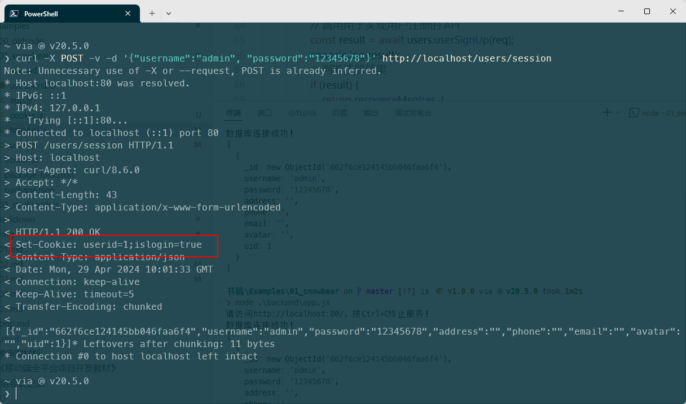
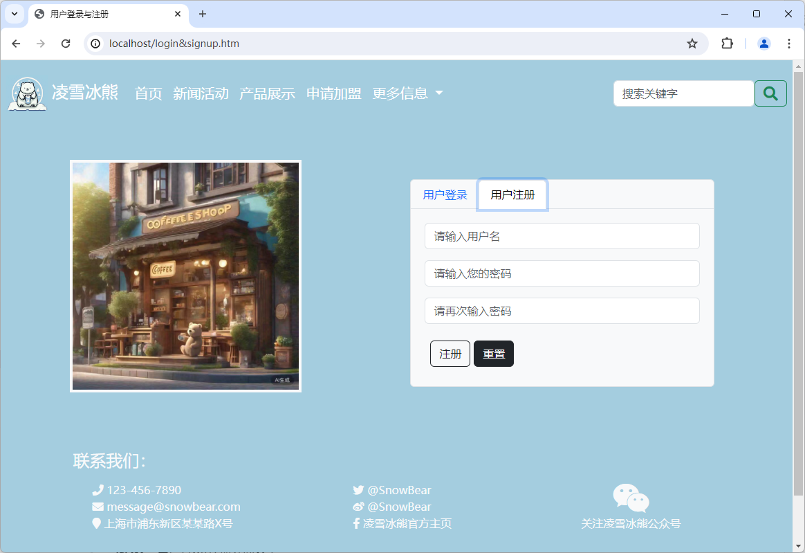
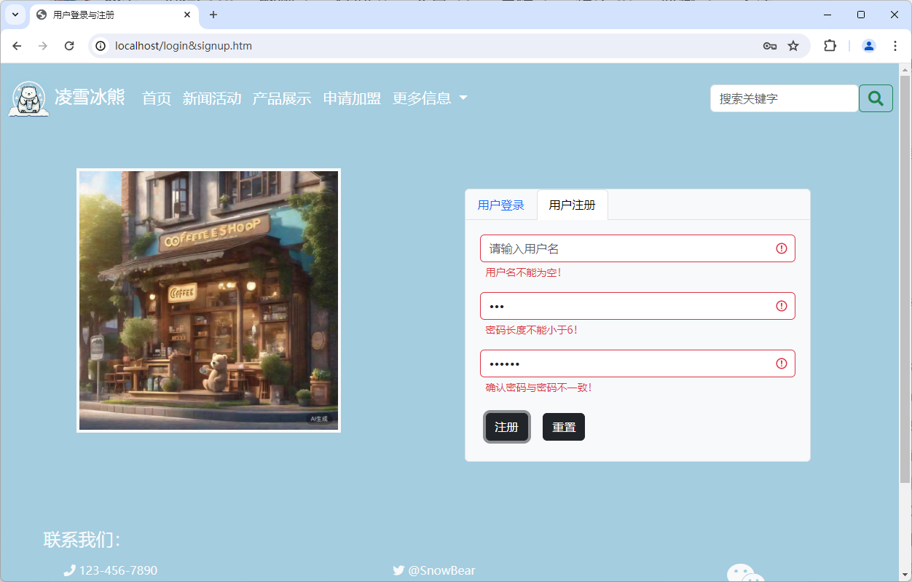
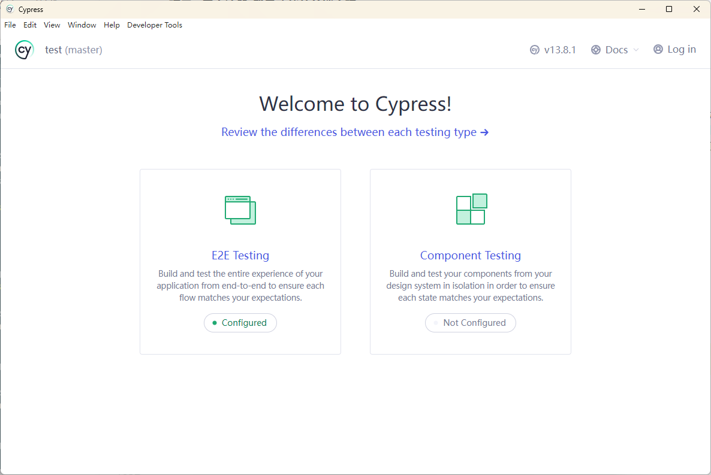
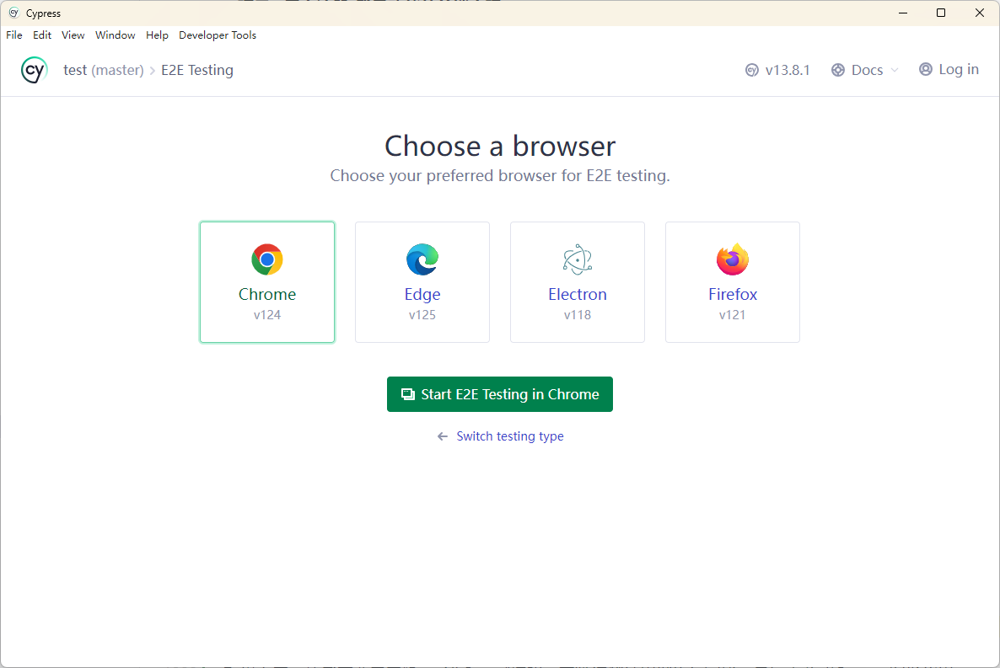
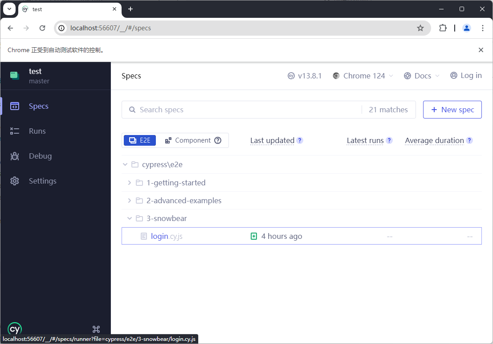
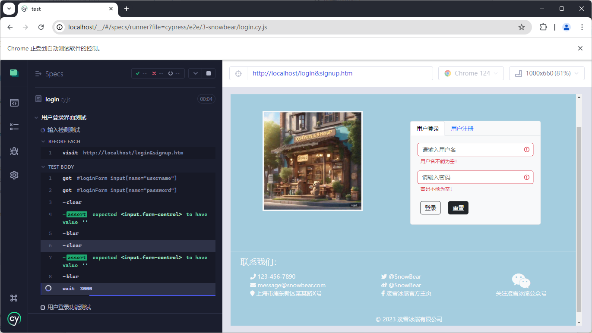

# 项目3 用户注册/登录功能的前端实现

用户注册/登录的前端实现在Web应用开发领域中属于最为简单的Web UI类项目，此类项目的开发目的是让企业的潜在客户可以通过网页浏览器来申请并使用该企业的线上服务，而不必在自己的计算设备上安装特定的客户端软件。由于这种基于B/S架构的用户界面将在很大程度上降低企业在软件产品的开发、部署、维护以及推广等方面所需要支付的人力成本和经济费用，因此它的开发也通常被认为是软件工程师在进入到Web应用开发领域时在前端部分必须掌握的项目类型之一。

## 【学习目标】

本章项目将会致力于演示如何为一家企业的官方网站实现其用户注册/登录功能的前端界面，以便其潜在的客户可以直接基于通用的网页浏览器来获取使用该企业线上服务的用户权限。通过本章项目的实践，读者将会初步了解在基于现有的后端服务来构建相应Web UI的过程中所需要执行的基本步骤，以及执行这些步骤所需要掌握的技术以及相关的工具。总而言之，在阅读完本章之后，我们希望读者能够：

- 掌握如何基于JavaScript语言来编写用于处理表单数据的前端脚本；
- 掌握如何基于RESTful规则来解析Web后端服务所返回的响应数据；
- 掌握如何基于AJAX技术来实现具有良好用户操作体验的Web UI；

## 【学习场景描述】

现在你是一位刚刚入职到“凌雪冰熊”这家连锁饮料店的软件工程师。该连锁店的领导层正在考虑将线下实体店中的部分业务扩展到线上，因此需要在部署了现有网站的Web服务中新增一个用户功能模块，让人们可以通过其网站注册为该饮料店的用户并获取使用其线上服务的权限。在开发该功能模块的项目中，你的任务是根据项目组中负责后端部分的成员所实现的HTTP API来构建用于执行注册/登录操作的Web UI。

## 【任务书】

- **项目名**：凌雪冰熊网站用户注册/登录功能的Web UI
- **委托方**：凌雪冰熊股份有限公司互联网部门
- **项目资料**：用户注册/登录功能的后端API，其具体信息如下。
  - *用户注册的API*：
    - 请求URL：`http://snowbear.com/users/newuser`
    - 请求方法：`POST`
    - 请求参数，需以JSON格式提交：
      - 用户名：`username`
      - 密码：`password`
    - 响应数据，以JSON格式返回：
      - 成功响应：`{ status: 200, message: "user_sign_up_success"}`
      - 失败响应1: `{ status: 403, message: "user_sign_up_failed"}`
      - 失败响应2: `{ status: 400, message: "request_url_error"}`
  - *用户登录的API*：
    - 请求URL：`http://snowbear.com/users/session`
    - 请求方法：`POST`
    - 请求参数，需以JSON格式提交：
      - 用户名：`username`
      - 密码：`password`
    - 响应数据，以JSON格式返回：
      - 成功响应：`{ status: 200, userData:<以JSON格式返回的用户数据>}`
      - 失败响应1: `{ status: 403, message: "user_login_failed"}`
      - 失败响应2: `{ status: 400, message: "request_url_error"}`
- **项目要求**：基于【任务书】提供的HTTP API构建出用于执行注册/登录操作的Web UI，该UI的实现应符合以下要求。
  - 该Web UI应允许人们通过网页浏览器完成用户的注册/登录；
  - 该Web UI应提供给人们不逊于桌面端应用的用户操作体验；
- **时间要求**：在5个工作日内完成；

## 【任务拆解】

整个项目的开发可以划分为以下三个小任务：

- 在Web应用的前后端之间建立一种用于保持用户登录状态的数据凭证机制；
- 构建用于执行新用户注册操作的Web UI，并与相应的后端API完成数据交互；
- 构建用于执行用户登录操作的Web UI，并与相应的后端API完成数据交互；

## 【工作准备】

虽然我们已经要求读者在正式开启本书所引导的项目实践之旅钱，需要确保自己已经具备了进行网页设计工作所需的基本技能，即HTML、CSS、JavaScript这三门计算机语言的语法规则与基本使用方法，但即便如此，将一般性的网页设计工作进阶到Web UI的构建，读者还需再做一些相关的知识准备。例如，如何基于JavaScript语言来编写用于检查用户输入、向后端提交表单数据、以及解析后端响应数据的前端脚本，如何基于AJAX技术来提高Web UI的交互体验等。在本章的【工作准备】部分中，笔者将会重点介绍这部分的知识点。同样的，如果读者觉得自己已经掌握了上述知识，也可以选择跳过本节内容，直接进入本章项目的【工作实施与交付】环节。

### 知识点1：检查并提交表单数据

由于本章项目的任务是构建用于执行注册/登录功能的Web UI，而这部分的UI通常主要是由表单元素构成的，因此读者在执行此类任务之前，首先要学会的就是如何编写用于处理表单元素的前端脚本。通常情况下，处理表单元素的前端脚本主要担负着获取表单元素、处理表单事件这两项工作。下面，就让我们分别来介绍一下这两项工作的具体内容。

#### 获取表单元素

在编写用于处理表单元素的前端脚本时，我们通常都需要先获取到该表单元素所属的DOM对象，无论接下来是要获取并检查用户所输入的数据，还是将这些数据提交给Web应用的后端服务，它都是这一系列后续操作可以执行的前提。如果读者是基于JavaScript语言来编写前端脚本的，那么这项工作主要是通过调用以下两个基于DOM的元素选择器方法来实现。

- **`querySelector()`方法**：该方法的作用是返回目标对象中第一个符合条件的元素对象，它接收一个字符串类型的调用参数，读者可以通过该参数用`#id`、`.className`、`tagName`这样的CSS选择器模式来指定要匹配的元素，例如像下面这样。

  ```JavaScript
  // 返回 document 对象中第一个 ID 值等于 box_1 的元素：
  const box_1 = document.querySelector('#box_1');
  // 返回 document 对象中第一个 class 值等于 box 的元素：
  const boxObj_1 = document.querySelector('.box');
  // 返回 document 对象中第一个标签为 div 的元素：
  const div_1 = document.querySelector('div');
  ```

- **`querySelectorAll()`方法**：该方法的作用是返回目标对象中所有符合条件的元素对象，它也同样接收一个字符串类型的调用参数，该参数的用法与`querySelector()`方法相同，也就是说，我们可以这样使用该接口：

  ```JavaScript
  // 返回 document 对象中所有 ID 值等于 box_1 的元素：
  const boxes = document.querySelectorAll('#box_1');
  // 返回 document 对象中所有 class 值等于 box 的元素：
  const boxObjs = document.querySelectorAll('.box');
  // 返回 document 对象中所有标签为 div 的元素：
  const divAll = document.querySelectorAll('div');
  ```

需要注意的是，这两个元素选择器方法不仅可以用`document`对象来调用，读者也可以在具体的DOM元素节点对象上调用它们，只不过在这种情况下，这两个方法将会在调用它的这个节点对象的子节点中选取要匹配的元素。除此之外，由于这两个方法的调用参数支持与CSS选择器相同的语法，所以读者还能通过它指定一些更为复杂的元素匹配条件，例如像下面这样。

```JavaScript
  // 返回 document 对象中第一个 class 值等于 box 的 div 元素：
  const divBox_1 = document.querySelector('div.box');
// 返回 document 对象中所有 class 值等于 box 的 div 元素：
const divBoxes = document.querySelectorAll('div.box');
```

当然了，上述方法虽然简单医用，但它们毕竟是ES6标准之后才被支持的DOM接口，如果读者在构建Web UI的过程中，需要考虑到一些版本较旧的网页浏览器，那就得需要用回以下四个较为早期的元素选择器方法了。

- `getElementById()`方法
- `getElementsByName()`方法
- `getElementsByTagName()`方法
- `getElementsByClassName()`方法

但上述接口有两个明显的问题：首先，它们的名称各不相同而且都相当长，在没有自动补齐的编程环境中是极易出错的，尤其是除了第一个接口外，其他三个接口的`Element`单词后面都有一个`s`。其次，它们的行为也并不一致，第一个接口返回的是单一元素，即使目标DOM对象中有多个匹配元素，它也只返回第一个匹配的元素。而其他三个接口返回的都是一个元素数组，即使目标DOM对象中只有一个匹配元素，它们返回的也是一个包含单元素的数组，这意味着我们还是要用读取数据的方式来获取元素对象。在过去，为了避免上述问题，开发者们只能选择使用JQuery这样的第三方库提供的接口，或者亲自动手对它们进行如下封装，例如像下面这样。

```JavaScript
function getElement(query) {
    // 如果 document 对象中存在 querySelector 方法，则直接调用它：
    if(typeof document.querySelector == 'function') {
        return document.querySelector(query);
    } else {
        // 否则，则根据 query 参数的第一个字符来判断要调用的旧版元素选择器方法
        switch(query[0]) {
            case '#':  // 如果 query 参数以 '#' 字符开头，则按元素的 id 属性来选取：
                return document.getElementById(query.substring(1));
            case '.':  // 如果 query 参数以 '.' 字符开头，则按元素的 class 属性值来选取：
                return document.getElementsByClassName(query.substring(1))[0];
            default: // 否则，则按元素的标签名来选取：
                return document.getElementsByTagName(query)[0];
        }
    }
}
```

正如读者所见，笔者在这里自己封装了一个名为`getElement()`的元素选择器函数，它的调用参数也应该是一个符合CSS选择器规则的字符串，调用方式与`document.querySelector()`方法相同。当该函数被调用时，它首先会用`typeof`操作符来判断`document`对象中是否存在一个名为`querySelector`的成员，只有该成员存在并且是该对象的一个方法时，`typeof`操作符才会返回“function”这个字符串。在这种情况下，该函数就只需直接调用`document.querySelector()`方法并返回其结果即可。但是，如果该方法不存在，那么该就需要依据CSS选择器的规则对`query`参数的值进行如下解析。

- 如果参数的值以`#`字符开头，就按元素的`id`属性来选取元素；
- 如果参数的值以`.`字符开头，那就按元素的`class`属性来选取元素；
- 如果参数的值不属于以上两种情况，就默认按元素的标签名来选取元素；

以上解决方案的思路就像是许多电子产品的接口转换器，一旦发现新的接口规格不被支持，就自动转换到旧有规格的接口上去，以确保产品的基本功能可以正常运作。

#### 处理表单事件

在获取到表单元素所属的DOM对象之后，接下来要做的就是根据用户可能在该对象上触发的操作事件来编写事件处理函数了。对于表单元素而言，前端脚本要处理的事件主要用于完成以下两种类型的任务。

- **获取并检查用户在表单元素中的输入**：处理这类任务的事件处理函数通常会被注册在表单中某个具体输入元素所特有的操作事件上，其中较为常见的包括：`<input type="text" />`、`<input type="password" />`、`<textarea>`这类文本框元素的`onkeypress`事件；`<input type="checkbox" />`、`<input type="radio" />`、`<select>`这类选择性元素的`onchange`事件；`<button>`、`<input type="button" />`这类按钮元素的`onclick`事件。举个例子，如果读者想检查用户在指定表单中的`<input type="text" id=“email” />`输入框元素中的输入是否符合邮箱地址的格式，那么就可以像下面这样来注册该元素的`keypress`事件处理函数。

  ```JavaScript
  // 定义一个用于检查用户输入是否符合邮箱地址格式的函数：
  function isEmail(emailText) {
      // 检查用户输入的文本是否符合邮箱地址的格式：
      const emailReg = /^[a-zA-Z0-9_-]+@[a-zA-Z0-9_-]+(\.[a-zA-Z0-9_-]+)+$/;
      return emailReg.test(emailText);
  }

  // 获取 document 对象中 ID 值等于 email 的元素：
  const emailObj = document.querySelector('#email');
  // 注册 emailObj 元素的 onkeypress 事件处理函数：
  emailObj.addEventListener('keypress', function(event) {
      // 获取用户输入的文本：
      const emailText = emailObj.value;
      // 检查用户输入的文本是否符合邮箱地址的格式：
      if(isEmail(emailText)) {
          // 如果符合，则将表单元素的 class 属性值修改为 'success'：
          emailObj.className = 'success';
      } else {
          // 如果不符合，则将表单元素的 class 属性值修改为 'error'：
          emailObj.className = 'error';
      }
  });
  ```

- **向Web应用的后端服务提交表单数据**：处理这类任务的事件处理函数通常会被注册在表单元素本身的`onsubmit`事件上。在默认情况下，只要用户按下表单元素中的`<input type="submit" />`按钮，就会自动按照表单的`action`属性和`method`属性中所设定的参数向Web应用的后端服务发送HTTP请求。这时候，如果开发者想在发送请求之前对表单数据做一些处理（譬如将其转换成JSON格式的字符串），就需要注册该表单元素的`onsubmit`事件处理函数，以便阻止该表单元素的默认提交动作。举个例子，对于下面这样一个表单元素。

  ```HTML
  <form id="formExample"
        action="http://snowbear.com/users/newuser" method="POST">
        <input type="text" id="email" />
        <input type="password" id="password" />
        <input type="submit" value="注册" />
  </form>
  ```

  如果读者想以JSON格式向Web应用的后端服务提交请求数据，那么就可以像下面这样来注册该表单元素的`submit`事件处理函数。

  ```JavaScript
  // 获取 document 对象中 ID 值等于 formExample 的元素：
  const form = document.querySelector('#formExample');
  // 注册 form 元素的 onsubmit 事件处理函数：
  form.addEventListener('submit', function(event) {
      // 阻止表单的默认提交行为：
      event.preventDefault();
      // 获取用户的输入并将其组织成一个数据对象：
      const userData = {
          email: form.querySelector('#email').value,
          password: form.querySelector('#password').value
      };
      // 将数据对象转换成 JSON 格式的字符串：
      const userDataJSON = JSON.stringify(userData);
      // 通过调用 fetch() 方法向后端服务发送HTTP请求：
      fetch(form.action, {
          method: form.method,
          headers: {
              'Content-Type': 'application/json'
          },
          body: userDataJSON
      }).then(function(response) {
          // 获取响应数据：
          return response.json();
      }).then(function(data) {
          // 处理响应数据：
          console.log(data);
      }).catch(function(error) {
          // 处理错误：
          console.log(error);
      });
  });
  ```

在上述`onsubmit`事件处理函数的实现中，我们首先通过调用`event.preventDefault()`这个方法阻止了表单对象的默认提交动作，然后将用户在表单中的输入组织成一个数据对象，并将其转换成JSON格式的字符串，最后再通过调用`fetch()`这个专用于提交HTTP请求的方法来向Web应用的后端服务发送这个JSON格式的字符串，并处理后者返回的响应数据。

### 知识点2：实现前后端的异步通信

在上个知识点的末尾，笔者在演示如何为表单元素的`onsubmit`事件注册事件处理函数时，使用了`fetch()`这个方法来向Web应用的后端服务发送HTTP请求，目的是以异步的方式来实现Web应用的前后端通信。在Web应用开发领域中，前后端之间的异步通信最早源自一项被称之为“AJAX”的技术。考虑到这项技术在Web UI的构建过程中起到了非常关键的作用，所以我们接下来需要专门为读者介绍一下与此相关的知识点。

#### 什么是AJAX？

AJAX是Asynchronous Javascript And XML的缩写，这一技术名词最早出现于Jesse James Garrett在2005年撰写的“Ajax: A New Approach to Web Applications”一文中，这篇文章中第一次系统性地阐述了如何利用这一技术实现浏览器与服务器之间的异步数据通信，并在不重新加载当前页面的情况下局部更新该页面上的数据，从而赋予其更好的用户体验。需要特别提醒的是，虽然AJAX中的“X”是XML的缩写，但这并不代表这项技术只能针对XML格式的数据来发送异步通信请求，它并没有数据格式上的限制，对TXT、JSON等格式的数据也一样可行。但在具体介绍如何通过异步通信的方式从服务器上获取这些格式的数据之前，我们还是应该先解释一下执行这种异步通信的必要性。

众所周知，网页浏览器与Web服务器之间的HTTP连接长期以来都被认为是种一次性的短期连接，它被限制每次连接只处理一个请求。也就是说，每当浏览器向服务器发送一次访问请求，服务器就会在返回响应内容之后立即切断自身与浏览器之间的连接。与此同时，HTTP连接还是一种无状态连接，即服务器不会记得同一个浏览器上一次请求的内容。这意味着，B/S架构之下的Web UI不可能像其他C/S架构中的客户端一样与服务器保持连续的通信状态。

所以，Web应用的前后端通信在传统模式下都是一次性的。在这一次通信中，位于前端的浏览器会首先获取HTML文档描述的界面结构，再加载以JavaScript为代表的前端脚本，然后再由脚本代码来加载界面中需要呈现的数据，这一系列动作是一个连贯的、不可分割的整体。而且由于HTTP连接无状态的特性，Web应用的后端也不记得前端上一次请求的内容，自然无法通过比较两次请求内容的差异，从中剥离出变化了的部分返回给前端。这一切反映到应用软件的用户体验上，就变成了任何一丁点儿的前后端之间的数据通信都会导致整个用户界面的重新加载，这就是Web应用传统的“发送请求-等待响应”交互模式。这种用户体验极差的交互模式在相当长一段时间里都是人们拒绝基于B/S架构来开发应用软件的主要因素之一。而正如我们之前所说，JavaScript解决这一问题的核心思路，就是用异步操作为数据类通信单独发送请求，这样浏览器就不必向服务器发送访问整个页面的请求了。

事实上，早在Garrett提出AJAX这个专用术语之前，开发者们就已经在利用各种变通手段来实现浏览器与服务器之间的异步数据通信了，例如在HTML文档中使用隐藏式的`<iframe>`元素来执行额外的数据请求任务，或者使用Java applet或Flash中的相关功能等。但由于这些方法使用的工具都不是专用于异步数据通信的，所以在具体使用时总是会遇到这样那样的问题，效果不尽如人意。而AJAX的独到之处就是提出了`XMLHttpRequest`这个专用来处理异步数据通信的对象，它能更为流畅地完成向服务器发送请求、并解析服务器响应数据的任务。所以在ES6标准提出`fetch()`这个专用的异步通信API之前，学习`XMLHttpRequest`对象并熟练掌握它的使用方法是Web应用的开发者必须要掌握的基础技能之一，即使在`fetch()`出现之后，如果读者希望自己构建的Web应用在网页浏览器这一端拥有最大限度的兼容性，也应该了解一下该对象的基本使用方法。

#### `XMLHttpRequest`对象简介

`XMLHttpRequest`对象最初来自于微软的IE5浏览器，它原本是后者MSXML库中的一个ActiveX对象。但随着AJAX技术被广泛运用，如今绝大部分网页浏览器也都已经提供了相同的对象实现。这也就是说，`XMLHttpRequest`对象某种程度上已经成为了当下主流浏览器事实上的标准组件，所以在通常情况下（或者说在IE7及其之后出现的主流浏览器中），我们都可以直接通过`new`操作符来创建`XMLHttpRequest`对象，像这样：

```JavaScript
const xhr = new XMLHttpRequest();
```

当然，如果读者不得不考虑IE6等老版本的浏览器，也可以考虑将创建`XMLHttpRequest`对象的操作封装成一个兼容新老浏览器的函数，然后再用它来创建对象，具体如下。

```JavaScript
function createXMLHttpRequest() {
    if (window.XMLHttpRequest) { // Chrome、Firefox、Safari、IE7+ ...
        return new XMLHttpRequest();
    } else if (window.ActiveXObject) { // IE6 及更老版本的 IE 浏览器
        return new ActiveXObject("Microsoft.XMLHTTP");
    } else {
        throw new Error('你的浏览器不支持 XMLHttpRequest 对象！');
    }
}

const xhr = createXMLHttpRequest();
```

在创建了该对象之后，就可以开始使用该对象提供接口了，以下是该对象的一些常用接口：

- **`readyState`属性**：只读属性，作用是返回一个用于表示请求状态的枚举值，下面是各枚举值代表的含义：
  - UNSET：请求处于未初始化状态。
  - OPENED：请求处于启动状态。
  - HEADERS_RECEIVED：请求处于发送状态。
  - LOADING：请求处于接收响应数据的状态。
  - DODE：请求处于任务完成的状态。
- **`response`属性**：只读属性，作用是返回`XMLHttpRequest`对象从服务器上接收到响应内容，其具体值的类型取决于`XMLHttpRequest.responseType`的值。
- **`responseText`属性**：只读属性，作用是以纯文本的格式返回`XMLHttpRequest`对象从服务器上接收到响应内容，如果请求未成功或尚未发送，则返回 null。
- **`responseType`属性**：该属性是一个枚举值，用于表示响应数据的类型，具体如下：
  - "text" ：表示响应数据为纯文本类型的字符串对象，这是其默认类型（该枚举值也可以是个空字符串：""）。
  - "arraybuffer"：表示响应数据为`ArrayBuffer`类型的二进制数组对象。
  - "blob" ：表示响应数据为`Blob`类型的对象。
  - "document"：表示响应数据为一个HTML或XML格式的数据对象。
  - "json"：表示响应数据为一个JSON格式的数据对象。
- **`responseURL`属性**：只读属性，作用是返回响应数据所在的URL，如果该URL为空，则返回空字符串。
- **`responseXML`属性**：只读属性，作用是以XML DOM对象的格式返回`XMLHttpRequest`对象从服务器上接收到响应内容，如果请求未成功、尚未发送或时不能被解析为XML或HTML，则返回`null`。
- **`status`属性**：只读属性，作用是以数字的形式返回`XMLHttpRequest`对象发送请求完成之后得到的响应状态值，譬如200代表响应正常，404代表其请求的内容不存在等。
- **`statusText`属性**：只读属性，作用是以文本的形式返回`XMLHttpRequest`对象发送请求完成之后得到的响应状态。与`status`属性不同的是，它包含完整的响应状态文本（例如，"200 OK"）。
- **`timeout`属性**：该属性可被赋予一个无符号长整型的数值，用于设置`XMLHttpRequest`对象所发送请求的最大请求时间（单位为毫秒），一旦某次请求所用的时间超出了该属性被设定的值，就会被自动终止。
- **`upload`属性**：只读属性，作用是返回一个用来表示上传进度的`XMLHttpRequestUpload`对象，我们可以通过响应该对象事件的方式来追踪数据上传的进度。下面我们就具体来介绍一下可在该对象上注册的一些事件处理函数：
  - **`onloadstart`事件处理函数**：在数据上传开始时被调用。
  - **`onprogress`事件处理函数**：在数据上传的过程中一直被调用，所以建议不要执行太复杂的操作。
  - **`onabort`事件处理函数**：在数据上传过程被中止时被调用。
  - **`onerror`事件处理函数**：在数据上传失败时被调用。
  - **`onload`事件处理函数**：在数据上传成功时被调用。
  - **`ontimeout`事件处理函数**：在数据上传未在用户规定的时间内完成时被调用。
  - **`onloadend`事件处理函数**：在数据上传的过程完成时被调用（不论上传成功与否）。
- **`withCredentials`属性**：该属性是一个布尔类型的值，用于设置`XMLHttpRequest`对象是否该使用类似 cookies、authorization headers（头部授权）或TLS客户端证书这一类认证机制来创建一个跨域请求。
- **`abort()`方法**：该方法会在请求已被发送的情况下，于收到响应之前中止请求。
- **`getAllResponseHeaders()`方法**：该方法以字符串的形式返回所有用CRLF分隔的响应头，如果请求没有收到响应，则返回`null`。
- **`getResponseHeader()`方法**：该方法会返回包含指定响应头的字符串，如果请求没有收到响应或在收到的响应中不存在该报头，则返回 null。
- **`open()`方法**：该方法的作用是初始化`XMLHttpRequest`对象要发送的请求。
- **`overrideMimeType()`方法**：该方法会重写由服务器返回的MIME类型。
- **`send()`方法**：该方法用于发送请求。如果请求是异步的（默认），那么该方法将在请求发送后立即返回。
- **`setRequestHeader()`方法**：该方法用于设置HTTP请求头的值，它必须在`open()`之后、`send()`之前被调用。
- **`onreadystatechange`事件处理函数**：该事件处理函数会在其所在`XMLHttpRequest`对象的`readyState`属性值发生变化时被调用。

和之前一样，由于我们并不打算将本书写成一本照本宣科式的参考手册，所以上面列出的这些只是`XMLHttpRequest`对象中最常用的，且被大多数主流浏览器支持的属性、方法与事件处理函数，并不是该对象提供的所有接口。如果有读者希望更完整地了解`XMLHttpRequest`对象的所有细节，那么他还需要去查阅专门的技术文档。

在了解了`XMLHttpRequest`对象的常用接口之后，我们就可以具体来介绍一下该如何用它来异步数据通信了。下面，先来看一下用`XMLHttpRequest`对象与服务器进行异步通信的基本操作：

```JavaScript
// 第一步：创建 XMLHttpRequest 对象
// 在这里，我们会调用之前封装的createXMLHttpRequest()函数
const xhr = createXMLHttpRequest();
// 第二步：初始化请求
xhr.open('GET', '[某个URL]', true);
// 第三步：向服务器发送请求
xhr.send(null);
// 第四步：处理服务器的响应
xhr.addEventListener('readystatechange', function() {
    if(xhr.readyState === XMLHttpRequest.DONE) {
        if(xhr.status >= 200 && xhr.status < 300 || xhr.status == 304) {
            // 处理响应数据
            console.log(xhr.response);
        } else {
            throw new Error('请求数据失败！');
        }
    }
});
```

在这里需要特别说明一件事：出于安全方面的考虑，许多浏览器在默认情况下会禁止JavaScript代码进行跨域访问。所谓的跨域访问，指的是客户端的JavaScript代码在当前域名（包含端口号）下访问另一域名（或相同域名的不同端口号）所指向的服务端资源。例如，如果我们要想让在`example1.com`域名下的JavaScript脚本向`example1.com`域名下的资源发送异步请求，这就是一次跨域访问。所以读者在编写Web应用之前，应该先了解一下如何在当前域名所指向的服务端上做一些资源获取方面的处理工作，以避免这种跨域访问资源。

当然了，在基于`XMLHttpRequest`对象进行编程一段时间之后，读者就会发现他们每次要编写的代码都大同小异，基本上就是上述基本步骤的小幅调整，有时是调用参数会有些许不同，有时是请求的初始化设置多了几个，但总体而言，代码的重复率是高的。每当遇到这种情况时，我们就应该要考虑将这些重复的部分封装成若干个的工具函数以供日常调用，以减少代码的重复率，提高我们的编码效率。下面，我们就以请求类型的不同来封装一个用于发送“GET”请求的`ajax_get()`函数和一个用于发送“POST”请求的`ajax_post()`函数，以作示范。

现在，让我们先来封装用来发送“GET”请求的`ajax_get()`函数。由于这种请求方式相对简单，即使要向服务器发送数据，这些数据也是以参数的形式被写在要请求的URL中，所以我们只需要给该函数两个调用参数，第一个用于设置URL，第二个用于定义响应数据的回调函数，其具体编码如下：

```JavaScript
function ajax_get(url, func) {
    const xhr = createXMLHttpRequest(); // 此处依然使用之前封装的创建函数
    xhr.open('GET', url, true);
    xhr.send(null);
    xhr.addEventListener('readystatechange', function() {        
        if(xhr.readyState === XMLHttpRequest.DONE) {
            if(xhr.status >= 200 && xhr.status < 300 || xhr.status == 304) {
                func(xhr.response);
            } else {
                throw new Error('请求数据失败！');
            }
        }
    });
}
```

有了这个函数之后，当我们要用 AJAX 方式发送异步的“GET”请求时就只需要像下面这样调用它即可：

```JavaScript
// 在这里，我们假设当前页面上有一个 ID 值为 linkExample 的超链接元素：
const link = document.querySelector('#linkExample');
link.onclick = function(event) {
    ajax_get(link.href, function(data){
        // 处理响应数据，例如，将其输出到控制台中：
        console.log(data);
    });
 }
```

接下来，我们再来封装用于发送“POST”请求的`ajax_post()`函数。由于这类请求通常用于提交表单数据，所以该函数的形参除了用于设置 URL 的字符串和用于处理响应数据的回调参数，还需要一个传递表单数据的形参，其具体编码如下：

```JavaScript
function ajax_post(url, sendData, func) {
    const xhr = createXMLHttpRequest(); // 此处依然使用之前封装的创建函数
    xhr.open('POST', url, true);
    // 设置发生数据的格式为JSON格式
    xhr.setRequestHeader('Content-Type', 'application/json');
    // 发送JSON格式的字符串数据
    xhr.send(JSON.stringify(sendData));
    xhr.addEventListener('readystatechange', function() {        
        if(xhr.readyState === XMLHttpRequest.DONE) {
            if(xhr.status >= 200 && xhr.status < 300 || xhr.status == 304) {
                func(xhr.response);
            } else {
                throw new Error('请求数据失败！');
            }
        }
    });
}
```

同样地，在有了这个函数之后，当我们要用 AJAX 方式发送异步的“POST”请求时就只需要像下面这样调用它即可：

```JavaScript
// 在这里，我们假设当前页面上有一个 id 值为 formExample 的表单元素：
const form = document.querySelector('#formExample');
form.addEventListener('submit', function(event) {
    event.preventDefault(); // 阻止表单的默认提交行为
    // 获取表单中的数据
    const formData = {
        username: form.username.value,
        password: form.password.value
    };
    ajax_post(form.action, formData, function(data){
        // 处理响应数据，例如，将其输出到控制台中：
        console.log(data);
    });
});
```

#### 专用的异步通信API

在实际的项目实践中，开发者们基于“不要重复发明轮子”的原则，很少会直接基于`XMLHttpRequest`对象的接口来进行编程。即使在ES6标准推出`fetch()`这个方法之前，他们通常情况下也会通过引入像`jQuery`这样的第三方扩展来使用一些封装了`XMLHttpRequest`对象的、专用于前后端异步通信的API。例如，下面是一个使用jQuery的`ajax()`方法来发送异步请求的示例：

```JavaScript
// 在这里，我们假设当前页面上有一个 id 值为 formExample 的表单元素：
const form = document.querySelector('#formExample');
form.addEventListener('submit', function(event) {
    event.preventDefault(); // 阻止表单的默认提交行为
    // 获取表单中的数据
    const formData = {
        username: form.querySelector('#username').value,
        password: form.querySelector('#password').value
    };
    $.ajax({
        url: form.action,
        type: form.method,
        data: formData,
        success: function(data){
            // 处理响应数据，例如，将其输出到控制台中：
            console.log(data);
        },
        error: function(xhr, status, error){
            // 处理错误信息
            console.log(error);
        }
    });
});
```

当然了，在`fetch()`方法推出之后，由于它本身除封装了`XMLHttpRequest`对象之外，还支持以`Promise`对象的形式来处理异步操作，这使它成为了更受Web开发者欢迎的、专用于前后端异步通信的API。因为这意味着，开发者在使用该方法时，除了能使用我们在上个知识点中示范过的基于`then()`、`catch()`、`finally()`这三个方法的调用链之外，还能基于`async/await`关键字用更为直观的语法来处理前后端的异步通信任务。例如，下面是一个使用`fetch()`方法来发送异步请求的示例：

```JavaScript
// 在这里，我们假设当前页面上有一个 id 值为 formExample 的表单元素：
const form = document.querySelector('#formExample');
form.addEventListener('submit', async function(event) {
    event.preventDefault();    
    const formData = {
        username: form.querySelector('#username').value,
        password: form.querySelector('#password').value
    };
    try {
        const response = await fetch(form.action, {
            method: form.method,
            headers: {
                'Content-Type': 'application/json'
            },
            body: JSON.stringify(formData)
        });
        const data = await response.json();
        console.log(data);
    } catch(error) {
        console.log(error);
    }
});
```

下面，让我们基于上述示例来简单介绍一下`fetch()`方法的基本使用方法。通常情况下，我们在调用该方法时常需要提供以下参数：

- **`url`**：该参数用于指定要请求的URL，例如在上述示例中，我们将其设置成了表单对象的`action`属性值，它通常是Web后端服务中用于处理该表单请求的API所在的URL。
- **`init`**：该参数用于设置请求的初始化参数，它的值是一个常包含以下属性的对象：
  - **`method`**：该参数用于设置请求的类型，例如GET、POST、PUT、DELETE等，在上述示例中，我们将其设置成了表单对象的`method`属性值，这将是该表单元素被触发`onsubmit`事件时所要发送的请求类型。
  - **`headers`**：该参数用于设置请求的头部信息，它的值是一个常包含以下属性的对象：
    - **`Content-Type`**：该参数用于指定请求的MIME类型，我们常通过该属性来设置请求数据的格式，例如`application/json`代表的是JSON格式、`application/x-www-form-urlencoded`代表的是URL编码格式等。
    - **`Content-Length`**：该参数用于指定请求的正文数据的长度。
  - **`body`**：该参数用于指定请求的正文数据，例如在上述示例中，我们将其设置成了一个JSON格式的字符串，它是表单元素经相关前端脚本处理之后，要提交给Web后端服务的数据。

需要强调的是，这里所介绍的只是`fetch()`方法的基本使用方法，这些内容大体上可以帮助读者本章项目所需要执行的任务。但如果读者想要更为全面地掌握这个方法，那么就还需要进一步去阅读[MDN](https://developer.mozilla.org/zh-CN/docs/Web/API/Fetch_API/Using_Fetch)网站上的相关文档。

### 知识点3：保持用户的登录状态

正如之前所说，HTTP在很长一段时间内都被认知为是一种无状态的连接协议（在HTTP长连接出现之前）。这意味着，网页浏览器每一次向Web服务器发送的请求时都会自认为是第一次向该Web服务器发送请求，它不会记得上一次向服务端发送了什么请求。同样的，接收请求的Web服务器也不会记得该网页浏览器上一次访问请求了什么。换言之，如果开发者不采取任何额外的措施，Web应用的用户在完成登录操作之后，只要刷新一下当前页面或者跳转到同一应用的另一个页面上，就会因失去登录状态而需要重新登录，这对于Web应用的用户体验来说显然是不可接受的。为了解决这一问题，Web应用的开发者们通常都会选择在网页浏览器中存储一些数据，以便在用户成功执行了登录操作之后，Web应用就应该在网页浏览器中存储一些能维持该用户登录状态的数据。目前Web应用开发领域对于这类问题的方案有很多，下面先来介绍一种最简单的解决方案：Cookie。

从技术实现的角度上来说，读者可以将Cookie理解成是网页浏览器中用于存储某种特定字符串的一个容器对象，而该字符串就是Web应用的前后端之间在进行通信时必须要携带的数据凭证，使用该数据凭证的基本步骤如下：

1. 由Web服务器在响应某一特定请求时向网页浏览器发送该数据凭证，例如在响应用户登录请求时发送一个代表了登录许可的数据凭证给网页浏览器；
2. 由Web UI接收来自Web服务器的、代表了登录许可的数据凭证，并将其保存在其当前所在网页浏览器的Cookie中；
3. 之后Web UI在每次向同一Web服务器发送时都会自动从网页浏览器的Cookie中读取这一数据凭证，并将其添加在其要发送的请求数据中，然后一并发送给该服务器；

按照Cookie的定义，这个用于充当数据凭证的字符串应该是一连串用`[name]=[value]`格式编码而成的数据项，而每个数据项之间则用`;`分割。例如在某个Web应用的用户功能模块中，如果我们约定其前后端之间用于识别彼此的凭证是带有`userid`和`islogin`这两项信息的数据，那么其存储在Cookie中的字符串应该是这样的：

```Cookie
userid=1;islogin=true
```

另外在某些情况下，开发者们还会为该数据凭证设置以下数据项：

- **`Path`**：该选项设置的是Cookie对应的请求路径。也就是说，如果设置了`Path`选项，当前的Cookie就只有在浏览器请求该选项指定的路径时才有效。如果不设置该选项，当前Cookie就对同一应用下的所有请求路径都有效。
- **`Expires`**：该选项设置的是Cookie的有效时间。设置`Expires`选项需要使用一个UTC格式的字符串来指定当前Cookie的具体到期时间。如果不设置该选项，Cookie的有效期就到浏览器结束当前会话为止。
- **`Max-Age`**：该选项设置的也是Cookie的有效时间，但它的设置方式不是其失效的具体时间点，而是指定当前Cookie在多久之后失效，默认时间单位是秒。
- **`HttpOnly`**：该选项用于禁止浏览器修改当前Cookie。也就是说，如果设置了`HttpOnly`选项，我们在前端就不能通过`document.cookie`这个对象来修改当前Cookie了。
- **`Source`**：该选项用于指定当前Cookie只能在HTTPS连接中传播，目的是进一步保障安全性。

例如，如果读者想将上面的示例修改为只针对`/`路径有效，且有效时间为一个小时的数据凭证，就可以将其修改如下：

```Cookie
userid=1;islogin=true;Path=/;Max-Age=3600
```

总而言之，Cookie中存储的就是一个可被附带在请求数据和响应数据的头部信息中的一个字符串。开发者们可以通过在该字符串中设置少量的数据凭证，以此达到相互识别的效果。这就是目前解决在Web前端端保存用户登录状态的。最简单的解决方案。该解决方案的优点在于：

- **可配置有效时间**：Cookie中存储的数据既可以在网页浏览器结束当前会话时失效，也可以在其中保留三十天，甚至更久，这取决于网页浏览器所允许的最长有效期。
- **结构简单**：Cookie是一种基于文本的、轻量结构的容器对象，其中所存储的基本上只是一个由若干个简单的键值对组成的字符串。
- **数据持久性**：虽然Cookie的有效时间取决于我们为其配置的有效时间以及网页浏览器本身的一些规则，但Cookie通常依然是Web应用在网页浏览器这一端持续时间最长的数据保留形式。

当然， Cookie的缺点也是显而易见的，主要在以下几个方面：

- **大小受到限制**：由于Cookie需要被放在请求数据和响应数据的头部信息中来回传输，如果在其中设置太多数据是会影响请求和响应速度的，所以大多数网页浏览器对Cookie中存储的数据大小有一定的限制，一般都会被限制在4KB到8KB之间。
- **存在安全风险**：从技术理论的角度上来说，用户是完全有能力，也有可能会在浏览器端篡改Cookie数据的，这无疑会带来一定程度的安全风险。虽然开发者们也可以选择对Cookie中存储的数据进行加密和解密，但这需要进行额外的编码，并且因为加密和解密需要耗费一定的时间而影响应用软件的性能。
- **可能被用户禁用**：正是因为存在着安全风险，有些用户可能会直接选择禁用了网页浏览器中与Cookie相关的功能。一旦出现这种情况，该解决方案就根本起不了作用了。

## 【工作实施和交付】

在完成了上述工作准备之后，读者现在就可以根据之前【任务书】中的要求来着手为凌雪冰熊网站实现用户功能模块的前端部分了，该项目的实施过程可以分为以下步骤来进行。

### 第1步：创建用于保持用户登录状态的凭证机制

在这一步骤中，软件工程师的主要任务是在Web应用的前后端之间创建一个可用于保持用户登录状态的凭证机制。正如本章之前所介绍的那样，这种凭证机制可以通过在前后端之间传递Cookie格式的数据来实现。和XML、JSON等格式的数据一样，Cookie数据对JavaScript脚本来说也只是一个普通的字符串而已。因此，这一步骤的任务本质上要执行的就是这些字符串的解析或序列化工作。在Web应用的前端部分，这些任务可以通过调用`document.cookie`这个对象提供的接口来完成，而在后端部分，读者也可以基于Cookie规则来自定义一个类似的专用模块，以便提高自己的工作效率，其具体操作如下。

1. 使用VS Code编辑器打开之前创建的`01_snowbear`项目，然后在项目根目录下的`backend`目录中为创建一个名为`Cookie.js`的模块文件，并在其中输入如下代码。

    ```JavaScript
    // 将 Cookie 数据解析成 JavaScript 对象：
    module.exports.parse = function(cookiesString) {
        let cookies = {};
        if(!cookiesString) {
            return cookies;
        }
        const tmpList = cookiesString.split(';');
        for(let i = 0; i < tmpList.length; ++i) {
            const pair = tmpList[i].split('=');
            cookies[pair[0].trim()] = pair[1];
        }
        return cookies;
    }
    
    // 将 JavaScript 对象序列化成 cookie 数据：
    module.exports.serialize = function(cookies) {
        const pair = new Array();
        for(const name in cookies) {
            pair.push(`${name}=${cookies[name]}`);
        }
        return pair.join(';');
    }
    ```

2. 继续在VS Code编辑器重新打开之前在上一章中创建的`02_snowbear/backend/httpApi.js`文件，然后在该文件的头部添加下面这样一行代码，以便导入`Cookie.js`模块文件，并创建一个可用于调用该模块接口的实例。

    ```JavaScript
    const cookie = require('./Cookie');
    ```

3. 接着在上述`httpApi.js`文件中找到用于处理用户登录请求的代码，并将之前注释掉的，与Cookie相关的代码重新启用，具体如下。

    ```JavaScript
    // 以下代码位于 postReques() 方法的定义中
    postRequest: async function (req, res) {
        this.parseUrl(req, res, async function(reqParam) {
            if (reqParam === 'newuser') {
                // 此处省略处理用户注册的代码
            } else if (reqParam === 'session') {
                // 调用用于实现用户登录的 API
                const result = await users.userLogin(req);
                // 判断登录结果
                if (result) {
                    res.writeHead(200, {
                        // 此处以头信息的形式向前端发送 Cookie 数据
                        'Set-Cookie': cookie.serialize({
                            'userid': result.uid,
                            'islogin': true
                        }),
                        "Content-Type": "application/json"
                    });
                    res.end(JSON.stringify(result));
                } else {
                    return responseMsg(res, {
                        status: 400,
                        message: 'user_login_failed'
                    })
                }
            } else {
                return responseMsg(res, {
                    status: 400,
                    message: 'request_url_error'
                });
            }
        })
    },
    // 此处省略其他代码
    ```

4. 在保存了上述代码之后，读者可以试着重新启动一下该Web应用的后端服务，然后再用CURL命令行工具模拟一次成功的用户登录请求（加上`-v`参数），就可以看到它发送给前端的Cookie数据了，其效果如图3-1所示。

    

    **图3-1**：用户登录成功后的Cookie数据

5. 如果上述操作一切顺利，读者就可以将当前步骤所获得的进展提交给git版本控制系统了，具体命令如下。

    ```bash
    git add .
    git commit -m "项目3：创建用于保持用户登录状态的凭证机制"
    ```

### 第2步：创建用于执行用户登录操作的Web UI

在这一步骤中，软件工程师的主要任务是基于项目【任务书】中提供的、用于执行用户登录操作的后端HTTP API来创建相应的Web UI。为此，读者需要执行以下操作。

1. 回到之前创建的`01_snowbear`项目中，然后在项目根目录下的`frontend/static`目录中找到名为`template.htm`的网页设计模板，并基于该模板文件创建一个名为`login&signup.htm`的HTML文件。

2. 使用VS Code编辑器打开刚刚创建的`login&signup.htm`文件，然后其中找到`<!-- 在此处填充网页的主体内容 -->`这行注释所在的位置，并在该位置上插入如下代码。

   ```html
   <section class="row">
        <aside class="col-5 text-center mx-2 p-0">
            
        </aside>
        <aside class="col-5 my-4 offset-md-1 p-1">
            <div id="webUI" class="border rounded text-bg-light">
                <ul class="nav nav-tabs" role="tablist">
                    <li class="nav-item" role="presentation">
                        <button class="nav-link active" id="loginTab-tab" 
                            data-bs-toggle="tab" data-bs-target="#loginTab" 
                            aria-controls="loginTab" aria-selected="true">
                            用户登录
                        </button>
                    </li>
                    <li class="nav-item" role="presentation">
                        <button class="nav-link" id="signupTab-tab"
                            data-bs-toggle="tab" data-bs-target="#signupTab"
                            aria-controls="signupTab" aria-selected="false">
                            用户注册
                        </button>
                    </li>
                </ul>
                <div class="tab-content container p-1">
                    <div class="tab-pane fade show active" id="loginTab"
                        role="tabpanel" aria-labelledby="loginTab-tab">
                        <!-- 在此处插入用于执行用户登录操作的表单元素 -->
                    </div>
                    <div class="tab-pane fade" id="signupTab" 
                        role="tabpanel" aria-labelledby="signupTab-tab">
                        <!-- 在此处插入用于执行用户注册操作的表单元素 -->
                    </div>
                </div>
            </div>
        </aside>
   </section>
   ```

3. 继续在上述代码中找到`<!-- 在此处插入用于执行用户登录操作的表单元素 -->`这行注释所在的位置，并在该位置上插入如下代码。

    ```html
    <form class="p-3 m-0" id="loginForm"
        method="post" action="http://localhost/users/session">
        <div class="mb-3">
            <input type="text" class="form-control" 
                name="username" placeholder="请输入用户名">
            <div id="checkname" class="mx-2"></div>
        </div>
        <div class="mb-3">
            <input type="password" class="form-control" 
                name="password" placeholder="请输入密码">
            <div id="checkpwd" class="mx-2"></div>
        </div>
        <div class="mt-3 p-2">
            <button type="submit" 
                class="btn btn-light btn-outline-dark">
                登录
            </button>
            <button type="reset" 
                class="btn btn-dark mx-3">
                重置
            </button>
        </div>
    </form>                 
    ```

4. 下面来编写一下用于处理上述表单元素的JavaScript脚本。为此，读者需要继续在上述`frontend/static`目录下创建一个名为`scripts`的子目录，并在其中创建一个名为`login&signup.js`的模块文件，并在其中输入如下代码。

    ```JavaScript
    // 以下是一些表单的通用处理代码
    // 添加输入提示信息
    function addHint(form, divid, hintText) {
        const hint = form.querySelector('#' + divid);
        hint.innerHTML = hintText;
        hint.classList.add('invalid-feedback');
    }
    // 移除输入提示信息
    function removeHint(form, divid) {
        const hint = form.querySelector('#' + divid);
        hint.innerHTML = '';
        hint.classList.remove('invalid-feedback');
    }
    // 移除文本框验证样式
    function removeValidation(input) {
        input.classList.remove('is-valid');
        input.classList.remove('is-invalid');
    }
    // 检查用户名文本框的输入
    function checkUsername(form) {
        const inputText = form.username;
        if (!inputText.value) {
            // 用户名为空时的处理逻辑
            inputText.classList.add('is-invalid');
            addHint(form,'checkname', '用户名不能为空！');
        } else if(!/^[a-zA-Z0-9]+$/.test(inputText.value)) {
            // 用户名包含非法字符时的处理逻辑
            inputText.classList.add('is-invalid');
            addHint(form, 'checkname', '用户名只能包含字母和数字！');
        } else {
            // 用户名合法时的处理逻辑
            inputText.classList.remove('is-invalid');
            removeHint(form, 'checkname');
            inputText.classList.add('is-valid');
        }
    }
    // 检查密码文本框的输入
    function checkPassword(form) {
        const inputText = form.password;
        if (!inputText.value) {
            // 密码为空时的处理逻辑
            inputText.classList.add('is-invalid');
            addHint(form, 'checkpwd', '密码不能为空！');
        } else if(inputText.value.length < 6) {
            // 密码长度小于6时的处理逻辑
            inputText.classList.add('is-invalid');
            addHint(form, 'checkpwd', '密码长度不能小于6！');
        } else {
            // 密码输入合法时的处理逻辑
            inputText.classList.remove('is-invalid');
            removeHint(form, 'checkpwd');
            inputText.classList.add('is-valid');
        }
    }

    // 以下代码用于处理 id="loginForm" 的表单元素
    const loginForm = document.querySelector('#loginForm');
    // 在用户名文本框获得焦点时移除输入提示信息
    loginForm.username.addEventListener('focus', function() {
        this.classList.remove('is-invalid');
        this.classList.remove('is-valid');
        removeHint(loginForm, 'checkname');
    });
    // 在用户名文本框失去焦点时检查输入
    loginForm.username.addEventListener('blur', function() {
        checkUsername(loginForm);
    });
    // 在密码文本框获得焦点时移除输入提示信息
    loginForm.password.addEventListener('focus', function() {
        this.classList.remove('is-invalid');
        this.classList.remove('is-valid');
        removeHint(loginForm, 'checkpwd');
    });
    // 在密码文本框失去焦点时检查输入
    loginForm.password.addEventListener('blur', function() {
        checkPassword(loginForm);
    });
    // 提交表单时的处理逻辑
    loginForm.addEventListener('submit', async function(event) {
        event.preventDefault(); // 阻止表单默认提交行为
        // 检查表单是否通过验证
        if (!loginForm.username.value || !loginForm.password.value) {
            // 用户名或密码为空时的处理逻辑
            checkUsername(loginForm);
            checkPassword(loginForm);
            return;
        }
        // 收集表单数据
        const formData = {
            username: loginForm.username.value,
            password: md5(loginForm.password.value)
        };
        console.log(formData);
        // 发送用户登录请求
        try {
            const res = await fetch(loginForm.action, {
                method: loginForm.method,
                headers: {
                    'Content-Type': 'application/json'
                },
                body: JSON.stringify(formData)        
            });
            if(res.status == 200) {
                // 登录成功时的处理逻辑
                const data = await res.json()
                document.cookie = `userid=${data.uid}`;
                window.location.href = '/userinfo.htm';
            } else if(res.status == 403) {
                // 登录失败时的处理逻辑
                window.alert('登录失败');
            }
        } catch(error) {
            // 请求出错时的处理逻辑
            window.alert('请求出错');
        }
    })
    // 重置表单的处理逻辑
    loginForm.addEventListener('reset', function() {
        // 清除表单输入提示
        removeHint(this, 'checkname');
        removeHint(this,'checkpwd');
        // 清除表单验证样式;
        removeValidation(loginForm.username);
        removeValidation(loginForm.password);
        // 重置表单
        loginForm.reset();
        
    })
    ```

5. 在保存了上述代码之后，读者可以试着重新启动一下该Web应用的前端服务，然后再用浏览器打开当前步骤所创建的`login&signup.htm`文件，就可以看到它所呈现的界面效果了。例如，图3-2中所示的是该Web UI在用户输入不符合规则时的显示效果。

    

    **图3-2**：用于执行用户登录操作的Web UI

6. 接下来，读者需要将当前步骤所获得的进展提交给git版本控制系统了，具体命令如下。

    ```bash
    git add .
    git commit -m "项目3：创建用于执行用户登录操作的Web UI"
    ```

### 第3步：创建用于执行用户注册操作的Web UI

在这一步骤中，软件工程师的主要任务是基于项目【任务书】中提供的、用于执行用户注册操作的后端HTTP API来创建相应的Web UI。为此，读者需要执行以下操作。

1. 在VS Code编辑器中重新打开之前创建的`login&signup.htm`文件，然后其中找到`<!-- 在此处插入用于执行用户注册操作的表单元素 -->`这行注释所在的位置，并在该位置上插入如下代码。

    ```html
    <form class="p-3 m-0" id="signupForm"
        method="post" action="http://localhost/users/newuser">
        <div class="mb-3">
            <input type="text" class="form-control" 
                name="username" placeholder="请输入用户名">
            <div id="checkname" class="mx-2"></div>
        </div>
        <div class="mb-3">
            <input type="password" class="form-control" 
                name="password" placeholder="请输入您的密码">
            <div id="checkpwd" class="mx-2"></div>
        </div>
        <div class="mb-3">
            <input type="password" class="form-control" 
                name="confirmpwd" placeholder="请再次输入密码">
            <div id="confirmpwd" class="mx-2"></div>
        </div>
        <div class="mt-3 p-2">
            <button type="submit" class="btn btn-light btn-outline-dark"">
                注册
            </button>
            <button type="reset" class="btn btn-dark mx-3">
                重置
            </button>
        </div>
    </form>
    ```

2. 下面来编写一下用于处理注册表单元素的JavaScript脚本。为此，读者需要重新回到之前创建的`login&signup.js`文件中，在现有代码的后面继续插入如下代码。

    ```JavaScript
    // 以下代码用于处理 id="signupForm" 的表单元素
    const signupForm = document.querySelector('#signupForm');
    // 在用户名文本框获得焦点时移除输入提示信息
    signupForm.username.addEventListener('foucs', function() {
        this.classList.remove('is-invalid');
        this.classList.remove('is-valid');
        removeHint(signupForm, 'checkname')
    });
    // 在用户名文本框失去焦点时检查输入
    signupForm.username.addEventListener('blur', function() {
        checkUsername(signupForm);
    });
    // 在密码文本框获得焦点时移除输入提示信息
    signupForm.password.addEventListener('focus', function() {
        this.classList.remove('is-invalid');
        this.classList.remove('is-valid');
        removeHint(signupForm, 'checkpwd');
    })
    // 在密码文本框失去焦点时检查输入
    signupForm.password.addEventListener('blur', function() {
        checkPassword(signupForm);
    });
    // 在用于确认密码的文本框获得焦点时移除输入提示信息
    signupForm.confirmpwd.addEventListener('focus', function() {
        this.classList.remove('is-invalid');
        this.classList.remove('is-valid');
        removeHint(signupForm, 'confirmpwd');
    })
    // 在用于确认密码的文本框失去焦点时检查输入
    signupForm.confirmpwd.addEventListener('blur', function() {
        if (!this.value) {
            // 确认密码为空时的处理逻辑
            this.classList.add('is-invalid');
            addHint(signupForm,'confirmpwd', '请确认您的密码！');
        } else if(this.value !== signupForm.password.value) {
            // 确认密码与密码不一致时的处理逻辑
            this.classList.add('is-invalid');
            addHint(signupForm, 'confirmpwd', 
                '您输入的确认密码与之前不一致！');
        } else {
            // 确认密码输入合法时的处理逻辑
            this.classList.remove('is-invalid');
            removeHint('confirmpwd');
            this.classList.add('is-valid');
        }
    });
    // 提交表单时的处理逻辑
    signupForm.addEventListener('submit', async function(event) {
        event.preventDefault(); // 阻止表单默认提交行为
        // 检查表单是否通过验证
        if (!signupForm.username.value 
            || !signupForm.password.value) {
            // 用户名或密码为空时的处理逻辑
            checkUsername(signupForm);
            checkPassword(signupForm);
            return;
        } else if(signupForm.password.value 
            !== signupForm.confirmpwd.value) {
            // 密码与确认密码不一致时的处理逻辑
            signupForm.confirmpwd.classList.add('is-invalid');
            addHint(signupForm, 'confirmpwd', '密码与确认密码不一致！');
            return;
        }
        // 收集表单数据
        const formData = {
            username: signupForm.username.value,
            password: md5(signupForm.password.value)
        };
        // 发送用户注册请求
        try {
            const res = await fetch(signupForm.action, {
                method: signupForm.method,
                headers: {
                    'Content-Type': 'application/json'
                },
                body: JSON.stringify(formData)
            });
            if(res.status == 200) {
                // 注册成功时的处理逻辑
                window.alert('注册成功，请登录！');
                // 刷新当前页面
                window.location.reload();
            } else if(res.status == 403){
                // 注册失败时的处理逻辑
                window.alert('注册失败');
            }
        } catch(error) {
            // 请求出错时的处理逻辑
            window.alert('请求出错');
        }
    })
    // 重置表单的处理逻辑
    signupForm.addEventListener('reset', function() {
        // 清除表单输入提示
        removeHint(this, 'checkname');
        removeHint(this, 'checkpwd');
        removeHint(this, 'confirmpwd');
        // 清除表单验证样式;
        removeValidation(signupForm.username);
        removeValidation(signupForm.password);
        removeValidation(signupForm.confirmpwd);
        // 重置表单
        signupForm.reset();
    })
    ```

3. 在保存了上述代码之后，读者可以试着重新启动一下该Web应用的前端服务，然后再用浏览器打开刚刚修改过的`login&signup.htm`文件，就可以看到它所呈现的界面效果了。例如，图3-3中所示的是该Web UI在用户输入不符合规则时的显示效果。

    

    **图3-3**：用于执行用户注册操作的Web UI

4. 接下来，读者需要将当前步骤所获得的进展提交给git版本控制系统了，具体命令如下。

    ```bash
    git add .
    git commit -m "项目3：创建用于执行用户注册操作的Web UI"
    ```

## 【拓展知识】

正如读者所见，本章项目所演示的是基于DOM接口实现用户登录/注册界面的基本步骤。下面，让我们来介绍如何利用一些第三方扩展来完善这一类项目的实现，以此作为本章的【拓展知识】介绍给读者。

### 知识点1：实现用户密码的加密传输

在上述项目中，我们所实现的Web UI会将用户输入的密码以明文的形式发送给后端HTTP API，并由后者直接存储在数据库中，这样做主要是为了通过简化该项目的核心实现流程来突出本章的教学重点，但它显然会带来很大的安全隐患。因此在实际生产环境中，开发者们通常会先借助一些第三方扩展对用户输入到Web UI中的密码进行加密，然后再将其发送给后端HTTP API。下面，我们就以`blueimp-md5`库为例来演示如何在本章项目中实现这一功能，其具体步骤如下。

1. 首先，读者需要回到本章项目Web UI所在的目录中（即`01_snowbear/frontend/static`目录），将`blueimp-md5`库下载到该目录中，具体命令如下。

    ```bash
    npm install blueimp-md5 --save
    ```

2. 接下来，读者需要回到之前所创建的`login&signup.htm`文件中，并其`<head>`与`</head>`这对标记之间，以及引入`login&signup.js`脚本的`<script>`标记之前添加如下代码，以便将`blueimp-md5`库引入到当前脚本中。

    ```html
    <!-- 引入blueimp-md5库的JavaScript脚本文件 -->
    <script src="./node_modules/blueimp-md5/js/md5.min.js"></script>    
    ```

3. 继续在`login&signup.js`文件中，找到`loginForm`、`signupForm`这两个表单的`submit`事件处理函数，并将其中收集表单数据的代码修改如下。

    ```JavaScript
    loginForm.addEventListener('submit', async function(event) {
        // 此处省略之前的检查代码
        // 收集表单数据
        const formData = {
            username: loginForm.username.value,
            password: md5(loginForm.password.value) // 对用户密码进行加密
        };
        // 此处省略之后的提交代码
    });

    signupForm.addEventListener('submit', async function(event) {
        // 此处省略之前的检查代码
        // 收集表单数据
        const formData = {
            username: signupForm.username.value,
            password: md5(signupForm.password.value) // 对用户密码进行加密
        };
        // 此处省略之后的提交代码
    });
    ```

4. 最后，读者需要将当前步骤所获得的进展提交给git版本控制系统了，具体命令如下。

    ```bash
    git add .
    git commit -m "项目3：使用 blueimp-md5 库对用户密码进行加密"
    ```

### 知识点2：针对Web UI的自动化测试

在上一章的【拓展知识】部分中，我们曾介绍过如何在没有Web ui的情况下，如何使用`superTest`这样的第三方扩展来实现针对后端HTTP API的自动化测试。如今，我们已经为这些HTTP API创建了对应的Web UI，接下来就需要将它们结合起来进行进一步的端对端测试了。而如果我们想实现这一类测试的自动化，就必须要能以代码的形式模拟用户在Web UI中各种可能的操作，并确认该UI对用户操作的响应行为符合我们的预期。下面，本书将以另一款名为`Cypress`的第三方扩展为例来演示如何实现这一类测试，其具体步骤如下。

1. 首先，使用VS Code编辑器重新打开`01_snowbear`项目，并在项目根目录下创建一个名为`test`的子目录，以便用于安装这个测试框架。

2. 接下来，读者需要使用命令行终端进入到刚刚创建的`test`目录中，将`cypress`库下载到该目录中，具体命令如下。

    ```bash
    npm install cypress --save
    ```

3. 如果一切顺利，当我们继续在`test`目录中执行`npx cypress open`命令时，就会看到如图3-4所示的图形化向导界面了。

    

    **图3-4**：Cypress图形化向导界面

4. 下面来编写一下针对用户登录功能的测试用例。为此，读者需要先将上述界面关闭，然后在`test`目录中找到已经自动生成的`cypress/e2e`目录，并在创建一个名为`3-snowbear`的目录，以便用于存放本项目的端对端测试代码

5. 继续进入到刚刚创建的`3-snowbear`目录中，并创建一个名为`login.cy.js`的文件，并在其中输入如下测试代码。

    ````javascript
    describe('用户登录界面测试', function() {
        beforeEach(function() {
            cy.visit('http://localhost/login&signup.htm');
        });

        it('输入检测测试', function() {
            const inputName = cy.get('#loginForm input[name="username"]');
            const inputpwd = cy.get('#loginForm input[name="password"]');
            // 先测试输入为空的情况
            inputName.clear().should('have.value', '');
            inputName.blur();
            inputpwd.clear().should('have.value', '');
            inputpwd.blur();
            cy.wait(3000);

            // 建立三组测试用例，并进行测试
            const inputdata = [
                { username: '_man', password: '1234' },
                { username: 'owlman', password: '1234' },
                { username: 'owlman', password: '12345678' },
            ];
            inputdata.forEach(function(data) {
                inputName.clear();
                inputName.type(data.username)
                .should('have.value', data.username);
                inputName.blur();
                inputpwd.clear();
                inputpwd.type(data.password)
                .should('have.value', data.password);
                inputpwd.blur();
                cy.wait(3000);
            });
        });
        it('用户登录功能测试', function() {
            cy.get('#loginForm input[name="username"]').type('owlman');
            cy.get('#loginForm input[name="password"]').type('111111111');
            cy.get('#loginForm').submit();
            // 如果页面跳转至userinfo.htm即代表登录成功
            cy.url().should('include', '/userinfo.htm');
        });
    });
    ```

6. 在保存上述代码所在的文件之后，读者需要回到之前所创建的`03_snowbear/test`目录中，通过执行`npx cypress open`命令重新打开Cypress图形化界面，然后在界面中单击“E2E Testing”按钮，届时读者就会看到一个如图3-5所示的浏览器选择界面。

    

    **图3-5**：浏览器选择界面

7. 继续在上述界面中单击“Start E2E Testing  in Chrome”按钮，读者就会看到一个如图3-6所示的测试脚本界面了。

    

    **图3-6**：测试脚本界面

8. 接下来，读者就只需在上述界面中找到自己之前创建的`login.cy.js`文件并单击它，就可以启动对本项目用户登录功能的测试了，其测试过程如图3-7所示。

    

    **图3-7**：Cypress测试过程

9. 最后，读者需要将当前步骤所获得的进展提交给git版本控制系统了，具体命令如下。

    ```bash
    git add .
    git commit -m "项目3：使用Cypress库对用户登录功能进行测试"
    ```

## 【作业】

有一家名为“白熊前端”的程序员培训机构，刚刚将自己的官方网站部署成了一个基于Ubuntu+Node.js环境的Web服务。接下来，他们需要为该Web服务添加一个用户功能模块，以便用户可以通过互联网申请成为他们的学员，并能在登录之后享用他们的线上培训服务，在开发该功能模块的项目中，你的任务是根据项目组中负责后端部分的成员所实现的HTTP API来构建用于执行注册/登录操作的Web UI。

- **项目名**：白熊培训网站的用户注册/登录Web UI
- **委托方**：白熊前端的创始人：林宇一
- **项目资料**：用户注册/登录功能的后端API，其具体信息如下。
  - *用户注册的API*：
    - 请求URL：`http:/whitebear.com/users/sigup`
    - 请求方法：`POST`
    - 请求参数，需以JSON格式提交：
      - 用户名：`username`
      - 密码：`password`
    - 响应数据，以JSON格式返回：
      - 成功响应：`{ status: 200, message: "user_sign_up_success"}`
      - 失败响应1: `{ status: 403, message: "user_sign_up_failed"}`
      - 失败响应2: `{ status: 400, message: "request_url_error"}`
  - *用户登录的API*：
    - 请求URL：`http://whitebear.com/users/login`
    - 请求方法：`POST`
    - 请求参数，需以JSON格式提交：
      - 用户名：`username`
      - 密码：`password`
    - 响应数据，以JSON格式返回：
      - 成功响应：`{ status: 200, userData:<以JSON格式返回的用户数据>}`
      - 失败响应1: `{ status: 403, message: "user_login_failed"}`
      - 失败响应2: `{ status: 400, message: "request_url_error"}`
- **项目要求**：基于【任务书】提供的HTTP API构建出用于执行注册/登录操作的Web UI，该UI的实现应符合以下要求。
  - 该Web UI应允许人们通过网页浏览器完成用户的注册/登录；
  - 该Web UI应提供给人们不逊于桌面端应用的用户操作体验；
- **时间要求**：在5个工作日内完成；

## 【作业评价】

| 序号 | 评测内容 | 评分标准 | 分值 | 自评 | 互评 | 师评 | 综合得分 |
| ----- | --------- | ------------ | --- | ------ | ------ | ---- | --------- |
| 01 | Web UII的可访问性 | Web UI能否通过甲方提供的域名进行访问？| 20 |  |  |  |  |  
| 02 | 检查用户输入的能力 |Web UI能否检测到用户不符合规则的输入？| 40 |  |  |  |   |
| 03 | 用户注册/登录功能 | Web UI能否在输入正确的情况下完成它的功能？| 40   |  |  |  |  |
