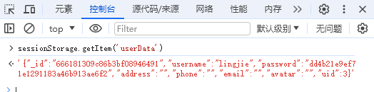
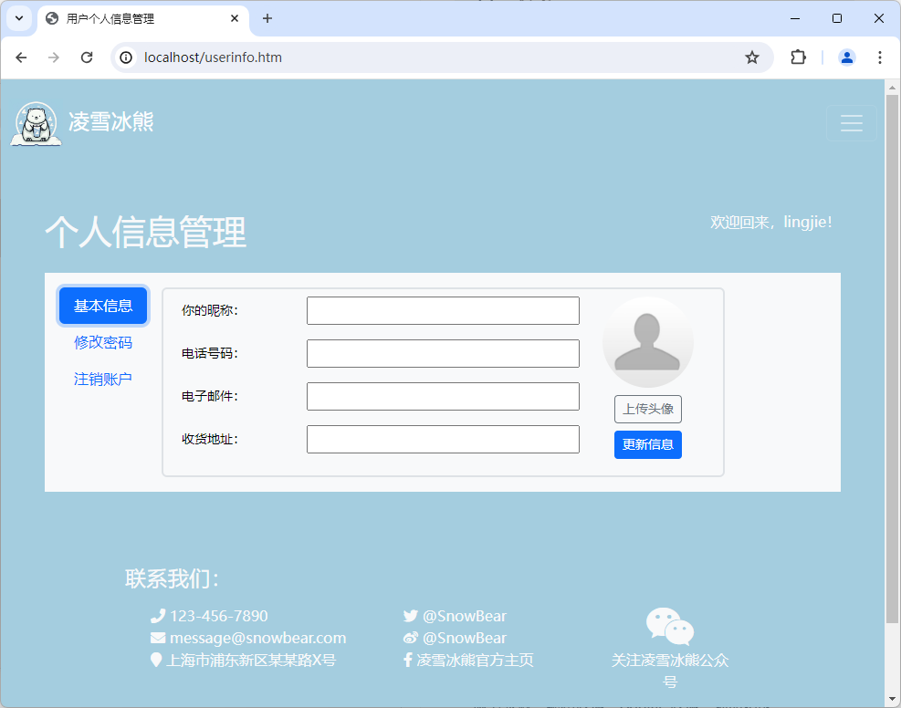
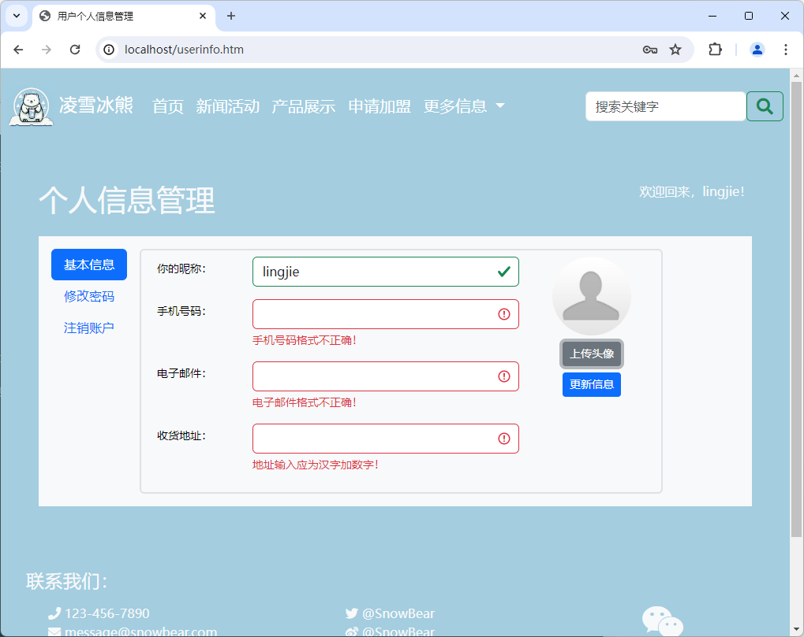
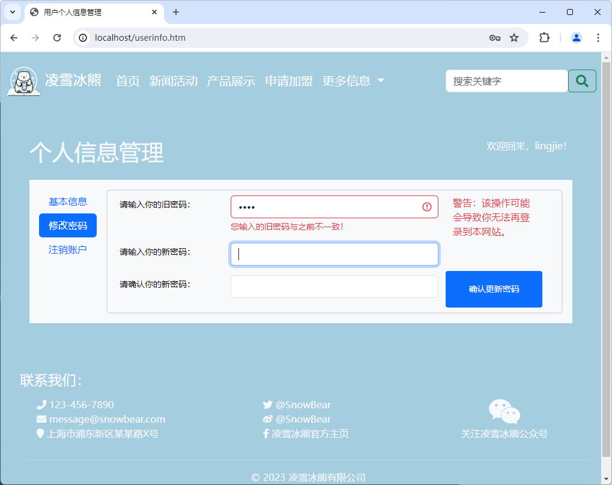
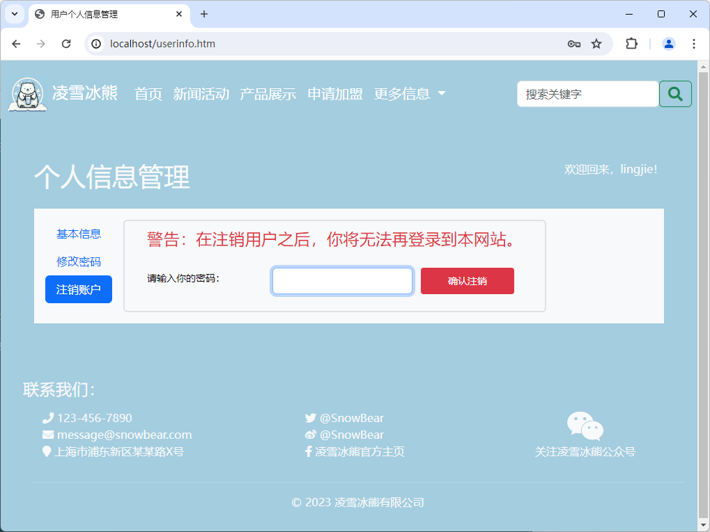
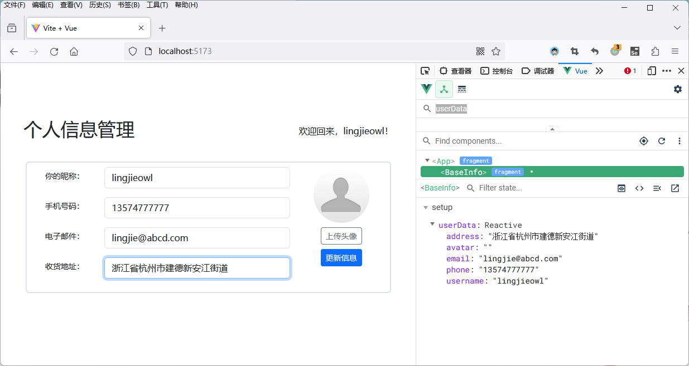

# 项目4. 用户信息管理功能的前端实现

用户信息管理功能的前端实现在Web应用开发领域中属于最简单的信息管理类UI项目，此类项目的开发目的是让企业的用户可以通过网页浏览器来编辑使用其线上服务时需要提供的个人信息，例如个人头像、电话号码、收货地址等。除了基于B/S架构的用户界面所能带来的低成本效益之外，能让用户能以较为便捷的方式提供这些信息，是企业得以开展电子商务等互联网业务的基础，因此它的开发也通常被认为是软件工程师在进入到Web应用开发领域时在前端部分必须掌握的项目类型之一。

## 【学习目标】

本章项目将会致力于演示如何为一家企业的官方网站实现其用户信息管理功能的Web UI，以便其用户可以直接通过通用的网页浏览器编辑并提交个人头像、电话号码、收货地址等个人信息，以便更好的使用该企业提供的互联网服务。通过本章项目的实践，读者将会初步了解在前端脚本中处理各种不同类型的数据，并将其提交给指定的后端服务，以及执行这些操作所需要掌握的技术以及相关的工具。总而言之，在阅读完本章之后，我们希望读者能够：

- 掌握如何在前端获取到用户在Web UI中所输入的信息，并将其格式化为可提交的数据；
- 掌握如何在前端基于既定的RESTful API规范将格式化完成的数据提交给相应的后端服务；
- 掌握如何在前端解析来自后端服务的、各种不同类型的响应数据，并将其显示在Web UI中；

## 【学习场景描述】

现在你是一位刚刚入职到“凌雪冰熊”这家连锁饮料店的软件工程师。该连锁店的领导层正在考虑将线下实体店中的部分业务扩展到线上，因此需要在部署了现有网站的Web服务中新增一个用户功能模块，让人们可以通过其网站注册为该饮料店的用户并获取使用其线上服务的权限。在开发该功能模块的项目中，你的任务是根据项目组中负责后端部分的成员所实现的HTTP API来构建用于提供用户信息管理功能的Web UI。

## 【任务书】

- **项目名**：凌雪冰熊网站用户信息管理功能的Web UI
- **委托方**：凌雪冰熊股份有限公司互联网部门
- **项目资料**：用户信息管理功能的后端API，其具体信息如下。
  - *用户信息修改的API*：
    - 请求URL：`http://snowbear.com/users/<用户的ID>`
    - 请求方法：`PUT`
    - 请求参数，需以JSON格式提交, 具体数据为用户所希望修改的个人信息。
    - 响应数据，以JSON格式返回：
      - 成功响应：`{ status: 200, message: "user_update_success"}`
      - 失败响应1: `{ status: 403, message: "user_update_failed"}`
      - 失败响应2: `{ status: 400, message: "request_url_error"}`
  - *用户信息删除的API*：
    - 请求URL：`http://snowbear.com/users/<用户的ID>`
    - 请求方法：`DELETE`
    - 响应数据，以JSON格式返回：
      - 成功响应：`{ status: 200, message: "user_delete_success"}`
      - 失败响应1: `{ status: 403, message: "user_delete_failed"}`
      - 失败响应2: `{ status: 400, message: "request_url_error“}`
- **项目要求**：基于【任务书】提供的HTTP API构建出用于执行用户信息管理操作的Web UI，该UI的实现应符合以下要求。
  - 该Web UI应允许人们通过网页浏览器提交个人头像，电话号码，收货地址等信息；
  - 该Web UI应能正确、安全地将人们所提交的个人信息提交给指定的后端服务；
  - 该Web UI应允许人们通过网页浏览器正确地查看、修改、删除自己的个人信息；
  **时间要求**：在15个工作日内完成；

## 【任务拆解】

整个项目的开发可以划分为以下三个小任务。

- 在Web应用的前端建立起一种用于维持住在线编辑状态的数据存储机制；
- 构建用于提供用户信息管理功能的Web UI，并赋予其良好的人机交互体验；
- 按照既定的规则序列化用户输入的各类型数据，并将其提交给相应的后端API；

## 【工作准备】

在上一章的项目实践中，读者通过学习如何实现用户注册/登录功能的项目I，初步掌握了在基于JavaScript语言的前端脚本中处理字符串类型数据的方法。然而在本章项目将要实现的用户信息管理功能，乃至于一些更为复杂的应用场景中，前端脚本要处理的可远不止字符串这一种数据类型，用户要在Web UI中输入并提交的信息中往往还会包含数字、时间、布尔值、图形等各种不同类型的数据。这些数据通常都必须先被序列化成某种特定格式的数据之后，才能被提交给Web应用的后端服务。因此，要想在前端脚本中处理不同类型的数据，开发者们就必须更进一步地学习如何利用网页浏览器提供的接口来存储并处理这些数据。在本章的【工作准备】部分中，笔者将会对相关的知识点进行着重介绍。和之前一样，如果读者觉得自己已经掌握了上述知识，也可以选择跳过本节内容，直接进入本章项目的【工作实施与交付】环节。

### 知识点1： 数据在前端的存储

在上一个项目的【工作准备】中，我们曾对网页浏览器中的Cookie机制及其在使用上的优缺点做了详细的介绍。为了最大限度地发挥该机制的优点，并降低其缺点所可能带来的不良影响，笔者会在这里建议大家坚持只在Cookie中存储需要在前后端之间来回传递的数据。例如在上一项目中，我们之所以选择将`userid`和`islogin`这两项数据存储在Cookie中，是因为不仅位于前端的Web UI需要用它们来维持用户的登录状态，后端的HTTP API也需要根据它们来决定要返回的响应数据。总而言之，将数据存储在Cookie中的核心目的是方便它们在前后端之间的来回传递。然而在开发Web应用的过程中，我们在前端存储数据的目的可不只有这一种。例如像用户名或用户头像这样的数据，虽然我们在许多情况下也会希望将它们持久地保存在Web UI所在的网页浏览器中，但那是因为这类数据在Web UI中会被频繁地使用到，将它们存储下来有利于大量减少Web UI向后端服务发送请求的次数。在这种情况下，如果选择将这类数据也存储在Cookie中，就等于让它们在Web应用每次执行请求和响应操作时都要在前后端之间往返，这显然是与我们的目标背道而驰了。对于这一类数据在前端的持久化存储，使用HTML5中所新增的`localStorage`与`sessionStorage`这两个对象会是更好的解决方案。

从接口实现的角度上来说，`localStorage`与`sessionStorage`都属于键/值对结构的对象，它们是HTML5为在Web应用的前端实现数据的持久化存储而定义的BOM组件，目前已被大多数网页浏览器的提供商实现为`window`对象的一个成员。换句话说，如果我们将一些数据存储到了`localStorage`对象或`sessionStorage`对象中，那么在刷新页面，或者在一段时间后重新打开同一页面时，这些数据都依然会存在于Web应用的前端中。另外在接口的具体使用上，`localStorage`与`sessionStorage`这两个对象提供给开发者的接口是基本相同的，它们唯一的区别是数据存储的有效时间。具体来说就是，存储在`localStorage`对象中的数据可以长期保留；而当前会话[^1]结束时，或者说当前页面被关闭时，存储在`sessionStorage`对象中的数据则会被清除。所以，读者只要掌握了其中一个对象的用法，就自然会使用另一个对象了。下面，我们就以`localStorage`对象为例来介绍一下它们所提供的属性和方法。

- **`length`属性**：用于返回`localStorage`对象中当前所存储的键/值对个数。
- **`setItem()`方法**：用于将数据以键/值对的形式存储到`localStorage`对象中，它接收两个字符串类型的实参，分别用于传递要存储的键值。
- **`getItem()`方法**：用于从`localStorage`对象中获取指定键名的数据，它接收一个字符串类型的实参，用于指定要查询数据的键名。
- **`removeItem()`方法**：用于从`localStorage`对象中移除指定键名的数据，它接收一个字符串类型的实参，用于指定要移除数据的键名。
- **`clear()`方法**：用于从`localStorage`对象中清除所有数据。
- **`key()`方法**：用于从`localStorage`对象中获取指定索引值的数据，它接收一个数字类型的实参，用于指定要查询数据的索引值。

通过上述属性和方法，开发者们就可以在任意一个Web应用的前端脚本中对存储在`localStorage`中的数据进行增、删、改、查等操作，例如像下面这样。

```JavaScript
const islogin = true;
const userid = 1;  // 此处假设用户已完成登录动作

if(islogin) {    // 如果用户已经登录：
    localStorage.setItem('userid', userid);
    console.log(localStorage.getItem('userid'));
} else {
    if(localStorage.getItem('userid') !== null) {
        localStorage.removeItem('userid');
    }
}
localStorage.clear();
```

在这里需要特别注意的是，虽然`localStorage`对象中可存储的数据两要比Cookie多得多，但大多数网页浏览器依然对该对象的数据容量还是有一定限制的（通常被设置在5MB之内），所以也需要开发者们有节制地选择要存储在其中的数据。举个例子，在使用“留言板”这样的应用时，用户使用的网络昵称通常是不会频繁更改的。这样一来，我们就可以考虑在向后端服务提交留言信息的同时，将他们输入的用户昵称存储到`sessionStorage`对象中，并在网页浏览器重新载入留言板的Web UI时用存储在`sessionStorage`对象中的数据自动填充“昵称”所在的输入框中，具体步骤如下。

- 先新建一个名为`messageBoard.htm`的HTML文档，用于构建该“留言板”应用的Web UI，具体代码如下。

    ```HTML
    <!DOCTYPE html>
    <html lang="zh-CN">
        <head>
            <meta charset="utf-8">
            <script defer src="/script/message.js"></script>
            <title>留言板</title>
        </head>
        <body>
            <h1>留言板</h1>
            <form action="/sendMessage" method="POST" id="messageForm">
            <table>
                <tr>
                <td>你的昵称：</td>
                <td><input type="text" name="nickname" id="nickname"></td>
                </tr>
                <tr>
                <td>留言信息：</td>
                <td><textarea name="message" id="message"></textarea></td>
                </tr>
                <tr>
                <td><input type="submit"></td>
                <td><input type="reset"></td>
                </tr>
            </table>
            </form>
        </body>
    </html>
    ```

- 再根据上述HTML文档中`<script>`标签的设置，在指定的`/scrip/`目录下创建一个名为`message.js`的前端脚本文件，并在其中输入如下代码。

    ```JavaScript
    const messageForm = document.querySelector('#messageForm');
    messageForm.addEventListener('submit', function() {
        const nickname = document.querySelector('#nickname');
        const message = document.querySelector('#message');
        if(nickname.value == '' || message.value == '') {
            alert('昵称或留言信息不能为空！');
            return false;
        }
        sessionStorage.setItem('nickname', nickname.value);
            return true;
    });

    window.addEventListener('load', function() {
        if(sessionStorage.getItem('nickname') != null) {
            const nickname = document.querySelector('#nickname');
            nickname.value = sessionStorage.getItem('nickname');
        }
    });
    ```

在上述前端脚本中，我们先为`id`属性值为`messageForm`的表单元素注册了`submit`事件的处理函数。该处理函数会在表单中的输入数据被提交给服务器之前执行如下操作。

- 当表单中任意一个输入框中的数据为空字符串时，该处理函数都会在网页浏览器中弹出一个警告框提醒用户，并通过返回`false`来终止表单的提交程序。
- 当且仅当表单中的两个输入框都获取到了有效的输入时，该处理函数才会将用户输入的昵称存储到`sessionStorage`对象中，并通过返回`true`来允许表单将数据提交给服务器。

换而言之，只要用户成功提交过一次留言，他们所输入的昵称就会被存储在`sessionStorage`对象中。接下来，我们继续为“留言板”应用的Web UI注册了`load`事件的处理函数。该处理函数将会在网页浏览器成功载入留言板的Web UI时被执行，它会先判断`sessionStorage`对象中是否已经存储了键名为“`nickname`”的数据项，如果数据已经存在，就用该数据填充当前界面中`id`属性值为`nickname`的`<input>`元素。这样一来，只要用户是在当前会话结束之前再次回到留言界面，他们就会看到自己上次留言时所输入的昵称已经被自动填充在相应的输入框中了。

[^1]: 在Web应用中，“会话”通常指的是：用户从在网页浏览器中打开该b应用的首页开始，然后通过点击一系列的超链接、提交表单数据等操作读取或修改Web应用存储在服务端中的数据资源，并最终关闭浏览器或所有相关的标签页退出应用的整个操作过程。

### 知识点2：数据的序列化处理

在Web应用的运行过程中，前端脚本在从Web UI中获取到用户输入之后，通常需要先将输入数据先转换成某种特定格式的字节流，然后才能将其以HTTP请求的形式将其发送给位于后端的HTTP API。同样的，HTTP API在处理完这些请求之后，也需要先将要处理结果转换成相同格式的字节流，然后才能将其作为响应数据发送给前端。在计算机术语中，人们将这类将各种类型的数据转换成字节流的操作称之为数据的**序列化（Serialization）**。在本知识点中，笔者将以基于JavaScript语言编写的前端脚本为例，重点为读者介绍如何在实现用户信息管理功能的过程中执行数据的序列化与反序列化操作。

#### 图形数据的序列化

在拥有用户信息管理模块的Web应用中，允许用户设置头像是一个开发者们常需要实现的功能。由于用来充当头像的通常都是一些尺寸相对较小的图像文件，人们在实现该功能时往往会选择先将其转换成特定编码的字符串格然后再以HTTP请求的形式提交给后端服务，例如，如果读者使用的是JavaScript语言，这项功能就可以通过将用户上传的图形文件转换成`Base64`编码的字符串来实现。下面，让我们通过实例来具体演示一下这个针对图形文件的序列化操作，其基本步骤如下。

- 先在之前创建的`Examples/02_studynodejs` 目录下新建一个名为`imageToBase64`的子目录，然后在其中创建一个用于上传文件的HTML文档，并在其中输入如下代码。
  
    ```html
    <!DOCTYPE html>
    <html lang="zh-CN">
        <head>
            <meta charset="UTF-8">
            <script defer src="script/imageToBase64.js"></script>
            <title>Image to Base64</title>
        </head>
        <body>
            <!--  使用 FileReader 对象将用户上传的图形文件读取为 base64 编码 -->
            <div>
                <!-- 先设置一个用于上传图形文件的输入元素 -->
                <input type="file" id="inputImage" />      
                <br />
                <!-- 然后设置一个用于显示图形的输出元素 -->
                
            </div>
        </body>
    </html>
    ```

- 再根据上述HTML文档中`<script>`标签的设置，在指定的`script`目录下创建一个名为`imageToBase64.js`的前端脚本文件，并在其中输入如下代码。

    ```javascript
    const input = document.querySelector('inputImage'); 
    inputImage.addEventListener('change', function(event) {
        const file = event.target.files[0]; // 获取用户上传的图像文件
        const reader = new FileReader(); // 创建FileReader对象
        reader.readAsDataURL(file); // 将图像文件读取为base64编码
        reader.addEventListener('load', function(e) { // 读取完成后触发事件
            const base64 = e.target.result; // 获取图像的base64编码
            // console.log(base64); // 测试：在控制台中输出base64编码
            const image = document.querySelector('outputImage');
            image.src = base64; // 将base64编码设置为图像的src属性
        });
    });
    ```

在上述前端脚本中，笔者首先创建了一个`FileReader`类型的`reader`对象，该对象的类型是HTML5中新增的、可用于将指定文件读取为`Base64`编码的API。在这里，我们用它来读取用户上传的图形文件，并将其转换成`Base64`编码的字符串。在这个读取+转码的工作完成时，`reader`对象就会触发一个`load`事件，我们可以在该事件的处理函数中获取到编码转换的结果并对其进行后续处理，例如在这里，笔者选择将图像回显在了`id`属性值为`outputImage`的``元素中。当然，读者也可以在该处理函数中将这个`Base64`编码的字符串以HTTP请求的形式发送给后端服务。

除了以文件形式上传的图形之外，用户有时候也会以URL的形式来指定自己想要使用的图形。在这种情况下，我们可以选择利用HTML5中新增的`Canvas`组件来将图形转换成`Base64`编码的字符串。下面，让我们也通过实例来学习一下如何基于`Canvas`组件将制定URL的图形序列化的操作，其基本步骤如下。

- 重新打开之前创建的`imageToBase64.htm`文档，并在其中添加一组用于指定图形URL的输入元素，和一个用于在页面中绘制图形的`<canvas>`元素，具体代码如下。
  
```html
<!-- 使用 Canvas 组件将指定 URL 的图形读取为 base64 编码 -->
<div>
    <!-- 设置一个用于指定图形 URL 的输入元素 -->
    <input type="text" id="inputURL" placeholder="请输入图像URL" />
    <button id="btnGetImage">获取图像</button> 
    <br />
    <!-- 设置一个Cavas元素，用于绘制用户指定的图形 -->
    <canvas id="demoCanvas" width="200" height="200"></canvas>
</div>
```

- 再次打开之前的`imageToBase64.js`文件，并在其中添加用于在前端生成图形，并将其转换为`Base64`编码的代码，具体如下。
  
    ```javascript
    // 使用canvas组件将 URL 的图形转换成 base64 编码的字符串
    const img = new Image();
    const seturl = document.querySelector('#btnGetImage');
    seturl.addEventListener('click', function(event) {
        const input = document.querySelector('#inputURL');
        img.src = input.value; // 设置图像的URL
        img.crossOrigin = 'Anonymous'; // 设置跨域请求
    });

    img.addEventListener('load', function(e) {
        const canvas = document.querySelector('#demoCanvas');
        canvas.width = img.width;
        canvas.height = img.height;
        const ctx = canvas.getContext('2d');
        ctx.drawImage(img, 0, 0); // 将图像绘制到canvas上
        const base64 = canvas.toDataURL('image/png');  // 将图形转换为base64编码
        console.log(base64); // 测试：在控制台中输出base64编码
    })
    ```

在上述前端脚本中，我们首先在`seturl`按钮元素的`click`事件处理函数中创建了一个`Image`类型的`img`对象，该对象将根据用户指定的URL来加载目标图形。在这一部分的操作中，读者需要记得将`img`对象的`crossOrigin`属性设置为`Anonymous`，以便允许后面的`Canvas`组件对其进行跨域请求。接下来，当`img`对象加载完成后，我们就可以在该对象的`load`事件处理函数中使用`Canvas`组件的`drawImage()`方法将该图形绘制出来，并使用它的`toDataURL()`方法将该图形转换为`Base64`编码的字符串。

#### 数据对象的序列化

在实现用户信息管理功能的过程中，为了尽可能减少前后端之间的通信次数，以提高Web应用的执行性能和用户体验，开发者们通常会在用户头像这类特定数据在被转换成`Base64`编码的字符串之后，先将其与用户的电话号码、收货地址等其他数据组织成单一的数据对象，然后再将这个数据对象一次性地发送给后端服务。而对于存储在计算机内存中的数据对象，它本身在以HTTP请求的形式发送给后端服务之前，通常也需要先转换成JSON、XML等特定格式的字符串。接下来，我们就以JSON格式为例来着重介绍一下如何最喜在JavaScript脚本中完成对数据对象的序列化操作。

在JavaScript脚本中，数据对象与JSON格式的字符串之间的相互转换操作通常是通过`JSON`这个对象来完成的。该对象是JavaScript中内置的一个全局对象，它提供了`stringify()`和`parse()`两个方法，分别用于将数据对象的序列化与反序列化操作。下面，我们也通过一个实例来演示一下这两个方法的具体使用方法，其具体步骤如下。

- 先在之前创建的的`Examples/02_studynodejs` 目录下新建一个名为`objectSerialization`的子目录，然后在其中创建一个带有表单元素的HTML文档，并在其中输入如下代码。

    ```html
    <!DOCTYPE html>
    <html lang="zh-CN">
        <head>
            <meta charset="UTF-8">
            <script defer src="script/objectSerialization.js"></script>
            <title>数据对象的序列化</title>
        </head>
        <body>
            <!-- 在此处构建一个让用户输入数据的表单元素 -->
            <form id="demoForm">
                <input type="text" name="name" 
                    placeholder="请输入你的姓名" />
                <br />
                <label>
                    请设置你的头像：
                    <input type="file" name="photo" style="display: none;" />
                    <input type="button" value="上传文件" 
                        onclick="document.querySelector('#demoForm').photo.click()" /> 
                </label>
                <br />
                <textarea name="intro" rows="5" cols="30" 
                    placeholder="请输入你的个人简介"></textarea>
                <br />
                <input type="submit" value="提交" />
            </form>
        </body>
    </html>
    ```

- 再根据上述HTML文档中`<script>`标签的设置，在指定的`script`目录下创建一个名为`objectSerialization.js`的前端脚本文件，并在其中输入如下代码。

    ```javascript
    const inputForm = document.querySelector("#demoForm");
    const formData  = { // 创建将用于存储表单数据的对象
        "userName": "",
        "userIntro": "",
        "userPhoto": ""
    }; 

    inputForm.photo.addEventListener("change",  function(event) {
        const file = event.target.files[0]; 
        const reader = new FileReader(); 
        reader.readAsDataURL(file); 
        reader.addEventListener('load', function(e) { 
            const base64 = e.target.result; // 获取头像的base64编码
            formData["userPhoto"] = base64; // 将头像的base64编码保存到formData对象中
        });
    });

    inputForm.addEventListener("submit",  function (event) {
        event.preventDefault();
        formData["userName"] = inputForm.name.value; // 将用户名信息保存到formData对象中
        formData["userIntro"] = inputForm.intro.value; // 将个人简介信息保存到formData对象中

        // 将formData对象转换为JSON字符串
        const jsonString = JSON.stringify(formData);
        console.log(jsonString); // 测试：输出序列化之后的结果
        // 此处省略将序列化结果发送给后端的代码
    });
    ```

- 最后，读者只需用网页浏览器打开上述HTML文档，在按照页面中的提示填写完表单并按下“提交”按钮之后，就会看到如图4-1所示的输出效果。

    

    **图4-1** 数据的序列化示例

下面，让我们来具体讲解一下上述实例的前端脚本中所执行的操作。

- 首先，我们通过调用`document.querySelector()`方法获取到了用于接收输入信息的表单元素，并将其保存到了名为`inputForm`的对象中。与此同时，我们还创建了一个名为`formData`的对象，它就是将被用于保存输入信息的数据对象。
- 接下来，我们为目标表单中用于设置头像的`photo`输入项注册了`change`事件的处理函数，该处理函数会负责将用户上传的头像转换成`Base64`编码的字符串，并将其保存在`formData`对象中键名为`userPhoto`的数据项中。
- 然后，我们又在目标表单的`submit`事件该处理函数中获取了用户输入的用户名和个人简介，并分别将它们保存在`formData`对象中键名为`userName`和`userIntro`的数据项中。
- 最后，我们通过调用`JSON.stringify()`方法将`formData`对象转换成了JSON字符串，并将其输出到了控制台中。

以上就是我们在JavaScript前端脚本中构建数据对象，并将其序列化为JSON字符串的基本步骤。另外与之相对应的是，当计算机程序接收到来自外部的JSON字符串时，也需要先对其进行相应的解码工作，才能进行下一步的操作。在计算机术语中，这种将特定格式的字符串转换成可交由计算机程序处理的数据对象的操作称为数据的**反序列化（deserialization）**。具体到JavaScript脚本中，JSON字符串的反序列化操作可以通过调用`JSON.parse()`方法来完成，具体使用方法如下。

```javascript
// 先假设当前脚本从外部接收到了一个JSON字符串
const jsonString = '{"userName":"张三","userIntro":"我是一个前端开发工程师"}';

// 下面对该JSON字符串进行反序列化操作
const DataObject = JSON.parse(jsonString); // 将JSON字符串反序列化为数据对象
console.log(DataObject['userName']); // 输出：张三
console.log(DataObject['userIntro']);   // 输出：我是一个前端开发工程师
```

## 【工作实施和交付】

在完成了上述工作准备之后，读者现在就可以根据之前【任务书】中的要求来着手为凌雪冰熊网站实现用户信息管理功能的前端部分了，该项目的实施过程可以分为以下步骤来进行。

### 第1步：实现用户数据在前端的持久化存储

在这一步骤中，软件工程师的主要任务是回到之前实现的用户注册/登录功能中，修改该功能模块在用户成功完成登录，并接收到来自后端响应数据之后的处理动作，在其中添加用于网页浏览器中持久化保存用户信息的代码。为此，读者需要执行以下操作。

1. 使用VS Code编辑器重新打开我们在上一章中创建的`login&signup.js`脚本文件，并在其中找到`loginForm`表单对象的`submit`事件处理函数，该函数目前的实现代码如下，

    ```javascript
    // 此处省略了其他代码
    loginForm.addEventListener('submit', async function(event) {
        event.preventDefault(); // 阻止表单默认提交行为
        // 检查表单是否通过验证
        if (!loginForm.username.value || !loginForm.password.value) {
            // 用户名或密码为空时的处理逻辑
            checkUsername(loginForm);
            checkPassword(loginForm);
            return;
        }
        // 收集表单数据
        const formData = {
            username: loginForm.username.value,
            password: md5(loginForm.password.value)
        };
        console.log(formData);
        // 发送用户登录请求
        try {
            const res = await fetch(loginForm.action, {
                method: loginForm.method,
                headers: {
                    'Content-Type': 'application/json'
                },
                body: JSON.stringify(formData)        
            });
            if(res.status == 200) {
                // 登录成功时的处理逻辑
                const data = await res.json()
                document.cookie = `userid=${data.uid}`;
                window.location.href = '/userinfo.htm';
            } else if(res.status == 403) {
                // 登录失败时的处理逻辑
                window.alert('登录失败');
            }
        } catch(error) {
            // 请求出错时的处理逻辑
            window.alert('请求出错');
        }
    })
    ```

2. 在上述代码中，找到“`// 登录成功时的处理逻辑`”这行注释所在的`if`语句分支，并将该分支中的代码修改如下。

    ```javascript
    // 此处省略了其他代码
    if(res.status == 200) {
        // 登录成功时的处理逻辑
        const data = await res.json()
        document.cookie = `userid=${data.uid}`;
        // 在此处将后端返回的用户数据序列化，
        // 并实现在 sessionStorage 对象中的存储
        sessionStorage.setItem('userData', 
                            JSON.stringify(data));
        window.location.href = '/userinfo.htm';
    }  // 此处省略了其他 if 分支
    ```

3. 在保存了上述修改之后，如果读者重新启动这个Web应用的登录界面，在成果完成登录操作之后，就可以在网页浏览器中通过调用`sessionStorage.getItem('userData')`来读取到后端数据返回的用户数据了，其效果如图4-2所示。

    

    **图4-2** 数据在前端的持久化存储

4. 如果上述操作一切顺利，读者就可以将当前步骤所获得的进展提交给git版本控制系统了，具体命令如下。

    ```bash
    git add .
    git commit -m "项目4：实现用户数据在前端的持久化存储"
    ```

### 第2步：创建用于编辑用户信息的Web UI

在这一步骤中，软件工程师的主要任务是基于HTML构建出用于查看、修改和删除用户信息的Web UI。在此过程中，我们会建议读者利用Bootstrap框架的导航栏组件将用户信息的编辑界面划分成基本信息、修改密码与注销用户三个表单来进行设计，其具体操作如下。

1. 在VS Code编辑器中重新打开之前刚刚修改过的`login&signup.js`脚本文件，将其中`addHint`、`removeHint`、`removeValidation`、`checkUsername`和`checkPassword`这四个函数的定义提取出来另存为一个名为`commonForm.js`的j脚本文件，以便在本项目中继续重用这些函数。

2. 继续在代码编辑器中重新打开我们在上一章中创建的`login&signup.htm`文档，在其中找到`<!-- 引入自定义的JavaScript脚本文件 -->`这行注释所在的位置，并在该注释标记与用于加载`login&signup.js`文件的`<script>`标记之间插入用于加载`commonForm.js`脚本的`<script>`标记，具体如下。

    ```html
    <!-- 引入自定义的JavaScript脚本文件 -->
    <script defer src="scripts/commonForm.js"></script>
    <script defer src=" scripts/login&signup.js"></script>
    ```

3. 在当前项目的`/frontend/static`目录下，基于既定的网页模板文件（即相同目录下的`template.htm`文件）创建一个名为`userinfo.htm`的HTML文档，其具体代码如下。

    ```html
    <!DOCTYPE html>
    <html lang="zh-CN">
    <head>
        <meta charset="UTF-8">
        <meta name="viewport" content="width=device-width, initial-scale=1.0">
        <!-- 引入Bootstrap框架的CSS样式文件 -->
        <link rel="stylesheet" href="./node_modules/bootstrap/dist/css/bootstrap.min.css">
        <!-- 引入Bootstrap框架需要加载的脚本文件 -->       
        <script defer src="./node_modules/@popperjs/core/dist/umd/popper.min.js"></script>
        <!-- 引入Bootstrap框架的JavaScript脚本文件 -->
        <script defer src="./node_modules/bootstrap/dist/js/bootstrap.min.js"></script>
        <!-- 引入FontAwesome图标库定义的样式文件 -->
        <link rel="stylesheet" 
            href="https://use.fontawesome.com/releases/v5.11.2/css/all.css">
        <!-- 引入自定义的CSS样式文件 -->
        <link rel="stylesheet" href="styles/custom.css">
        <!-- 引入blueimp-md5库的JavaScript脚本文件 -->
        <script src="./node_modules/blueimp-md5/js/md5.min.js"></script>
        <!-- 引入自定义的JavaScript脚本文件 -->
        <script defer src="scripts/commonForm.js"></script>
        <script defer src="scripts/userInfo.js"></script>
        <title>用户个人信息管理</title>
    </head>
    <body>
        <!-- 导航栏区域开始-->
        <nav class="navbar navbar-expand-lg navbar-dark navbar-text">
            <div class="container-fluid p-2">
                <a class="navbar-brand" href="#">
                    
                    <span class="fs-4">凌雪冰熊</span>
                </a>
                <button class="navbar-toggler" type="button"  data-bs-toggle="collapse" 
                    data-bs-target="#navbarSupportedContent" 
                    aria-controls="navbarSupportedContent" aria-expanded="false" 
                    aria-label="Toggle navigation">
                    <span class="navbar-toggler-icon"></span>
                </button>
                <div class="collapse navbar-collapse" id="navbarSupportedContent">
                    <ul class="navbar-nav me-auto mb-2 mb-lg-0 fs-5">
                        <li class="nav-item">
                            <a class="nav-link active" aria-current="page" href="./index.htm">
                                首页
                            </a>
                        </li>
                        <li class="nav-item">
                            <a class="nav-link" href="./news.htm">新闻活动</a>
                        </li>
                        <li class="nav-item">
                            <a class="nav-link" href="./show.htm">产品展示</a>
                        </li>
                        <li class="nav-item">
                            <a class="nav-link" href="./join.htm">申请加盟</a>
                        </li>
                        <li class="nav-item dropdown">
                            <a class="nav-link dropdown-toggle"
                                href="#" id="navbarDropdown" 
                                role="button" data-bs-toggle="dropdown" 
                                aria-expanded="false">
                                更多信息
                            </a>
                            <ul id="dropdown-menu" 
                                class="dropdown-menu" 
                                aria-labelledby="navbarDropdown">
                                <li><a class="dropdown-item" href="#">企业文化</a></li>
                                <li><a class="dropdown-item" href="#">企业荣誉</a></li>
                                <li><a class="dropdown-item" href="#">企业历程</a></li>
                            </ul>
                        </li>
                    </ul>
                    <form class="d-flex">
                        <input class="form-control" type="search" 
                            placeholder="搜索关键字" aria-label="Search">
                        <button class="btn btn-outline-success" type="submit">
                            <i class="fa fa-search fa-lg"></i>
                        </button>
                    </form>
                </div>
            </div>
        </nav>
        <!-- 导航栏区域结束 -->
        <!-- 主体区域开始 -->
        <main class="container-fluid p-5">
            <!-- 在此处填充网页的主体内容 -->
        </main>
        <!-- 主体区域结束 -->
        <!-- 页脚区域开始 -->
        <footer class="p-3 text-light">
            <section id="contact" class="container">
                <h4>联系我们：</h4>
                <div class="row m-3">
                    <!-- 使用 <i> 标记的 class 属性插入来自第三方库的图标 -->
                    <ul class="list-unstyled col-5">
                        <li><i class="fa fa-phone"></i> 123-456-7890</li>
                        <li><i class="fa fa-envelope"></i> message@snowbear.com</li>
                        <li><i class="fa fa-map-marker"></i> 上海市浦东新区某某路X号</li>
                    </ul>
                    <ul class="list-unstyled col-4">
                        <li><i class="fab fa-twitter"></i> @SnowBear</li>
                        <li><i class="fab fa-weibo"></i> @SnowBear</li>
                        <li><i class="fab fa-facebook-f"></i> 凌雪冰熊官方主页</li>
                    </ul>
                    <div class="col-3 text-center">
                        <i class="fab fa-weixin fa-3x"></i>
                        <p>关注凌雪冰熊公众号</p>
                    </div>
                </div>
            </section>
            <section class="container text-center m-3 ">
                <hr>
                <span>&copy; 2023 凌雪冰熊有限公司</span>
            </section>
        </footer>
        <!-- 页脚区域开始 -->
    </body>
    </html>
    ```
  
4. 在代码编辑器中打开上述`userinfo.htm`文档，在其中找到`<!-- 在此处填充网页的主体内容 -->`这行注释所在的位置，并在该处添加如下代码，以便创建用于分组用户个人信息的Web UI。

    ```html
    <header class="text-light row">
        <h1 class="col-8">个人信息管理</h1>
        <p class="col-4 text-end">
            欢迎回来，<span id="userName"></span>！
        </p>
    </header>
    <section class="my-3 p-3 text-bg-light">
        <div class="d-flex align-items-start">
            <div class="nav flex-column nav-pills me-3 text-nowrap"
                id="v-pills-tab" role="tablist" 
                aria-orientation="vertical">
                <button class="nav-link active" 
                        id="v-pills-baseinfo-tab" 
                        data-bs-toggle="pill" 
                        data-bs-target="#v-pills-baseinfo" 
                        type="button" role="tab"
                        aria-controls="v-pills-baseinfo" 
                        aria-selected="true">
                        基本信息
                </button>
                <button class="nav-link" 
                        id="v-pills-password-tab" 
                        data-bs-toggle="pill" 
                        data-bs-target="#v-pills-password" 
                        type="button" role="tab" 
                        aria-controls="v-pills-password" 
                        aria-selected="false">
                    修改密码
                </button>
                <button class="nav-link" 
                        id="v-pills-messages-tab" 
                        data-bs-toggle="pill" 
                        data-bs-target="#v-pills-messages" 
                        type="button" role="tab" 
                        aria-controls="v-pills-messages" 
                        aria-selected="false">
                        注销账户
                </button>
            </div>
            <div class="tab-content" id="v-pills-tabContent">
                <div class="tab-pane fade container-fluid show active" 
                    id="v-pills-baseinfo" role="tabpanel" 
                    aria-labelledby="v-pills-baseinfo-tab">
                    <!-- 在此处设置用于编辑用户基本信息的表单 -->
                </div>
                <div class="tab-pane fade container-fluid" id="v-pills-password"
                    role="tabpanel" aria-labelledby="v-pills-password-tab">
                    <!-- 在此处设置用于修改用户密码的表单 -->
                </div>
                <div class="tab-pane fade container-fluid"
                    id="v-pills-messages" role="tabpanel" 
                    aria-labelledby="v-pills-messages-tab">
                    <!-- 在此处设置用于注销用户表单 -->
                </div>
            </div>
        </div>
    </section>
    ```

5. 在上述代码中找到`<!-- 在此处设置用于编辑用户基本信息的表单 -->`这行注释所在的位置，并在该处添加如下代码，以便创建用于编辑用户基本信息的Web UI。

    ```html
    <form id="baseinfoForm">
        <div class="p-2 row border border-2 rounded-2">
            <div class="col-9">
                <div class="mb-3 row">
                    <label for="username" class="col-form-label-sm col-3">
                        你的昵称：
                    </label>
                    <div class="col-9">
                        <input name="username"
                            type="text" class="form-control" 
                        />
                        <div id="checkname"></div>
                    </div>
                </div>
                <div class="mb-3 row">
                    <label for="phone" class="col-form-label-sm col-3">
                        手机号码：
                    </label>
                    <div class="col-9">
                        <input name="phone" 
                            type="text" class="form-control"
                        />
                        <div id="checkphone"></div>
                    </div>    
                </div>
                <div class="mb-3 row">
                    <label for="phone" class="col-form-label-sm col-3">
                        电子邮件：
                    </label>
                    <div class="col-9">
                        <input name="email" 
                            type="text" class="form-control" 
                        />
                        <div id="checkemail"></div>
                    </div>    
                </div>
                <div class="mb-3 row">
                    <label for="address" class="col-form-label-sm col-3">
                        收货地址：
                    </label>
                    <div class="col-9">
                        <input name="address"  
                            type="text" class="form-control" 
                        />
                        <div id="checkaddress"></div>
                    </div>    
                </div>
            </div>
            <div class="col-3 text-center">
                
                <label class="m-2">
                    <input name="avatar" 
                        type="file" style="display: none;"
                    />
                    <input name="uploadAvatar" value="上传头像"
                        type="button" class="btn btn-outline-secondary btn-sm"
                        onclick="document.querySelector('#baseinfoForm').avatar.click()"
                        /> 
                </label>
                <input value="更新信息" type="submit" 
                    class="btn btn-primary btn-sm"
                />
            </div>
        </div>
    </form>
    ```

6. 继续在`userInfo.htm`文件在中找到`<!-- 在此处设置用于修改用户密码的表单 -->`这行注释所在的位置，并在该处添加如下代码，以便创建用于修改用户密码的Web UI。

    ```html
    <form id="passwordForm">
        <div class="p-2 row border border-2 rounded-2">
            <div class="col-9">
                <div class="mb-3 row">
                    <label for="oldPassword" 
                        class="col-form-label-sm col-4">
                        请输入你的旧密码：
                    </label>
                    <div class="col-8">
                        <input name="oldPassword"
                            type="password" class="form-control"
                        />
                        <div id="checkoldPassword"></div>
                    </div>
                </div>
                <div class="mb-3 row">
                    <label for="newPassword" 
                        class="col-form-label-sm col-4">
                        请输入你的新密码：
                    </label>
                    <div class="col-8">
                        <input name="newPassword"
                            type="password" class="form-control"  
                        />
                        <div id="checknewPassword"></div>
                    </div>
                </div>
                <div class="mb-3 row">
                    <label for="confirmPassword" 
                        class="col-form-label-sm col-4">
                        请确认你的新密码：
                    </label>
                    <div class="col-8">
                        <input name="confirmPassword"
                            type="password" class="form-control"  
                        />
                        <div id="checkconfirmPassword"></div>
                    </div>
                </div>
            </div>
            <div class="col-3 row">
                <p class="text-danger fs-6 mb-4">
                    警告：该操作可能会导致你无法再登录到本网站。
                </p>
                <input type="submit" value="确认更新密码" 
                    class="btn btn-primary btn-sm" 
                />
            </div>
        </div>
    </form>
    ```

7. 继续在`userInfo.htm`文件在中找到`<!-- 在此处设置用于注销用户的表单 -->`这行注释所在的位置，并在该处添加如下代码，以便创建用于注销用户的Web UI。

    ```html
    <form id="deleteForm">
        <div class="p-2 row border border-2 rounded-2">
            <div class="col-12 px-4">
                <p class="text-danger fs-4 mb-4">
                    警告：在注销用户之后，你将无法再登录到本网站。
                </p>
                <div class="mb-3 row col-12">
                    <label for="password" 
                        class="col-form-label-sm col-4">
                        请输入你的密码：
                    </label>
                    <div class="col-5">
                        <input name="password"
                            type="password" class="form-control"  
                        />
                        <div id="checkPassword"></div>
                    </div>
                    <input type="submit" value="确认注销" 
                        class="btn btn-danger btn-sm col-3"
                    />
                </div>
            </div>    
        </div>
    </form>
    ```

8. 在保存了上述所有文件之后，如果读者重新启动这个Web应用的登录界面，在成果完成登录操作之后，就可以在网页浏览器中看到用于编辑用户信息的初始界面了，其效果如图4-3所示。

    

    **图4-3** 用户个人信息的编辑界面

9. 如果上述操作一切顺利，读者就可以将当前步骤所获得的进展提交给git版本控制系统了，具体命令如下。

    ```bash
    git add .
    git commit -m "项目4：创建用户个人信息的编辑界面"
    ```

### 第3步：序列化并提交用户提交的信息

在这一步骤中，软件工程师的主要任务是在前端脚本中完成三件事：首先是检查用户在Web UI中的输入，以便确保这些输入符合规则；然后再将用户输入的信息组织成单一的数据对象，并将其序列化为JSON格式的字符串；最后再将得到的JSON字符串以HTTP请求的形式发送给后端的API并处理其响应数据。为此，读者需要执行以下操作。

1. 使用VS Code编辑器重新打开`scripts`目录下的`commonForm.js`文件，并在其中添加如下函数的实现，分别用于检查电子邮件、电话号码、收货地址的输入格式。

    ```javascript
    // 此处省略之前的代码
    // 检查电子邮件的输入格式
    function checkEmail(form) {
        const inputText = form.email;
        if (!/^[^\s@]+@[^\s@]+\.[^\s@]+$/.test(inputText.value)) {
            // 电子邮件格式不合法时的处理逻辑
            inputText.classList.add('is-invalid');
            addHint(form, 'checkemail', '电子邮件格式不正确！');
        } else {
            // 电子邮件格式合法时的处理逻辑
            inputText.classList.remove('is-invalid');
            removeHint(form, 'checkemail');
            inputText.classList.add('is-valid');
        }
    }

    // 检查手机号码的输入格式
    function checkPhone(form) {
        const inputText = form.phone;
        if (!/^1[3-9]\d{9}$/.test(inputText.value)) {
            // 手机号码格式不合法时的处理逻辑
            inputText.classList.add('is-invalid');
            addHint(form, 'checkphone', '手机号码格式不正确！');
        } else {
            // 手机号码格式合法时的处理逻辑
            inputText.classList.remove('is-invalid');
            removeHint(form, 'checkphone');
            inputText.classList.add('is-valid');
        }
    }

    // 检查街道地址的输入格式
    function checkAddress(form) {
        const inputText = form.address;
        // 限定地址输入应为汉字加数字
        if (!/^[\u4e00-\u9fa50-9]+$/.test(inputText.value)) {
            // 地址输入不合法时的处理逻辑
            inputText.classList.add('is-invalid');
            addHint(form, 'checkaddress', '地址输入应为汉字加数字！');
        } else {
            // 地址输入合法时的处理逻辑
            inputText.classList.remove('is-invalid');
            removeHint(form, 'checkaddress');
            inputText.classList.add('is-valid');
        }
    }
    ```

2. 另外在`scripts`目录创建一个名为`userinfo.js`的文件，以便用于编写处理用户信息管理功能的前端脚本。首先是一些全局性的设置，具体如下。

    ```javascript
    // 将存储在前端的JSON字符串反序列化为用于存储用户信息的对象
    const userData = JSON.parse(sessionStorage.getItem("userData"));
    // 设置显示在标题栏中的用户昵称
    const nickname = document.querySelector("#nickname");
    nickname.innerText = userData["username"];
    // 封装用于向后端发送数据修改请求的函数
    async function submitUserInfo() { 
        // 先设置HTTP API所在的 URL
        const actionAPI = 'http://snowbear.com/users/'+userData['uid'];
        // 再序列化要提交的数据
        const formData = JSON.stringify(userData);
        try {
            const res = await fetch(actionAPI, {
                method: 'PUT',
                headers: {
                    'Content-Type': 'application/json'
                },
                body: formData
            });
            return res.status;
        } catch(error) {
            // 请求出错时的处理逻辑
            window.alert('请求出错');
            return 0;
        }  
    }
    ```

3. 接下来，读者需要为`id`属性值为`baseinfoForm`的表单元素编写前端脚本，用于实现管理用户基本信息的Web UI，该脚本中的代码具体如下。

    ```javascript
    // 以下代码用于处理 id="baseinfoForm" 的表单元素
    const baseinfoForm = document.querySelector("#baseinfoForm");
    // 当页面在加载时，对 baseinfoForm 表单执行以下初始化操作
    window.addEventListener('load', function() {
        baseinfoForm.username.value = userData['username'];
        baseinfoForm.email.value = userData['email'];
        baseinfoForm.phone.value = userData['phone'];
        baseinfoForm.address.value = userData['address'];
        if (userData['avatar'] !== "") {
            baseinfoForm.outputAvatar.src = userData['avatar'];
        }
    })
    // 在昵称设置文本框获得焦点时移除输入提示信息
    baseinfoForm.username.addEventListener('focus', function() {
        this.classList.remove('is-invalid');
        this.classList.remove('is-valid');
        removeHint(baseinfoForm, 'checkname');
    });
    // 在昵称设置文本框失去焦点时检查输入
    baseinfoForm.username.addEventListener('blur', function() {
        checkUsername(baseinfoForm);
    });
    // 在邮箱设置文本框获得焦点时移除输入提示信息
    baseinfoForm.email.addEventListener('focus', function() {
        this.classList.remove('is-invalid');
        this.classList.remove('is-valid');
        removeHint(baseinfoForm, 'checkemail');
    });
    // 在邮箱设置文本框失去焦点时检查输入
    baseinfoForm.email.addEventListener('blur', function() {
        checkEmail(baseinfoForm);
    });
    // 在手机设置文本框获得焦点时移除输入提示信息
    baseinfoForm.phone.addEventListener('focus', function() {
        this.classList.remove('is-invalid');
        this.classList.remove('is-valid');
        removeHint(baseinfoForm, 'checkphone');
    });
    // 在手机号码文本框失去焦点时检查输入
    baseinfoForm.phone.addEventListener('blur', function() {
        checkPhone(baseinfoForm);
    });
    // 在收货地址文本框获得焦点时移除输入提示信息
    baseinfoForm.address.addEventListener('focus', function() {
        this.classList.remove('is-invalid');
        this.classList.remove('is-valid');
        removeHint(baseinfoForm, 'checkaddress');
    });
    // 在收货地址文本框失去焦点时检查输入
    baseinfoForm.address.addEventListener('blur', function() {
        checkAddress(baseinfoForm);
    });
    // 以下代码处理用户上传头像的操作
    baseinfoForm.avatar.addEventListener('change', function(event) {
        const file = event.target.files[0]; 
        const reader = new FileReader(); 
        reader.readAsDataURL(file); 
        reader.addEventListener('load', function(e) { // 读取完成后触发
            const base64 = e.target.result; // 获取头像的base64编码
            userData['avatar'] = base64; // 更新用户数据
            baseinfoForm.outputAvatar.src = userData['avatar']; // 更新头像显示
        });
    });
    // 处理 baseinfoForm 表单提交事件
    baseinfoForm.addEventListener('submit', async function(event) {
        event.preventDefault(); // 阻止表单默认提交行为
        // 先检查表单中的输入是否符合规则
        const blured = new Event('blur');
        baseinfoForm.username.dispatchEvent(blured);
        baseinfoForm.email.dispatchEvent(blured);
        baseinfoForm.phone.dispatchEvent(blured);
        baseinfoForm.address.dispatchEvent(blured);
        if(baseinfoForm.username.classList.contains('is-invalid') ||
            baseinfoForm.email.classList.contains('is-invalid') ||
            baseinfoForm.phone.classList.contains('is-invalid') ||
            baseinfoForm.address.classList.contains('is-invalid')) {
            // 当用户输入不符合规则时
            window.alert('请按提示输入正确的信息！');
            return;
        } else if(baseinfoForm.username.value == userData['username'] &&
            baseinfoForm.email.value == userData['email'] &&
            baseinfoForm.phone.value == userData['phone'] &&
            baseinfoForm.address.value == userData['address'] &&
            baseinfoForm.outputAvatar.src == userData['avatar']) {
            // 当用户没有修改任何信息时
            window.alert('您没有修改任何信息！');
            return;
        }

        // 更新用户的数据对象
        userData['username'] = baseinfoForm.username.value;
        userData['email'] = baseinfoForm.email.value;
        userData['phone'] = baseinfoForm.phone.value;
        userData['address'] = baseinfoForm.address.value;
        // 开始提交数据
    const status = await submitUserInfo();
    if(status == 200) {
            // 更新成功时的处理逻辑
            window.alert('用户数据更新成功！');
            // 更新存储在前端的用户数据
            sessionStorage.setItem('userData', JSON.stringify(userData));
            // 刷新当前页面
            window.location.reload();
        } else if(status == 403){
            // 更新失败时的处理逻辑
            window.alert('用户数据更新失败');
        }
    });
    ```

    在保存上述代码之后，当我们重新进入到`userInfo.htm`页面所对应的、用于编辑基本信息的表单元素中，并执行一些不符合规则的输入时，就会看到效果如图4-4所示的Web UI。

    

    **图4-4** 用于编辑用户基本信息的Web UI

4. 下面，读者需要继续为`id`属性值为`passwordForm`的表单元素编写前端脚本，用于实现修改用户密码的Web UI，该脚本中的代码具体如下。

    ```javascript
    // 以下代码用于处理 id="passwordForm" 的表单元素
    const passwordForm = document.querySelector("#passwordForm");
    // 在原密码文本框获得焦点时移除输入提示信息
    passwordForm.oldPassword.addEventListener('focus', function() {
        this.classList.remove('is-invalid');
        this.classList.remove('is-valid');
        removeHint(passwordForm, 'checkoldPassword');
    });
    // 在原密码文本框失去焦点时检查输入
    passwordForm.oldPassword.addEventListener('blur', function() {
        if (!this.value) {
            // 确认密码为空时的处理逻辑
            this.classList.add('is-invalid');
            addHint(passwordForm, 'checkoldPassword', 
                '请先输入你的旧密码！');
        } else if(md5(this.value) !== userData['password']) {
            // 确认密码与密码不一致时的处理逻辑
            this.classList.add('is-invalid');
            addHint(passwordForm, 'checkoldPassword', 
                '您输入的旧密码与之前不一致！');
        } else {
            // 确认密码输入合法时的处理逻辑
            this.classList.remove('is-invalid');
            removeHint(passwordForm,'checkoldPassword');
            this.classList.add('is-valid');
        }
    });
    // 在新密码文本框获得焦点时移除输入提示信息
    passwordForm.newPassword.addEventListener('focus', function() {
        this.classList.remove('is-invalid');
        this.classList.remove('is-valid');
        removeHint(passwordForm, 'checknewPassword');
    });
    // 在新密码文本框失去焦点时检查输入
    passwordForm.newPassword.addEventListener('blur', function() {
        const tmp = passwordForm;
        tmp.password = passwordForm.newPassword;
        checkPassword(tmp, 'checknewPassword');
    });
    // 在确认新密码文本框获得焦点时移除输入提示信息
    passwordForm.confirmPassword.addEventListener('focus', function() {
        this.classList.remove('is-invalid');
        this.classList.remove('is-valid');
        removeHint(passwordForm, 'checkconfirmPassword');
    });
    // 在确认新密码文本框失去焦点时检查输入
    passwordForm.confirmPassword.addEventListener('blur', function() {
        if (!this.value) {
            // 确认密码为空时的处理逻辑
            this.classList.add('is-invalid');
            addHint(passwordForm,'checkconfirmPassword', '请确认您的密码！');
        } else if(this.value !== passwordForm.newPassword.value) {
            // 确认密码与密码不一致时的处理逻辑
            this.classList.add('is-invalid');
            addHint(passwordForm, 'checkconfirmPassword', 
                '您输入的确认密码与之前不一致！');
        } else {
            // 确认密码输入合法时的处理逻辑
            this.classList.remove('is-invalid');
            removeHint(passwordForm,'checkconfirmPassword');
            this.classList.add('is-valid');
        }
    });
    // 处理 passwordForm 表单提交事件
    passwordForm.addEventListener('submit', async function(event) {
        // 阻止表单默认提交行为
        event.preventDefault();
        // 检查表单输入是否符合规则
        const blured = new Event('blur');
        passwordForm.oldPassword.dispatchEvent(blured);
        if (passwordForm.oldPassword.classList.contains('is-invalid')) {
            // 原密码输入不合法时的处理逻辑
            window.alert('请正确输入你的原密码！');
            return;
        } else  {
            passwordForm.newPassword.dispatchEvent(blured);
            passwordForm.confirmPassword.dispatchEvent(blured);
            if (passwordForm.newPassword.classList.contains('is-invalid') ||
                passwordForm.confirmPassword.classList.contains('is-invalid')) {
                // 新密码输入不合法时的处理逻辑
                window.alert('请正确输入并确认你的新密码！');
                return;
            }
        }
        // 更新用户的数据对象
        userData['password'] = md5(passwordForm.newPassword.value);
        // 开始提交数据
        const status = await submitUserInfo()
        if(status == 200) {
            window.alert('密码修改成功！');
            sessionStorage.setItem('userData', JSON.stringify(userData));
            window.location.reload();
        } else if(status == 403){
            window.alert('密码修改失败');
        }
    });
    ```

    在保存上述代码之后，当我们重新进入到`userInfo.htm`页面所对应的、用于修改用户密码的表单元素中，并执行一些不符合规则的输入时，就会看到效果如图4-5所示的Web UI。

    

    **图4-5** 用于修改用户密码的Web UI

5. 最后，读者需要为`id`属性值为`deleteForm`的表单元素编写前端脚本，用于实现注销用户的Web UI，该脚本中的代码具体如下。

    ```javascript
    // 以下代码用于处理 id="deleteForm" 的表单元素
    const deleteForm = document.querySelector("#deleteForm");
    // 在密码文本框获得焦点时移除输入提示信息
    deleteForm.password.addEventListener('focus', function() {
        this.classList.remove('is-invalid');
        this.classList.remove('is-valid');
        removeHint(deleteForm, 'checkPassword');
    });
    // 在密码文本框失去焦点时检查输入
    deleteForm.password.addEventListener('blur', function() {
        if (!this.value) {
            // 确认密码为空时的处理逻辑
            this.classList.add('is-invalid');
            addHint(deleteForm,'checkPassword', '请先输入你的密码！');
        } else if(md5(this.value) !== userData['password']) {
            // 确认密码与密码不一致时的处理逻辑
            this.classList.add('is-invalid');
            addHint(deleteForm, 'checkPassword', 
                '您输入的密码错误！');
        } else {
            // 确认密码输入合法时的处理逻辑
            this.classList.remove('is-invalid');
            removeHint(deleteForm,'checkPassword');
            this.classList.add('is-valid');
        }
    });
    // 处理 deleteForm 表单提交事件
    deleteForm.addEventListener('submit', async function(event) {
        event.preventDefault();
        // 检查密码是否通过验证
        const blured = new Event('blur');
        deleteForm.password.dispatchEvent(blured);
        if(deleteForm.password.classList.contains('is-invalid')) {
            alert('请正确输入你的密码！');
            return;
        }
        
        // 提交表单
        const actionAPI = 'http://localhost/users/'+userData['uid'];
        try {
            const res = await fetch(actionAPI, {
                method: 'DELETE',
                headers: {
                    'Content-Type': 'application/json'
                },
                body: JSON.stringify(userData)
            });
            if(res.status == 200) {
                window.alert('用户注销成功！');
                localStorage.removeItem('userData');
                window.location.href = 'login&signup.htm';
            } else if(res.status == 403){
                window.alert('用户注销失败');
            } 
        } catch(error) {
            // 请求出错时的处理逻辑
            window.alert('请求出错');
        }
    }); 
    ```

    在保存上述代码之后，当我们重新进入到`userInfo.htm`页面所对应的、用于注销用户的表单元素中，并执行一些不符合规则的输入时，就会看到效果如图4-6所示的Web UI。

    

    **图4-6** 用于注销用户的Web UI

6. 如果上述操作一切顺利，读者就可以将当前步骤所获得的进展提交给git版本控制系统了，具体命令如下。

    ```bash
    git add .
    git commit -m "项目4：序列化并提交用户提交的信息"
    ```

## 【拓展知识】

和之前的项目一样，读者在本项目中所学习的也是如何在前端基于ES6标准定义的DOM+BOM来实现信息管理界面的基本步骤。下面，让我们继续来介绍一下如何利用第三方扩展来实现这一类项目，以此作为本章的【拓展知识】介绍给读者。

### 知识点：基于前端框架来构建的Web UI

正如读者所见，本项目在构建信息管理类界面时采用的是将表单元素与前端数据对象绑定的解决方案。为此，每当Web UI加载完成时，开发者们都 必须要记得利用`window`对象的`load`事件处理函数来执行前端数据对象的初始化操作，并将该对象中的数据填入到对应的表单输入项中。然后在表单每次将数据成功提交到后端的同时，也务必要记得同步更新存储在前端的数据对象。这一过程是非常容易因发生遗漏而导致出错的，因此在实际生产环境中，开发者们通常会借助一些成熟的第三方扩展来辅助实现这一类的项目。在本项目的【拓展知识】部分中，我们就以Vue.js框架为例来介绍一下基于前端框架来实现信息管理类界面的基本步骤。

Vue.js是当前Web应用开发领域中最为流行的前端框架之一，由于它具有非常简洁的语法、灵活的组件化设计、以及非常强大的数据绑定功能，能为信息管理类界面的实现带来非常大的便利，因此对于这一类项目的实现工作来说，该框架的学习价值是不言而喻的。下面，让我们通过一个实例来具体介绍一下使用Vue.js框架构建前端界面时所需要执行的基本步骤。

#### 第1步：创建Vue.js项目

在这一步骤中，开发者的主要任务是利用Vue.js开发团队提供的项目构建工具来创建一个Vue.js项目。在Vue.js迭代到3.x版本之后，我们通常会建议读者使用Vite这个工具来完成前端项目的自动化构建。根据官方文档的说明，Vite是一种全新的前端构建工具，读者在概念上可以将其理解为一套集成了开发服务器+打包工具的自动化项目构建工具，它相较于人们在Vue.js 2.x时代常用的项目工具（即vue-cli+Webpack）具有以下优势。

- Vite使用的是支持ES6模块机制的源码构建工具，其在构建效率上要明显好于使用CommonJS模块机制的Webpack。当然 ，在主流浏览器还尚未普遍支持ES6模块机制的时代，使用Webpack工具也是一个合情合理的权宜之计，但如今这个问题已经得到了很大程度上的改善，也是时候有更好的选择了。

- 在使用vue-cli+Webpack这套组合工具的时候，由于我们启动的是基于Webpack实现的开发服务器，所以它每次都必须要先打包完成整个项目才能启动服务器，这通常需要花费不少时间，而且是项目的规模越大，服务器启动所花费的时间就越多，有时候甚至要等上十几分钟，这会严重影响项目的开发效率。而Vite则选择在一开始就将项目中的模块区分为**依赖项**和**项目源码**两大类，并根据*项目依赖项并不会经常发生变化*的特点对这两类模块加以分别处理，这样做就会大大加快开发服务器启动时间，我们的开发体验也会因此得到很大程度上的改善。

在了解了为什么在构建基于Vue.js 3.x的项目时Vite是一个更便捷的选择之后，下面就该通过具体实例来演示一下如何使用Vite构建前端项目了。首先，读者需要在命令行终端环境中进入到之前创建的`Examples`目录下，并通过执行`npm create vite@latest 03_vuejsDemo`命令来创建一个名为`03_vuejsDemo`的前端项目。在该命令执行过程中，它会以问答的形式要求我们对项目执行如下设置。

- **Package name**：该问题要求确认项目的名称。在这里，我们可以修改名称，也可以直接敲回车键使用命令中指定的名称。
- **Select a framework**：该问题要求选择一个用于构建当前项目的框架，在这里，我们只需要在问题下面的列表中选择`vue`模板即可。
- **Select a variant**：该问题要求选择一个用于构建当前项目的语言，在这里，我们只需要在问题下面的列表中选择`JavaScript`即可。

在回答完上述问题之后，读者就会看到命令行终端中输出如下信息：

```bash
Done. Now run:    

cd 03_vuejsDemo
npm install     
npm run dev     
```

上述信息提示了接下来要执行的操作命令，读者只需要根据提示进入到`03_vuejsDemo`项目根目录中，并执行`npm install`和`npm run dev`这两个命令来安装项目依赖项并启动Vite的开发服务器。如果一切顺利，读者就会看到命令行终端中输出如下信息。

```bash
VITE v5.2.13  ready in 1716 ms

➜  Local:   http://localhost:5173/
➜  Network: use --host to expose
➜  press h + enter to show help
```

接下来，读者需要根据上述信息用网页浏览器打开`http://localhost:5173/`这个URL，届时就会看到一个依据项目模板构建的“Hello, World”示例程序，其效果如图4-7所示。


**图4-7** 新建的Vue.js项目

接下来，读者就可以在之前创建的`03_vuejsDemo`目录下看到这个由Vite自动生成的新项目了，它的具体目录结构如下。

```bash
03_vuejsDemo
├─── node_modules                   # 存放项目依赖项的目录
├─── public                         # 存放不参与编译的资源文件的目录
│      └─── favicon.icon           # 项目使用的图标文件
├─── src                                      # 存放项目源代码的目录
│      ├─── assets                         # 存放将参与编译的资源文件的目录
│      │      └─── logo.png            # 示例图片类型的资源文件
│      ├─── components               # 存放自定义组件的目录
│      │      └─── HelloWorld.vue  # 自定义组件示例文件
│      ├─── App.vue                      # 应用程序的根组件定义文件
│      └─── main.js                        # 应用程序的入口文件
├─── vite.config.js                        # Vite 的配置文件
├─── .gitignore                            # 需要被 git 版本控制系统忽略的文件列表
├─── index.html                           # 项目的入口页面文件
├─── package-lock.json               # NPM 包管理器的锁定配置文件
└─── package.json                       # NPM 包管理器的配置文件
```

#### 第2步：编写Vue.js代码

在这一步骤中，开发者的主要任务是使用Vue.js框架所提供的特定语法构建出Web应用程序的前端界面。下面，我们来演示如何基于Vue.js框架来创建一个与本项目中类似的、用于编辑用户基本信息的Web UI，其具体操作如下。

- 先使用VS Code编辑器打开刚刚创建的`03_vuejsDemo`项目，并在其`/src/components/`目录下创建一个名为`baseInfo.vue`的Vue组件文件。
`
- 然后进入到刚刚创建的`baseInfo.vue`文件中，通过输入以下代码来创建一个用于编辑用户基本信息的Web UI，并将其与一个名为`userData`的数据对象绑定在一起。

    ```html
    <script setup>
        import { reactive } from 'vue';
        const userData = reactive({
            username: 'lingjie',
            phone: '1356666666',
            email: 'lingjie@abcd.com',
            address: '浙江省杭州市',
            avatar: ''    
        });
    </script>

    <template>
        <header class="d-flex justify-content-between align-items-center">
            <h1 class="text-start">个人信息管理</h1>
            <span class="text-end">
                欢迎回来，{{ userData.username }}！
            </span>
        </header>
        <section class="my-3 p-3">
            <form id="baseinfoForm">
                <div class="p-2 row border border-2 rounded-2">
                    <div class="col-9">
                        <div class="mb-3 row">
                            <label for="username" class="col-form-label-sm col-3">
                                你的昵称：
                            </label>
                            <div class="col-9">
                                <input type="text" name="username"
                                    class="form-control" v-model="userData.username"
                                />
                                <div id="checkname"></div>
                            </div>
                        </div>
                        <div class="mb-3 row">
                            <label for="phone" class="col-form-label-sm col-3">
                                手机号码：
                            </label>
                            <div class="col-9">
                                <input type="text" name="phone"
                                    class="form-control" v-model="userData.phone"
                                />
                                <div id="checkphone"></div>
                            </div>    
                        </div>
                        <div class="mb-3 row">
                            <label for="phone" class="col-form-label-sm col-3">
                                电子邮件：
                            </label>
                            <div class="col-9">
                                <input type="text" name="email"
                                    class="form-control" v-model="userData.email"
                                />
                                <div id="checkemail"></div>
                            </div>    
                        </div>
                        <div class="mb-3 row">
                            <label for="address" class="col-form-label-sm col-3">
                                收货地址：
                            </label>
                            <div class="col-9">
                                <input type="text" name="address"
                                    class="form-control" v-model="userData.address"
                                />
                                <div id="checkaddress"></div>
                            </div>    
                        </div>
                    </div>
                    <div class="col-3 text-center">
                        
                        <label class="m-2">
                            <input type="file" name="avatar" 
                                style="display: none;"
                            />
                            <input type="button" name="uploadAvatar" 
                                class="btn btn-outline-secondary btn-sm"
                                value="上传头像"
                                onclick="document.querySelector('#baseinfoForm').avatar.click()"
                                /> 
                        </label>
                        <input type="submit" value="更新信息" 
                            class="btn btn-primary btn-sm" />
                    </div>
                </div>
            </form>
        </section>
    </template>

    <style scoped>
    /* 添加样式 */
    </style>
    ```

- 接下来，读者需要回到`03_vuejsDemo`项目的根目录下，并修改`src/App.vue`这个根组件的实现代码，以便将刚刚创建的`baseinfo.vue`组件设置为默认加载的组件，该文件被修改之后的内容如下。
  
```html
<script setup>
    // 导入刚刚创建的 baseinfo.vue 组件文件
    import baseInfo from './components/baseInfo.vue';
</script>
<template>
    <!-- 将 baseinfo.vue 组件加载到界面中 -->
  <baseInfo></baseInfo>
</template>
<style scoped>
</style>
```

- 最后，为了上述代码中使用的、来自Bootstrap框架的CSS样式类正常发挥作用，读者还需要继续在项目根目录下，通过执行`npm install bootstrap @popperjs/core --save`命令将Bootstrap框架下载到当前项目的`node_modules`目录中，并将`src/main.js`文件中的代码修改如下。

    ```javascript
    import { createApp } from 'vue'
    import './style.css'
    import App from './App.vue'

    // 加载 bootstrap 框架的相关文件
    import 'bootstrap'
    import 'bootstrap/dist/css/bootstrap.min.css'

    createApp(App).mount('#app')
    ```

- 至此，读者已经在`03_vuejsDemo`项目中利用Vue.js框架实现了表单元素与前端数据对象的双向绑定，接下来只需要重新启动该项目的开发服务器，读者就可以在网页浏览器中观察到，用户在Web UI中输入到的信息会同步更新到`userData`这个前端数据对象中了，效果如图4-8所示。

    

    **图4-8** 基于Vue.js实现的Web UI

需要再次强调的是，

#### 第3步：生成静态页面

需要说明的是，`npm run dev`命令启动的是一个热部署的开发服务器，所以通常在项目中是看不到项目构建结果的。如果希望像之前一样看到项目在构建过程中产生的文件，我们也需要另外在该项目的根目录下再执行`npm run build`命令，后者同样会生成一个名为`dist`的目录，该目录中存放的就是我们想要查看的文件。

## 【作业】

## 【作业评价】
 