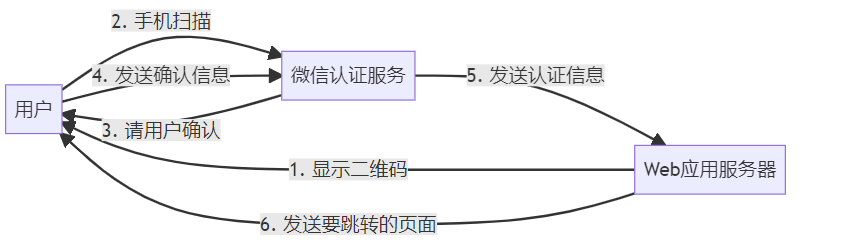
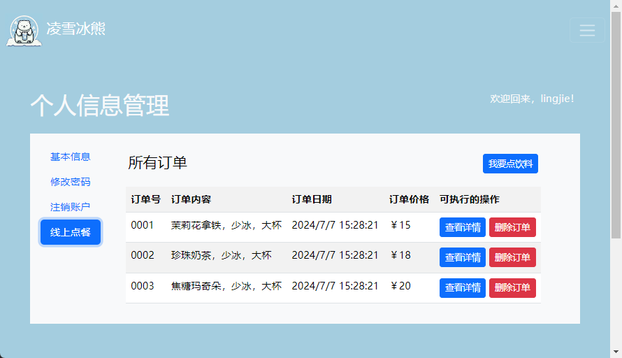
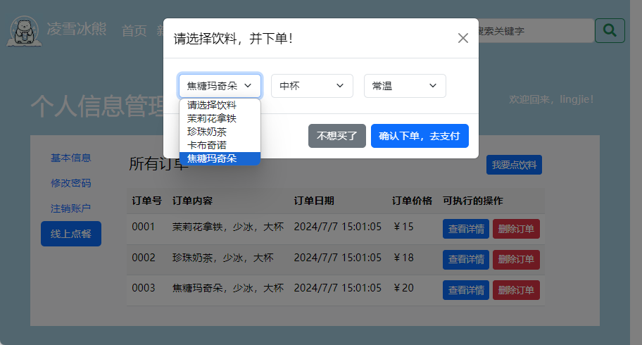
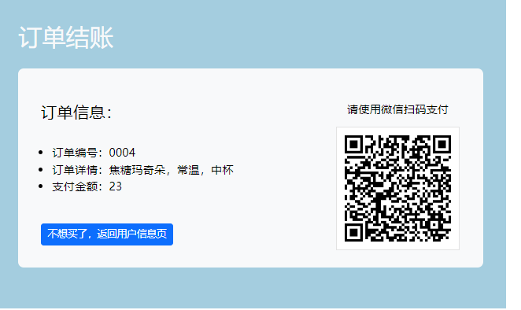

# 项目5.  用户线上购物功能的前端实现

线上购物功能的前端实现在Web应用开发领域中属于电子商务类应用的UI开发项目。作为企业在互联网上开展商务活动的核心基础项目之一，它的开发目标是让企业的用户能够便捷地通过网页浏览器购买其提供的商品和服务，例如餐饮类商店的同城外卖、职业培训机构的收费课程等。此类项目的实施不仅能让企业降低诸如广告行销、实体门店租金等因素所带来的运营成本，还有助于它们即时地根据客户的需求来提供更为精准的服务或更具针对性的产品，从而为消费者提供了更加便捷、高效的购物体验，让他们无需面对交通繁忙、信息滞后等问题，便能享受到丰富多样的商品选择和舒适的购物环境。因此，用户线上购物功能的前端实现被视为软件工程师在Web应用开发领域中的必备技能。

## 【学习目标】

本章项目将会致力于演示如何为一家连锁饮料店的官方网站实现其线上购物功能的Web UI，以便其用户可以直接通过网页浏览器来享用其线上点餐服务，以便更好地借助互联网来开展该连锁店的业务。通过本章项目的实践，读者将会初步学会如何实现订单管理、线上点餐这两大功能的Web UI，并掌握实现这些功能所需要掌握的技术和相关工具。总而言之，在阅读完本章之后，我们希望读者能够：

- 掌握如何在前端实现能用于管理订单的Web UI，以便用户能在该界面中查看自己的购物记录。
- 掌握如何在前端实现线上选购功能的Web UI，以便用户能在该界面中选择自己将要购买的商品；
- 掌握如何在前端实现线上支付功能的Web UI，以便用户能在该界面中完成对所购买商品的支付操作；

## 【学习场景描述】

现在你是一位刚刚入职到“凌雪冰熊”这家连锁饮料店的软件工程师。该连锁店的领导层正在考虑将线下实体店中的部分业务扩展到线上，因此需要在部署了现有网站的Web服务中新增一个线上购物功能，让人们可以通过其网站享用该该连锁店所提供的线上点餐服务。在开发该功能模块的项目中，你的任务是根据项目组中负责后端部分的成员所实现的HTTP API来构建能用于执行相应功能的Web UI。

## 【任务书】

- **项目名**：凌雪冰熊网站线上购物功能的Web UI
- **委托方**：凌雪冰熊股份有限公司互联网部门
- **项目资料**：线上购物功能的后端API，其具体信息如下。
  - *获取点餐菜单的API*：
    - 请求URL：`http://snowbear.com/orders/menu`
    - 请求方法：`GET`
    - 响应数据，以JSON格式返回：
      - 成功响应：`{ status: 200, orderLIst: <以JSON格式返回的菜单列表>}`
      - 失败响应1: `{ status: 404, message: "menu_list_failed"}`
      - 失败响应2: `{ status: 400, message: "request_url_error"}`
  - *查看指定订单的API*：
    - 请求URL：`http://snowbear.com/orders/<用户的ID>&<订单的ID>`
    - 请求方法：`GET`
    - 响应数据，以JSON格式返回：
      - 成功响应：`{ status: 200, message: "order_get_success"}`
      - 失败响应1: `{ status: 500, message: "order_get_failed"}`
      - 失败响应2: `{ status: 400, message: "request_url_error“}`
  - *获取当前用户全部订单的API*：
    - 请求URL：`http://snowbear.com/orders/<用户的ID>`
    - 请求方法：`GET`
    - 响应数据，以JSON格式返回：
      - 成功响应：`{ status: 200, orderLIst: <以JSON格式返回的订单列表>}`
      - 失败响应1: `{ status: 404, message: "order_list_failed"}`
      - 失败响应2: `{ status: 400, message: "request_url_error"}`
  - *结算并增加订单的API*：
    - 请求URL：`http://snowbear.com/orders/<用户的ID>`
    - 请求方法：`POST`
    - 请求参数，需以JSON格式提交, 具体数据为新订单的数据信息。
    - 响应数据，以JSON格式返回：
      - 成功响应：`{ status: 200, message: "order_add_success"}`
      - 失败响应1: `{ status: 403, message: "order_add_failed"}`
      - 失败响应2: `{ status: 400, message: "request_url_error"}`
  - *删除指定订单的API*：
    - 请求URL：`http://snowbear.com/orders/<用户的ID>&<订单的ID>`
    - 请求方法：`DELETE`
    - 响应数据，以JSON格式返回：
      - 成功响应：`{ status: 200, message: "order_delete_success"}`
      - 失败响应1: `{ status: 500, message: "order_delete_failed"}`
      - 失败响应2: `{ status: 400, message: "request_url_error“}`
- **项目要求**：基于【任务书】提供的HTTP API构建出用于执行用户信息管理操作的Web UI，该UI的实现应符合以下要求。
  - 该Web UI应允许用户在完成支付之前在前后端暂存要购买的商品列表；
  - 该Web UI应允许用户对购物车中商品执行增加、修改、删除和结算操作；
  - 该Web UI应允许用户在完成支付之后查看、修改、删除自己的购物订单；
  **时间要求**：在20个工作日内完成；

## 【任务拆解】

整个项目的开发可以划分为以下三个小任务。

- 基于【任务书】中提供的HTTP API构建出用于执行订单管理的Web UI；
- 基于【任务书】提供的HTTP API构建出用于执行线上选购功能的Web UI；
- 基于第三方支付/认证服务提供的API构建出用于执行线上支付功能的Web UI；

## 【工作准备】

在之前的项目实践中，读者主要学习了如何在前端脚本中处理Web UI所需要响应的用户操作，其主要任务是检查用户的输入并将其汇总成可序列化的数据对象，然后再以后HTTP请求的形式将这些数据对象提交给应用的后端服务。然而，作为互联网应用的前端，Web UI除了需要响应来自用户的操作，还需要负责接收后端服务所返回的响应数据，这也需要读者学习如何在前端脚本中对这些数据进行解析，并以表格等可视化的方式呈现给用户。在专业术语中，这一类根据后端响应数据来构建HTML页面的过程被称之为**动态页面的渲染**。在本章要实现的项目中，我们将带领读者重点针对这部分的内容展开学习。接下来，笔者将照例先介绍一些在实施本章项目的过程中会涉及到的知识，和之前一样，如果读者觉得自己已经掌握了上述知识，也可以选择跳过本节内容，直接进入本章项目的【工作实施与交付】环节。

### 知识点1：前端模板引擎

在Web 2.0概念出现之前，人们常常会使用PHP、ASP这一类传统的后端脚本语言来开发Web应用。在这种情况下，HTML页面是在Web应用的后端完成渲染的。换而言之，当开发者们在PHP、ASP等后端脚本中编写好页面的模板之后，将由Web应用的后端来负责按照模板中所设置的占位符将相关数据填充进去，这就是所谓的后端动态页面渲染。而在Web应用的前端，网页浏览器所接收到的依然只是一组静态的HTML+JavaScript+CSS源码文件。很显然，如果我们采用这种动态页面渲染技术，Web应用后端所在的服务器就不仅要负责执行数据的增、删、改、查操作以及与之相关的大规模计算任务，还至少要负责一部分与人机交互相关的任务。这会给Web应用的开发与维护工作带来以下三个不利的影响。

- 由于这种动态页面渲染技术要求Web应用的前后端都得参与Web UI的构建，因而被视为是一种高耦合度的做法，它既不利于开发过程中的任务分工，也不利于该应用项目的后期维护。
- 由于Web应用的后端也要参与Web Ui的构建，所以用户在Web UI中的每个操作可能都意味着要对后端发出请求，并极有可能会导致相关页面需要被频繁刷新，这对于提高Web UI的用户体验是非常不利的。
- 由于Web应用的后端在这种渲染技术中发送给前端的只能是一组静态的HTML+JavaScript+CSS源码文件，这就让网页浏览器成为了该应用唯一的客户端软件。如果我们日后想提供给用户基于Android/iOS平台的客户端软件，恐怕就需要另行开发应用的后端服务了。

随着AJAX等Web 2.0技术的大量普及，业界针对上述问题提出了*服务端API*这种新的Web应用开发方案。这种方案主张将动态页面的渲染工作完全交付给Web应用的前端来负责，而其后端所要担负的任务就只是监听前端发来的请求，并根据请求的内容来执行数据的增、删、改、查操作及其相关的大规模计算，然后将得到的结果以某种特定的数据格式返回给前端，以便作为服务器的响应。这样一来，就很好地解决了前后端的数据分离问题，以及项目开发中的分工问题了。

当然，凡事皆有代价，这个方案同时也给开发者们带来了一个不大不小的麻烦，那就是它会让我们无法再继续使用在PHP、ASP等后端脚本中常用的HTML模板技术了，而后者在动态页面渲染工作中所能提供的便利是很多开发者难以割舍的。为了解决这一麻烦，业界专门开发出了一种专用于实现动态页面渲染的第三方扩展，这类扩展通常被称为“模板引擎”。目前市面上较为常用的模板引擎是EJS和Jade，无论是在Web应用的前端还是后端，开发者们对它们都有大量的使用。但在这里，为了在更合理的篇幅内演示模板引擎的使用方式，笔者会更倾向于为读者介绍一款叫做art-template的模板引擎。

总体而言，art-template是一款同时可在前后端使用的，轻量级的模板引擎。它采用了作用域预声明的技术来优化模板渲染速度，从而获得接近 JavaScript 极限的运行性能。该模板引擎具有以下特性：

- **速度极快**：拥有接近 JavaScript 渲染极限的的性能。
- **调试友好**：语法、运行时错误日志精确到模板所在行。
- **体积较小**：在前端使用的版本仅 6KB 大小。

下面，让我们以创建一个用于呈现用户个人信息的页面为例，来具体为演示一下如何在Web应用的前端使用模板引擎来。首先，读者要在`Examples/02_studynodejs`目录下创建一个名为`useTemplating_engine`的示例项目，并使用`npm init -y`命令将其初始化为Node.js项目。然后陆续执行以下操作。

- 先使用命令行终端环境进入到刚刚创建的`useTemplating_engine`目录下，并执行`npm init -y&&npm install art-template --save`命令，将art-template下载到当前项目中。当然，读者也可以选择先在该项目的根目录下创建一个`script`目录，然后直接去其官网下载名为`template-web.js`的文件，并将其保存到该目录下。

- 接下来，读者需要在`useTemplating_engine`目录下创建一个名为`index.htm`的模版文件，并在其中编写如下代码：

    ```HTML
    <!DOCTYPE html>
    <html lang="zh-cn">
    <head>
        <meta charset="utf-8" />
        <!-- 以 ES6 模块的方式加载自定义前端脚本 -->
        <script type="module" src="./script/my.js"></script>
        <title>用户个人信息</title>
    </head>
    <body>
        <!-- 以下是用于显示页面内容的标记 -->
        <main id="content"></main>
        <!-- 以下是用于设置页面模版的标记 -->
        <script id="demo" type="text/html" >
            {{ if name }}
            <h1>{{ name }}的个人信息</h1>
            <table>
                <tr>
                    <td>姓名：</td>
                    <td>{{ name }}</td>
                </tr>
                <tr>
                    <td>年龄：</td>
                    <td>{{ age }}</td>
                </tr>
                <tr>
                    <td>性别：</td>
                    <td>{{ gender }}</td>
                </tr>
                <tr>
                    <td>爱好：</td>
                    <td>{{ each hobbies }} {{ $value }} {{ /each }}</td>
                </tr>
            </table>
            {{ else }}
            <h1>后端未能返回用户信息</h1>
            {{ /if }}
        </script>
    </body>
    </html>
    ```

- 然后，读者需要根据上述HTML文档中的设置，在`useTemplating_engine/script`目录下创建一个名为`my.js`的前端脚本，并在其中编写如下代码。

    ```JavaScript
    // 以第三方扩展的方式导入 art-template 模板引擎
    import "../node_modules/art-template/lib/template-web.js"

    // 此处假设前端脚本从后端获取到如下响应数据;
    const data = {
        name: '张三',
        age: 18,
        gender: '男',    
        hobbies: ['篮球', '足球', '游泳']
    };

    // template() 方法负责将数据填充到 id =“demo“ 的模板中
    // 并返回模板渲染的结果，这里将其保存在 content 变量中
    const content = template('demo', data);
    // 接下来就只需要将渲染结果显示在 id=“centent”的标记中
    const main = document.querySelector('#content');
    main.innerHTML = content;
    ```

- 在保存上述所有文件之后，读者就可以使用网页浏览器打开`useTemplating_engine`目录下的`index.htm`文档来查看页面渲染的结果，其在Google Chrome浏览器中的呈现效果如图5-1所示。

  

  **图5-1** 基于art-template的动态页面渲染

下面来具体讲解一下我们在上述示例中所做的操作。在基于art-template模板引擎执行动态页面渲的染任务时，首先需要做的是，在HTML文档中使用`<script type="text/html">`标记来定义一段HTML代码的模版，然后在其中用一套按既定规则编写的模板占位符来定义该模板最终要显示的页面元素。在art-template的模板编写规则中，模板占位符大致可分为“数据”和“指令”两大类。其中，数据类占位符的编写规则为：`{{ 数据标签 }}`，它的主要作用是将前端脚本所指定的数据直接输出在页面中。因此，我们在模板中使用的`数据标签`必须要与前端脚本中用于渲染模板的数据对象中的属性相对应，例如在上述示例中，模板中的占位符`{{ name }}`对应的是前端脚本中`data`对象的`name`属性。

如果我们在定义HTML模板的过程中，还希望进一步根据前端脚本提供的数据来动态生成对应的页面元素，就需要用指令类占位符来实现了。例如，当读者在HTML模板中需要基于某项数据来决定是否显示某个页面元素时，就要使用条件指令来对该数据的值进行判定，就像在上述示例中，我们就使用了`{{ if name }}`这个指令占位符，当`name`这项数据的值被判定为`null`时，这段模板代码就只会被渲染成一个带有“后端未能返回用户信息”字样的`<h1>`标记。在art-template的模板编写规则中，条件指令占位符主要有以下三种形式。

- **单分支条件指令**：用于只在某个条件满足时显示指定的HTML标记，具体编写规则如下。
  
  ```HTML
  {{ if [条件] }}
  <!-- 要显示的 HTML 标记 -->
  {{ /if }}
  ```

- **双分支条件指令**：用于根据某个条件在两组指定的HTML标记之间二选一，具体编写规则如下。
  
  ```HTML
  {{ if [条件] }}
  <!-- [条件]满足时要显示的 HTML 标记 -->
  {{ else }}
  <!-- [条件]不满足时要显示的 HTML 标记 -->
  {{ /if }}
  ```

- **多分支条件指令**：用于根据多个条件来选择要显示的HTML标记，具体编写规则如下。

  ```HTML
  {{ if [条件 1] }}
  <!--[条件 1]满足时要显示的 HTML 标记-->
  {{ else if [条件 2] }}
  <!--[条件 2]满足时要显示的 HTML 标记-->
  {{ else if [条件 3] }}
  <!--[条件 3]满足时要显示的 HTML 标记-->
  ....
  {{ else if [条件 n] }}
  <!--[条件 n]满足时要显示的 HTML 标记-->
  {{ /if }}
  ```

同样的，当读者在模板中需要通过迭代某项容器类对象来显示某些页面元素时，也可以使用迭代指令来实现。例如在上述示例中，`hobbies`数据是一个字符串类型的数组，所以我们需要通过迭代指令来显示其中的信息。在art-template模板引擎中，迭代指令的编写规则具体如下。

```HTML
{{ each [被迭代的数据] }}
    <[HTML标记]>{{ $index }} {{ $value }}</[HTML标记]>
{{ /each }}
```

在上述编写规则中，`[被遍历的数据]`应该是一个容器类型的数据对象，它应该是可被迭代的。`[HTML标签]`可以是任何一个可呈现内容的HTML标记。然后，`$index`是当前迭代项的索引值，通常是一个从0开始计数的正整数，而`$value`则是被迭代项的值。有时候，我们只需用到迭代项的索引值，有时候则只需用到它本身的值，这需要根据具体情况而定，但可以肯定的是，这两个值不必同时使用。另外，如果读者在使用条件或迭代指令的过程中还需对前端脚本所提供的数据进行更复杂的处理，art-template提供的指令占位符还容许我们设置模板变量，并执行简单的运算（甚至调用被引入的JavaScript函数），例如像下面这样。

```HTML
<script id="js_code" type="module">
    import "./node_modules/art-template/lib/template-web.js"
    const data = {
        name: "张三",
    };
    // 导出一个JavaScript函数
    template.defaults.imports.logout = console.log;
    const htmlcode = template('test', data);
    document.querySelector("#content").innerHTML = htmlcode;
</script>
<div id="content"></div>
<script id="test" type="text/html">
    <!-- 定义一个模板变量 -->
    {{ set isLogin = name!=null }}
    {{ if isLogin }}
        <h1>欢迎您，{{ name }}</h1>
    {{ else }}
        <h1>请先登录</h1>
    {{ /if }}
    <!-- 调用被导入的JavaScript函数 -->
    {{ $imports.logout("调用 console.log()方法") }}
</script>
```

总体而言，art-template的模版编写规则是相当简单的，虽然它也提供了一些用于设计HTML页面模板的，较为复杂一点的指令（例如与模板继承相关的指令），但基本上也只需要稍加学习就能上手，读者如果有兴趣的话可以查阅一下该模板引擎的官方文档，这里基于篇幅的局限，就不展开讨论了。

在完成了HTML页面的模板设计之后，接下来就可以在对应的前端脚本中对其进行该模板进行动态渲染了。该前端脚本的具体编写步骤如下。

- 首先，在确保已经成功下载到art-template的源码文件之后，使用ES6中的`import`关键字将该模板引擎以第三方扩展的方式加载到当前脚本文件中。
- 然后，我们需要调用art-templatem模板引擎提供的`template()`方法来将模版文件渲染成真正的页面。该方法可以接受两个参数。其中，第一个参数应该是一个字符串，接收的是模板标签所使用的id属性（例如上述示例中`id=‘demo’`的`<script>`标记），第二个参数应该是一个JSON格式的数据对象，用于渲染HTML页面中要填充的具体内容，因此该数据对象的每个属性名需要与模版中设置的变量占位符一一对应。
- 最后，我们就只需要用`document.querySelector(()`方法来获取到用于显示渲染结果的HTML标记，并调用其`innerHTML`属性来设置要显示的页面内容。

同样需要说明的是，我们在这里所介绍的这些只是art-template模板引擎在Web前端部分的基本使用方法，它足以应付本章项目的需要了。当然，除了这部分知识之外，该模板引擎同样也可以应用于Web后端部分，甚至可以搭配Express框架进行更为复杂的动态页面渲染。关于它的这些用法，读者可以自行去查阅该模板引擎的官方文档，这里基于篇幅方面的考虑就不再一一累述了。

### 知识点2：扫码认证功能的前端实现

在如今的Web应用开发中，在前端允许用户通过移动端设备扫描二维码的方式来完成某种需要安全认证的操作（例如用户登录，线上支付等），已经成为了一种非常流行且成熟的解决方案。该解决方案之所以被认为相对安全，主要是因为它是基于相对有公信力的认证平台发布的移动端软件来实现的。因此在开始实现扫码功能之前，读者需要先决定自己要基于哪一种第三方平台来实现它。由于在本章项目中，读者将被要求基于微信平台来模拟实现一个用于执行线上支付操作的Web UI，所以在正式开始项目之前，让我们先来介绍一下实现这类功能的基本步骤，具体如下。

- 首先，读者需要进入到微信公众平台所在的网站（如图5-2所示）中，然后使用自己的微信账号登录并申请创建一个微信小程序。当然，如果该小程序的开发仅用于教学演示或学习研究，出于节省时间和公共资源的考虑，我们在这里会建议读者向该平台申请一个可用于开发微信小程序的测试号即可。

  

  **图5-2** 微信公众平台的官方网站

- 待微信公众平台通过上述申请之后，读者就可以进入到微信小程序的设置界面中，并获取到小程序的AppID和AppSecret了，如图5-3所示。
  
  

  **图5-3** 微信小程序的设置界面

- 现在，读者需要在上述界面中对这个小程序进行一些基本配置。其中最重要的配置主要有两项，首先是“接口配置信息”和“JS接口安全域名”。其中，前者配置的是我们在后端准备用于接收微信服务器返回信息的API（具体的值是该API所在的URL，以及用于访问该URL的Token）。后者配置的是我们前端脚本所在的域名，具体如图5-4所示。

  

  **图5-4** 微信小程序的接口配置

  其次是"网页服务"这一项中的“网页授权获取用户基本信息”，这里配置的是用户扫码认证成功之后将访问的网页所在的域名（整理将其设置为`example.com`），如图5-5所示。

  

  **图5-5** 网页授权获取用户基本信息

- 在完成上述配置之后，读者就可以开始在自己的应用中实现扫码功能了。例如，我们可以在之前应用于创建示例项目的`Examples`目录下创建一个名为`04_wxappDemo`的目录，然后在该目录下创建一个名为`index.htm`的文件，并在其中输入如下代码。

    ```HTML
    <!DOCTYPE html>
    <html lang="zh_CN">
        <head>
            <meta charset="UTF-8">
            <script type="module" src="./script/showQRCode.js "></script>
            <title>实现扫码功能演示</title>
        </head>
        <body>
            <h1>实现扫码功能演示</h1>
            <button id="showQRCode">生成二维码</button>
            <div id="qrcodeContainer"></div>
        </body>
    </html>
    ```

- 接着，读者需要根据上述HTML文档中`<script>`标记指定的路径创建一个名为`showQCode.js`的前端脚本文件，并在其中输入如下代码。

    ```JavaScript
    import "https://res.wx.qq.com/connect/zh_CN/htmledition/js/wxLogin.js"

    window.addEventListener('load', function () {
        const btn = document.querySelector('#showQRCode');
        btn.addEventListener('click', getQRCode);
    });

    async function getQRCode() { 
        // 创建一个用于安全认证的二维码
        const obj = new WxLogin({
            id: "qrcodeContainer" ,  // 设置要加载二维码的容器
                                                // 这里指定的是id为qcodeContainer的div元素
            appid: "wx616f8e948185aa03",  // 设置微信小程序的AppID
                                                            // 这里使用的是微信公众平台的测试号
            scope: "snsapi_base,snsapi_userinfo",  // 设置授权范围
                        // 微信公众平台的测试号，设置为 snsapi_base 或者 snsapi_userinfo即可
                        // 如果是正式申请的小程序，需要设置为 snsapi_login
            state: "1203",  // 设置一个随机数，用于验证登录状态 
            redirect_uri: "https://example.com/wxMessage/index.htm", 
                // 设置扫码认证成功之后要重定向的URL，
                // 这里使用的是一个示例地址，实际应用中需要替换为你的服务器地址
        });
    }
    ```

- 在用户执行扫码认证成功之后，微信认证服务会自动将认证码拼接在重定向URL后面，并发送给Web应用的前端，例如像这样：
  
  ```javascript
  https://example.com/wxMessage?code=021NoBFa1u5ORE0600Ja1dDubb2NoBFT&state=1203
  ```
  
  在上述URL中，`code`参数是微信服务器返回的认证码，`state`参数是我们在前端脚本中指定的随机数。读者可以通过以下两种方法来获取该验证码：

    ```javascript
    // 1. 通过window对象获取
    window.location.search.substring(6).split('&')[0]
    // 2. 通过路由监听获取
    watch: {
        $route(){
            if(this.$route.query.code!=undefined){
                console.log(this.$route.query.code,this.$route.query.state);
            }
        }
    },
    ```

- 在成功获取到来自微信认证服务的认证码之后，读者就可以经由之前在`WxLogin`对象中设置的重定向URL来向Web应用的后端服务发送认证码并执行后续操作了。例如像下面这样获取指定的数据。
  
    ```javascript
    if(window.location.search.substring(6).split('&')[0]) {
        const url = 'http://example.com/data?code=' 
                       + window.location.search.substring(6).split('&')[0];
        try {
            const res = await fetch(url, { method: 'GET' });
            const data = await res.json();
            console.log(data);
        } catch (error) {
            console.error(error);
        }
    }
    ```

- 在保存上述所有代码之后，读者就只需要用网页浏览器中打开由`index.htm`文件所定义的网页，并点击其中带有“生成二维码”字样的按钮即可看到我们在脚本中用`WxLogin`对象动态生成的二维码了，如图5-6所示。

  

  **图5-6** 用于执行扫码认证的Web UI

当然，如果读者想让上述Web UI真正发挥它的功能，还需要在公共互联网中部署一个实际可用的Web应用服务，并且其中要能有一个后端API来处理微信认证服务返回的认证码，其整个工作流程如图5-7所示。


  
**图5-7** 微信扫码认证的工作流程

## 【工作实施和交付】

在完成了上述工作准备之后，读者就可以根据之前【任务书】中的要求来着手为凌雪冰熊网站实现用户线上购物功能的前端部分了。基于之前在【任务拆解】一节中所做的规划，该项目的实施过程可以分为以下步骤来进行。

### 第1步：构建用于执行订单管理的Web UI

在这一步骤中，软件工程师的主要任务是在上一章中创建的“个人信息管理”页中添加一个“线上点餐”界面，并利用之前介绍的art-template模板引擎来设计该界面中的订单列表。为此，读者需要执行以下操作。

1. 在使用VS Code编辑器重新打开我们之前在上一章中创建的`userinfo.htm`文件，并在其`<section>`标记中找到用于充当“个人信息管理”界面的Bootstrap导航栏组件，然后在其导航按钮所在的`<div id=“v-pills-tab”>`标记中添加一个标签为“线上点餐”的导航项，具体代码如下。

    ```html
    <div id="v-pills-tab" role="tablist"
        class="nav flex-column nav-pills me-3 text-nowrap"
        aria-orientation="vertical">
        <button class="nav-link active" 
                id="v-pills-baseinfo-tab" 
                data-bs-toggle="pill" 
                data-bs-target="#v-pills-baseinfo" 
                type="button" role="tab"
                aria-controls="v-pills-baseinfo" 
                aria-selected="true">
                基本信息
        </button>
        <button class="nav-link" 
                id="v-pills-password-tab" 
                data-bs-toggle="pill" 
                data-bs-target="#v-pills-password" 
                type="button" role="tab" 
                aria-controls="v-pills-password" 
                aria-selected="false">
            修改密码
        </button>
        <button class="nav-link" 
                id="v-pills-deleteuser-tab" 
                data-bs-toggle="pill" 
                data-bs-target="#v-pills-deleteuser" 
                type="button" role="tab" 
                aria-controls="v-pills-deleteuser" 
                aria-selected="false">
                注销账户
        </button>
        <!-- 在此处添加新的导航项 -->
        <button class="nav-link" 
                id="v-pills-order-tab" 
                data-bs-toggle="pill" 
                data-bs-target="#v-pills-order" 
                type="button" role="tab" 
                aria-controls="v-pills-order" 
                aria-selected="false">
                线上点餐
        </button>
    </div>
    ```

2. 在上述导航栏组件中找到其主内容所在的区域（即`<div id=“v-pills-tabContent”>`标记所在之处），并在其中添加与“线上点餐”导航项相对应的界面，具体代码如下。

    ```html
    <div id="v-pills-tabContent  class="tab-content"">
        <!-- 此处省略已有的代码 -->
        <div class="tab-pane fade container-fluid"
            id="v-pills-order" role="tabpanel" 
            aria-labelledby="v-pills-order-tab">
            <header class="p-3 row">
                <h4 class="col-10">所有订单 </h3>
                <div class="col-2 text-end">
                    <!-- 此处预留进入点餐对话框的入口 -->
                    <button type="button" class="btn btn-primary btn-sm"   
                        data-bs-toggle="modal" data-bs-target="#addorder">
                        我要点饮料
                    </button>
                    <!-- 此处将用于放置充当点餐界面的对话框组件 -->
                </div>
            </header>
            <article id="orderlist" class="container">
            </article>                        
            <script id="ordertemplate" type="text/html">
                <table id="ordertable" class="table table-striped table-hover">
                    <tr>
                        <th>订单号</th>
                        <th>订单内容</th>
                        <th>订单日期</th>
                        <th>订单价格</th>
                        <th>可执行的操作</th>
                    </tr>
                    {{ each orderlist }}
                    <tr>
                        <td> {{ $value.number }} </td>
                        <td> {{ $value.message }} </td>
                        <td> {{ $value.date }} </td>
                        <td> ￥{{ $value.price }} </td>
                        <td>
                            <button type="button" 
                                class="showDetail btn btn-primary btn-sm"
                                order-number="{{ $value.number }}">
                                查看详情
                            </button>
                            <button type="button" 
                                class="deleteOrder btn btn-danger btn-sm"
                                order-number="{{ $value.number }}">
                                删除订单
                            </button>
                        </td>
                    </tr>
                    {{ /each }}
                </table>
            </script>
        </div>
    </div>
    ```

3. 在`userinfo.htm`文件所在目录下的`scripts`子目录中创建一个名为`orderManage.js`的前端脚本文件，并在其中编写用于实现“订单管理”功能的相关代码，具体内容如下。

    ```javascript
    // 加载 art=emplate 模板引擎
    import "../node_modules/art-template/lib/template-web.js"

    // 设置用于 art-template 渲染的全局变量
    const data = {};
    // 设置网站的域名
    // const domain = 'snowbear.com';
    // 本地测试用的域名
    const domain = 'localhost';
    // 获取用户数据
    const userData = JSON.parse(sessionStorage.getItem("userData"));

    // 用于渲染用户订单列表的函数
    async function renderOrderList() {
        const actionAPI = `http://${domain}/orders/${userData["uid"]}`;
        try {
            // 获取当前用户所有订单
            const res = await fetch(actionAPI, { method: 'GET' });
            data.orderlist = await res.json();
            const templateContent = template('ordertemplate', data);
            const orderlist = document.querySelector('#orderlist');
            orderlist.innerHTML = templateContent;
        } catch (error) {
            throw error;
        }
    }

    // 用于显示订单详情的函数
    async function showOrderDetail(orderNumber) {
        const actionAPI = `http://${domain}/orders/${userData["uid"]}&${orderNumber}`;
        try {
            const res = await fetch(actionAPI, { method: 'GET' });
            const data = await res.json();
            const outMsg = `\
                订单编号：${data.number}\n \
                订单详情：${data.message}\n \
                订单价格：${data.price} 元`;
            window.alert(outMsg);
        } catch (error) {
            throw error;
        }
    }

    // 用于删除订单的函数
    async function deleteOrder(orderNumber) {
        const actionAPI = `http://${domain}/orders/${userData["uid"]}&${orderNumber}`;
        try {
            const res = await fetch(actionAPI, { method: 'DELETE' });
            if (res.status == 200) {
                window.alert('订单删除成功');
            } else {
                window.alert('订单删除失败');
            }
        } catch (error) {
            throw error;
        }
    }

    // 执行页面渲染操作
    window.addEventListener('load', async function() {
        try {
            // 渲染订单管理界面
            await renderOrderList();
            const showDetailBtns = document.querySelectorAll('.showDetail');
            for (let btn of showDetailBtns) {
                const orderNumber = btn.getAttribute('order-number');
                btn.addEventListener('click', async function() {
                    try {
                        await showOrderDetail(orderNumber)
                    } catch (error) {
                        window.alert(`订单详情获取错误：${error}`);
                    }
                });
            }
            const deleteOrderBtns = document.querySelectorAll('.deleteOrder');
            for (let btn of deleteOrderBtns) {
                const orderNumber = btn.getAttribute('order-number');
                btn.addEventListener('click', async function() {
                    try {
                        await deleteOrder(orderNumber);
                        await renderOrderList();    
                    } catch (error) {
                        window.alert(`订单删除错误：${error}`);
                    }
                });
            }
        } catch (error) {
            window.alert(`页面渲染错误：${error}`);
        }
    })
    ```

4. 使用`<script type="module">`标记以ES6模块的形式将上述脚本文件加载到`userinfo.htm`文件中的`<>`标记中，具体代码如下。

    ```html
    <head>
        <!-- 此处省略已有代码 -->
        <script type="module" src="scripts/orderManage.js"></script>
        <title>用户个人信息管理</title>
    </head>
    ```

5. 在保存了上述所有文件之后，如果读者重新启动并重新登录到这个Web应用中，就可以在“个人信息管理”页中看到这个“线上点餐”功能的订单管理界面了，其效果如图5-8所示。

    

    **图5-8** 用户的订单管理界面

6. 如果上述操作一切顺利，读者就可以将当前步骤所获得的进展提交给git版本控制系统了，具体命令如下。

    ```bash
    git add .
    git commit -m "项目5：创建用户的订单管理界面"
    ```

### 第2步：构建用于执行线上选购功能的Web UI

在这一步骤中，软件工程师的主要任务是基于我们之前在“订单管理”界面中预留的“我要点饮料”按钮，继续利用art-template模板引擎和Bootstrap对话框组件来创建一个可用于选购饮料的界面。为此，读者需要执行以下操作。

1. 使用VS Code编辑器重新打开`userinfo.htm`文件，并在其中找到`<!-- 此处将用于放置充当点餐界面的对话框组件 -->`这个注释标记所在的位置，然后在该位置后面插入一个基于Bootstrap对话框组件创建的选购界面，具体如下。

    ```html
    <!-- 此处将用于放置充当点餐界面的对话框组件 -->
    <div class="modal fade" id="addorder" tabindex="-1"
        aria-labelledby="addorderLabel" aria-hidden="true">
        <div class="modal-dialog">
            <div class="modal-content">
                <div class="modal-header">
                    <h5 class="modal-title" id="addorderLabel">
                        请选择饮料，并下单！
                    </h5>
                    <button type="button" class="btn-close"
                        data-bs-dismiss="modal" aria-label="Close">
                    </button>
                </div>
                <div class="modal-body" >
                    <form id="orderForm" class="p-2">
                        <div id="drinkList"></div>
                    </form>
                </div>
                <script id="drinklistTpl" type="text/html">
                    <div class="row g-3">
                        <div class="col-auto">
                            <select class="form-select" name="drink">
                                <option selected">请选择饮料 </option>
                                {{ each menuList }}
                                <option value="{{ $value.price  }}">
                                    {{ $value.name }}
                                </option>
                                {{ /each }}
                            </select>
                        </div>
                        <div class="col-auto">
                            <select class="form-select" name="size">
                                <option selected>请选择尺寸</option>
                                <option value="2">大杯</option>
                                <option value="1">中杯</option>
                                <option value="0">小杯</option>
                            </select>
                        </div>
                        <div class="col-auto">
                            <select class="form-select" name="heatlevel">
                                <option selected>请选择温度</option>
                                <option value="2">热饮</option>
                                <option value="0">常温</option>
                                <option value="1">少冰</option>
                                <option value="2">正常冰</option>
                            </select>
                        </div>
                    </div>
                </script>
                <div class="modal-footer">
                    <button type="button" class="btn btn-secondary" 
                        data-bs-dismiss="modal">
                        不想买了
                    </button>
                    <button type="button" class="btn btn-primary"
                        id="addorder">
                        确认下单，去支付
                    </button>
                </div>
            </div>
        </div>
    </div>
    ```

2. 回到之前创建的`orderManage.js`前端脚本文件中，并在其中添加用于实现“线上选购”功能的相关代码，具体内容如下。

    ```javascript
    // 用于渲染饮料选购界面的函数
    async function renderNewOrderForm() {
        // 从后端获取产品列表
        const actionAPI = `http://${domain}/orders/menu`;
        try {
            // 获取当前饮料店的菜单
            const res = await fetch(actionAPI, { method: 'GET' });
            data.menuList = await res.json();
            const drinklistTpl = template('drinklistTpl', data);
            const drinkList = document.querySelector('#drinkList');
            drinkList.innerHTML = drinklistTpl;    
        } catch (error) {
            throw error;
        }
    }

    // 用于获取下拉菜单中被选项的函数
    function getSelectItem(selectInput) {
        const index = selectInput.selectedIndex;
        if (index == 0) {
            return false;
        }
        const option = selectInput.options[index];
        return option;
    }

    // 以下定义用于添加订单的事件函数
    const addoder = document.querySelector('#addorder');
    addoder.addEventListener('click', function() {    
        const form = document.querySelector('#orderForm');
        const drink = getSelectItem(form.drink);
        const size = getSelectItem(form.size);
        const heatlevel = getSelectItem(form.heatlevel);
        if (drink && size && heatlevel) {
            const total =Number(drink.value) 
                            + Number(size.value) 
                            + Number(heatlevel.value);
            const newOrder = {
                number: '000'+Number(data.orderlist.length+1).toString(),
                message: `${drink.text}，${heatlevel.text}，${size.text}`,
                date: new Date().toLocaleString(),
                price: total
            };      
            sessionStorage.setItem('newOrder', JSON.stringify(newOrder));
            window.location.href = 'onlinePay.htm';
        } else {
            window.alert('请输入正确的订单选项');
        }
    });
    ```

3. 修改在上一步骤中创建的`window`对象的`load`事件函数，以便在页面加载时自动渲染饮料选购界面，具体代码如下。

    ```javascript
    window.addEventListener('load', async function() {
        try {
            // 此处省略用于渲染订单管理界面的代码
            // 渲染饮料选购界面
            await renderNewOrderForm();
        } catch (error) {
            window.alert(`页面渲染错误：${error}`);
        }
    })
    ```

4. 在保存了上述所有文件之后，如果读者重新启动并重新登录到这个Web应用中，然后在之前创建的订单管理界面中单击“我要点饮料”按钮，就可以看到效果如图5-9所示的饮料选购界面了。

    

    **图5-9** 用户的饮料选购界面

5. 如果上述操作一切顺利，读者就可以将当前步骤所获得的进展提交给git版本控制系统了，具体命令如下。

    ```bash
    git add .
    git commit -m "项目5：创建用户的饮料选购界面"
    ```

### 第3步：构建用于模拟扫码支付功能的Web UI

在这一步骤中，软件工程师的主要任务是参照支付宝和微信支付模拟一个可用于执行扫码支付操作的界面。该界面要能对支付成功与否进行判断，并将相关的信息响应给用户。为此，读者需要执行以下操作。

1. 参照本章在【工作准备】部分中介绍的知识点，前往微信公众平台的官方网站获取一个可用于模拟扫码认证的小程序测试号，并在其中完成相关域名的设置。

2. 在`userinfo.htm`文件所在目录下创建一个名为`onlinePay.htm`的HTML文档，并在其中编写用于构建“线上支付”界面的相关代码，具体内容如下。

    ```html
    <!DOCTYPE html>
    <html lang="zh-CN">
    <head>
        <meta charset="UTF-8">
        <title>订单结账</title>
        <!-- 引入Bootstrap框架的CSS样式文件 -->
        <link rel="stylesheet" href="./node_modules/bootstrap/dist/css/bootstrap.min.css">
        <!-- 引入Bootstrap框架需要加载的脚本文件 -->       
        <script defer src="./node_modules/@popperjs/core/dist/umd/popper.min.js"></script>
        <script defer src="./node_modules/bootstrap/dist/js/bootstrap.min.js"></script>
        <link rel="stylesheet" href="./styles/custom.css">
        <script type="module" src="./scripts/onlinePay.js"></script>
    </head>
    <body>
        <main id="onlinePay" class="container p-3 text-light">
            <h1 class="m-3 mb-4">订单结账</h1>
            <section class="row m-3 p-3 text-bg-light rounded-3">
                <div class="p-3 col-8">
                    <h4 class="my-3">订单信息：</h4>
                    <div id="orderMessage"></div>
                    <a href="./userinfo.htm" class="mt-2 btn btn-primary btn-sm">
                        不想买了，返回用户信息页
                    </a>
                    <script id="orderTemplate" type="text/html">
                        <ul class="p-3">
                            <li>订单编号：{{ number }}</li>
                            <li>订单详情：{{ message }}</li>
                            <li>支付金额：{{ price }}</li>
                        </ul>
                    </script>
                </div>
                <div class="p-3 col-4">
                    <h6 class="m-3">请使用微信扫码支付 </h6>
                    <div id="qrcodeContainer"></div>
                </div>
            </section>
        </main>
    </body>
    </html>
    ```

3. 在`onlinePay.htm`文件所在目录下的`scripts`子目录中创建一个名为`onlinePay.js`的前端脚本文件，并在其中编写用于模拟“线上支付”功能的相关代码，具体内容如下。

    ```javascript
    // 加载用于微信认证的 JS 文件
    import "https://res.wx.qq.com/connect/zh_CN/htmledition/js/wxLogin.js"
    // 加载用于模板渲染的 JS 文件
    import "../node_modules/art-template/lib/template-web.js"

    window.addEventListener('load', async function () {
        // 获取新订单的数据
        const newOrder = JSON.parse(sessionStorage.getItem('newOrder'))

        if(window.location.search.substring(6).split('&')[0]) {
            // 如果已经支付成功，就将订单提交给后端，并跳转至用户信息页
            const userData = JSON.parse(sessionStorage.getItem("userData"));
            // const actionAPI = 'http://snowbear.com/orders/' + userData["uid"];
            // 本地测试用的 URL
            const actionAPI = 'http://localhost/orders/' + userData["uid"];
            try {
                const res = await fetch(actionAPI, {
                    method: 'POST',
                    headers: {
                        'Content-Type': 'application/json'
                    },
                    body: JSON.stringify(newOrder)
                });
            if(res.status === 200) {
                    window.alert('下单成功！请点击确定返回用户信息页')
                    window.location.href = './userInfo.htm';
                } else if(res.status == 403) {
                    window.alert('下单失败，请重新支付！')
                    window.location.href = './onlinePay.htm';
                } else {
                    window.alert('下单失败，请检查网络是否畅通！')
                    window.location.href = './onlinePay.htm';
                }
            } catch (error) {
                this.window.alert(`程序出错！错误信息：${error}`)
                window.location.href = './onlinePay.htm';
            }
        } else {
            // 如果尚未完成支付，即渲染页面模板
            const tpl = template('orderTemplate', newOrder)
            document.querySelector('#orderMessage').innerHTML = tpl

            // 并创建一个用于模拟支付的二维码
            const cssbase64 = "data:text/css;base64,LmxvZ2luUGFuZWwubm9ybWFsUGFuZWwgLnRpdGxlIHsNCiAgZGlzcGxheTogbm9uZTsNCn0NCi5xcmNvZGUubGlnaHRCb3JkZXIgew0KICB3aWR0aDogMTc0cHg7DQogIGhlaWdodDogMTc0cHg7DQogIG1hcmdpbi10b3A6IDA7DQogIGJveC1zaXppbmc6IGJvcmRlci1ib3g7DQp9DQouaW1wb3dlckJveCAuaW5mbyB7DQogIGRpc3BsYXk6IG5vbmU7DQp9DQoud2ViX3FyY29kZV90eXBlX2lmcmFtZSB7DQogIHdpZHRoOiAxNzRweDsNCn0NCg=="
            const obj = new WxLogin({
                id: "qrcodeContainer" , 
                appid: "wx616f8e948185aa03",  // 这里使用的是微信公众平台的测试号
                scope: "snsapi_base,snsapi_userinfo",  
                        // 微信测试号设置为 snsapi_base 或者 snsapi_userinfo即可
                state: "1203",  // 设置一个随机数，用于验证登录状态 
                redirect_uri: "http://snowbear.com/onlinePay.htm", 
                href: cssbase64  // 设置自定义的二维码显示样式
            });
        }
    });
    ```

4. 在保存了上述所有文件之后，如果读者重新启动这个Web应用并进入到之前创建的饮料选购界面中，然后在选择好要买的饮料之后单击“确认下单，去支付”按钮，就可以看到效果如图5-10所示的线上支付界面了。

    

    **图5-10** 模拟扫码支付的界面

5. 如果上述操作一切顺利，读者就可以将当前步骤所获得的进展提交给git版本控制系统了，具体命令如下。

    ```bash
    git add .
    git commit -m "项目5：创建模拟扫码支付的界面"
    ```

## 【拓展知识】

在本章项目的实施过程中，我们基于教学方面的考虑，选择使用专用模板引擎和微信扫码认证这类封装粒度较为底层的API来实现相关的功能。但在实际生产环境中，开发者们通常会选择封装粒度较高的第三方程序设计框架来实现他们的项目，以便得到更好的开发体验和工作效率。接下来，我们就以Vue.js框架中的动态页面渲染，以及支付宝线上支付服务的申请流程为例来补充一下这方面的知识，以作为读者学习实现本章同类项目的拓展。

### 知识点1：基于Vue.js框架的动态页面渲染

在上一章的【拓展知识】部分中，我们为读者介绍了如何使用Vue.js框架的`v-model`指令来实现输入性界面元素与前端脚本的双向数据绑定，这本质上也是动态页面渲染操作的一部分。下面，让我们来学习更多相关页面指令，以便更全面地掌握该框架在动态渲染方面的应用。

#### 单向数据绑定：`v-text`和`v-html`

现在，我们不妨先来回顾一下之前在`01_hello_vuejs`示例项目，分析一下在`index.htm`模板文件中已经使用了的模板指令。首先是单向的数据绑定指令。在`id`值为`app`的`<div>`标签中，我们将`<h1>`标签之下的文本内容设置成了`{{ app_title }}`，这种类似于通用模板的写法实际上是`v-text`指令的语法糖。换句话说，该`<h1>`标签在 Vue.js 框架的模板文件中更规范的写法应该是这样的：

```HTML
<h1 v-text="app_title"></h1>
```

如你所见，`v-text`指令的作用将`<h1>`标签之下的文本内容绑定在一个名为`app_title`的模板变量上，而该模板变量中的数据将会在 Vue 对象中被定义。当然了，考虑到大家一直以来编写 HTML 标签的习惯，我们在通常情况下会更倾向于使用`{{ 模板变量 }}`这样的模版语法来绑定文本数据。除了纯文本内容的数据绑定之外，有时候我们也会需要在指定标签内插入其他标签，这就需要用到另一个名为`v-html`的数据绑定指令了，它的语法与`v-text`指令相同，即当某个模板变量`htmlTag`中的数据为`<h1>Hello, World</h1>`时，就可以像下面这样将它绑定到一个`<div>`标签中：

```HTML
<div v-html="htmlTag"></div>
```

同样地，我们在很多情况下也会需要为标签本身的属性绑定数据，这需要使用到一个名为`v-bind`的模板指令，该指令的具体语法是先在相应的标签属性名前面加上`v-bind:`前缀，然后再为该属性绑定一个在 Vue 对象中定义的数据。例如，如果想在 Vue.js 框架的模板文件中添加一个``标签，那么我们就可以这样为该标签的`src`属性绑定数据：

```HTML

```

这样一来，``标签的`src`属性就与一个名为`imgURL`的模板变量绑定在一起了，然后我们只需要在 Vue 对象中定义该模板变量中的数据，并为其指定具体的 URL 即可。另外，`v-bind`指令还有一个简写形式，这种形式只需要在要绑定数据的标签属性名之前加一个`:`前缀即可。例如，我们也可以像下面这样将``标签添加到`01_hello_vuejs/index.htm`模板文件中：

```HTML
<!DOCTYPE html>
<html lang="zh-cn">
    <head>
        <meta charset="UTF-8">
        <title>浏览器端JS代码测试</title>
        <link rel="stylesheet" type="text/css" href="styles/main.css" />        
        <script type="module" src="./scripts/main.js"></script>
    </head>
    <body>
        <div id="app">
            <h1> {{ app_title }} </h1>
            <!-- 上面是下面这种写法的语法糖 -->
            <!-- <h1 v-text="app_title"></h1> -->
            <div id="content">
                 
                <!-- 上面是下面这种写法的简写形式 -->
                <!--  -->
                <p> {{ message }} </p>
            </div>
            <input type="button" value="打个招呼！" v-on:click="sayHello()">
        </div>
    </body>
</html>
```

接下来，我们需要在`01_hello_vuejs`项目的根目录下再创建一个名为`images`的目录，并将一个名为`logo.png`的图标文件存储到该目录中，然后将`01_hello_vuejs/scripts/main.js`文件中的代码修改如下：

```JavaScript
// 加载开发环境版本，该版本包含了有帮助的命令行警告
import Vue from '../node_modules/vue/dist/vue.esm.browser.js';
// 或者
// 加载生产环境版本，该版本优化了文件大小和载入速度
// import Vue from '../node_modules/vue/dist/vue.esm.browser.min.js';

const app = new Vue({
    el: '#app',
    data: {
        app_title : 'Vue.js 前端应用示例',
        message   : '',
        imgURL    : './images/logo.png'
    },
    methods: {
        sayHello: function() {
            this.message = 'Hello，Vue.js app.';
        }
    }
});
```

当然了，在查看修改的效果之前，我们还需要在`01_hello_vuejs/styles/main.css`文件中为``标签添加如下样式：

```CSS
#content img {
    float: left;
    width: 200px;
    margin: 0px 14px;
}
```

现在，如果我们在 Web 浏览器中打开`index.htm`文件，并单击带有“打个招呼！”字样的按钮，就会看到如图 3-1 所示的效果：


**图 3-1**：使用`v-bind`指令实现绑定数据

#### 条件渲染：`v-show`和`v-if`

在 Vue.js 框架的模板文件中，我们通常会利用`v-show`指令或`v-if`指令根据某一特定条件来实现对相关标签的条件渲染。下面，让我们先以之前的`<ing`标签为例来介绍一下`v-show`指令，它的基本语法如下：

```HTML
 
```

如你所见，我们首先会像添加普通标签属性一样为``标签添加了`v-show`指令。然后，`v-show`指令必须要与一个布尔类型的数据相关联，该数据既可以来自某个存储了布尔值的模板变量，也可以来自某个返回布尔值的表达式。这个布尔类型的数据就是`v-show`指令所要依据的渲染条件，当且仅当该值等于 true 时，``标签才会在用户界面中被渲染出来。例如在之前的示例中，如果我们不想在 Vue 对象中添加新的数据，就可以将`v-show`指令关联上一个返回布尔值的表达式，例如像这样：

```HTML
 
```

这样一来，``标签就只能在模板变量`message`不等于空字符串时，也就是当用户单击了带有“打个招呼！”字样的按钮之后被渲染到用户界面中。但相信读者也看出来了，就当前这个业务逻辑的实现而言，上述方案通常是不可能令人满意的，因为它只能让用户通过单击按钮的方式将相关信息渲染出来。如果读者想反复切换这部分信息的渲染条件，设置一个专用的模板变量或许是一种更为优雅的解决方案，该方案的做法也非常简单，只需要按如下步骤对之前的示例代码做出修改：

1. 先在`index.htm`模板文件中，为``和`<p>`这两个标签都添加`v-show="isShow"`这个指令属性，并使用`v-bind`指令将`<input>`标签的`value`属性绑定在一个名为`btnText`的模板变量上，像这样：

   ```HTML
    <!DOCTYPE html>
    <html lang="zh-cn">
        <head>
            <meta charset="UTF-8">
            <title>浏览器端JS代码测试</title>
            <link rel="stylesheet" type="text/css" href="styles/main.css" />        
            <script type="module" src="./scripts/main.js"></script>
        </head>
        <body>
            <div id="app">
                <h1> {{ app_title }} </h1>
                <!-- 上面是下面这种写法的语法糖 -->
                <!-- <h1 v-text="app_title"></h1> -->
                <div id="content">
                     
                    <!-- 上面是下面这种写法的简写形式 -->
                    <!--  -->
                    <p v-show="isShow">{{ message }}</p>
                </div>
                <input type="button" :value="btnText" v-on:click="sayHello()">
            </div>
        </body>
    </html>
   ```

2. 然后在`main.js`文件中将 Vue 对象的实现修改一下，在`data`成员中加入与模板变量`isShow`相关联的数据，并更改单击事件处理函数的实现，像这样：

   ```JavaScript
    // 加载开发环境版本，该版本包含了有帮助的命令行警告
    import Vue from '../node_modules/vue/dist/vue.esm.browser.js';
    // 或者
    // 加载生产环境版本，该版本优化了文件大小和载入速度
    // import Vue from '../node_modules/vue/dist/vue.esm.browser.min.js';

    const app = new Vue({
        el: '#app',
        data: {
            app_title : 'Vue.js 前端应用示例',
            message   : 'Hello，Vue.js app.',
            imgURL    : './images/logo.png',
            isShow    : false,
            btnText   : '打声招呼！'
        },
        methods: {
            sayHello: function() {
                this.isShow = !this.isShow;
                this.btnText = this.isShow? '隐藏信息':'打声招呼！';
            }
        }
    });
   ```

现在，如果我们再次用 Web 浏览器中打开`index.htm`文件，就会看当用户单击带有“打个招呼！”字样的按钮时不仅相关的图片和文字会显示在用户界面中，按钮上的文本内容也会变成“隐藏信息”四个字（如图 3-2 所示），然后当用户再次单击按钮时，一切又会恢复原状。


**图 3-2**：使用`v-show`指令执行条件渲染

当然了，我们也可以直接将上面的`v-show`指令替换成`v-if`指令，在应用程序的功能方面是丝毫不会受到影响的。因为`v-if`指令的基本语法及其渲染功能与`v-show`指令是基本相同的，它们之间最大的区别是：`v-if`指令会直接在 DOM 树结构上添加或删除其所在标签对应的元素节点，而`v-show`指令则是单纯通过其所在标签的`style`属性来隐藏或显示该标签而已。在执行效率上，`v-show`指令要更高效一些。除此之外的另一个区别是，`v-if`指令还可以搭配`v-else`和`v-else-if`这两个指令来执行多个条件判断的条件渲染，其使用方式具体如下：

```HTML
<div v-if="name === 'Bruce Wayne'">
    Batman
</div>
<div v-else-if="name === 'Clark Kent'">
    Superman
</div>
<div v-else-if="name === 'Diana Prince'">
    Wonder Woman
</div>
<div v-else>
    Others
</div>
```

在上述代码影响之下，浏览器或其他客户端将会根据模板变量`name`中存储的名字来决定渲染哪一个`<div>`标签。相信读者也看出来了，它们的用法与 JavaScript 的`if-else-if`语句结构是基本相同的，相信大家对这类语句的使用早就驾轻就熟，因此我们在这里就不再累述了。

#### 循环渲染：`v-for`

无论是`v-show`指令还是`v-if`指令，它们都只能根据特定条件来决定是否在用户界面中渲染其所在的标签。如果我们想用循环迭代的方式将某一数据结构中的信息渲染在用户界面中，就需要用到另一个名为`v-for`的模板指令了。为相关标签添加`v-for`指令的方式与之前添加的`v-show`指令是类似的。首先，我们需要像为标签添加普通属性一样为其添加`v-for`指令属性。然后，`v-for`指令要与一个迭代表达式相关联，该迭代表达式的基本语法是`([迭代变量列表]) in [被迭代对象]`。当`[被迭代对象]`是一个数组类对象时，`[迭代变量列表]`中的第一个变量对应的是数组中各项的值，第二个变量是可选的，它对应的是数组中各项的索引值[^1]。例如，对于下面这个在 Vue 对象的`data`成员中被定义的数组类对象`todoList`：

```JavaScript
new Vue({
    el: '#app',
    data: {
        todoList : ['task 1', 'task 2', 'task 3']
    }
});
```

我们就可以在模板文件中使用`v-for`指令来对该数组类对象所管理的模板变量进行循环渲染了，例如编写这样一个`<ul>`标签:

```HTML
<UL>
    <li v-for="( item, index ) in todoList">
        {{ item }} ——> 列表索引：{{ index }}
    </li>
</ul>
```

在保存并重新打开该模板文件之后，我们就会看到浏览器或其他客户端将上述标签所在的位置渲染成这样一个无序列表元素：

```HTML
<UL>
    <li> task 1 ——> 列表索引：0 </li>
    <li> task 2 ——> 列表索引：1 </li>
    <li> task 3 ——> 列表索引：2 </li>
</ul>
```

而当`[被迭代对象]`是一个 JSON 格式的数据对象时，`[迭代变量列表]`中的第一个变量对应的是对象中各属性的值，第二个变量同样也是可选的，它对应的是对象中各属性的名称，例如，如果我们想在之前的`01_hello_vuejs`示例中显示关于 Vue.js 框架的详细资料，就可以在`main.js`文件中先定义一个存储了该框架相关资料的 JSON 格式的数据对象，并将该对象设置为与模板变量`message`相关联的数据，例如像这样：

```JavaScript
const vueMessage = {
    title       : 'Vue.js 框架简介',
    description : 'Vue (读音 /vjuː/) 是一套用于构建用户界面的渐进式框架。',
    documents   : {
        '2.x' : 'https://cn.vuejs.org/v2/guide/',
        '3.x' : `https://v3.vuejs.org/guide/`
    }
};

const app = new Vue({
    el: '#app',
    data: {
        app_title : 'Vue.js 前端应用示例',
        message   : vueMessage,
        imgURL    : './images/logo.png',
        isShow    : false,
        btnText   : '打声招呼！'
    },
    methods: {
        sayHello: function() {
            this.isShow = !this.isShow;
            this.btnText = this.isShow? '隐藏信息':'打声招呼！';
        }
    }
});
```

然后，我们就可以在`index.htm`中这样对模板变量`message`进行循环渲染了：

```HTML
<div v-show="isShow" v-for="( value, name ) in message">
    <h3 v-if="name === 'title'"> {{ value }} </h3>
    <ul v-else-if="name === 'documents'">
        <li v-for="( url, version ) in value">
            <a href="url"> Vue.js {{ version }} 官方教程 </a>
        </li>
    </ul>
    <p v-else> {{ value }} </p>
</div>
```

如你所见，除了关于`v-for`指令的示范，我们在上述代码中还示范了如何用`v-if`、`v-else`和`v-else-if`这三个指令针对该对象的不同属性进行了条件渲染。需要特别说明的是，如果只是想在用户界面中按上述布局来显示模板变量`message`中的各项数据，实际上使用简单的数据绑定指令就可以达成目的了（我们将在下一章中演示这种做法），上面这种繁琐的做法单纯只是为了示范如何用`v-for`指令对 JSON 格式的数据对象执行循环渲染，我个人并不鼓励读者在实际的项目实践中这样做。现在，当我们将上述代码更新到`01_hello_vuejs`示例中之后，再次用 Web 浏览器中打开`index.htm`文件，就会看当用户单击带有“打个招呼！”字样的按钮时相关的数据就会显示在用户界面中了，效果如图 3-3 所示：


**图 3-3**：使用`v-for`指令执行循环渲染

#### 事件处理：`v-on`

在 Vue.js 框架中，事件处理函数的注册通过`v-on`指令来实现的。它的基本使用方式与`v-bind`指令类似，就是在目标事件名称之前加上`v-on:`前缀，然后以`v-on:[事件名称<修饰符>]="[事件处理代码]"`的语法形式为要注册事件的 HTML 标签添加`v-on`指令属性。例如在之前的`01_hello_vuejs`示例中，我们是这样为`<input>`标签注册单击事件处理代码的：

```HTML
<input type="button" :value="btnText" v-on:click="sayHello()">
```

下面来详细说明一下`v-on`指令中的语法要素：首先是`v-on:`前缀，它的作用是标明这是一个`v-on`指令属性。需要说明的是，由于该前缀还提供了`@`这种简写形式，因此在更多时候，我们会这样来注册事件：

```HTML
<input type="button" :value="btnText" @click="sayHello()">
```

接下来是`[事件名称]`，在 Vue.js 框架中，我们可注册的事件基本上是与 HTML 标签所支持的 DOM 标准事件一一对应的，只是名称有些许不同而已。并且在通常情况下，读者只需将 DOM 事件名称中的“on”前缀去掉，就得到了相关事件在 Vue.js 框架中的对应名称了，在表 3-1 中，我们列出了一些在项目实践中常用的 DOM 事件及其在 Vue.js 框架中的对应名称：

| DOM 事件名称 | Vue.js 框架事件名称 | 事件触发的条件                     |
| ------------ | ------------------- | ---------------------------------- |
| onabort      | abort               | 标签所对应的元素加载过程被中断。   |
| onblur       | blur                | 标签所对应的元素失去焦点。         |
| onchange     | change              | 标签所对应的元素中的内容被改变。   |
| onclick      | click               | 用户点击某个标签所对应的元素。     |
| ondblclick   | dblclick            | 用户双击某个标签所对应的元素。     |
| onerror      | error               | 在加载标签所对应的元素时发生错误。 |
| onfocus      | focus               | 标签所对应的元素获得焦点。         |
| onkeydown    | keydown             | 某个键盘按键被按下。               |
| onkeypress   | keypress            | 某个键盘按键被按下并松开。         |
| onkeyup      | keyup               | 某个键盘按键被松开。               |
| onload       | load                | 标签所对应的元素完成加载。         |
| onmousedown  | mousedown           | 鼠标按钮被按下。                   |
| onmousemove  | mousemove           | 鼠标被移动。                       |
| onmouseout   | mouseout            | 鼠标从标签所对应的元素移开。       |
| onmouseover  | mouseover           | 鼠标移到标签所对应的元素之上。     |
| onmouseup    | mouseup             | 鼠标按键被松开。                   |
| onreset      | reset               | 「重置」按钮被点击。               |
| onresize     | resize              | 窗口或框架被重新调整大小。         |
| onselect     | select              | 标签所对应的元素中的文本被选中。   |
| onsubmit     | submit              | 「提交」按钮被点击。               |
| onunload     | unload              | 用户退出页面。                     |

**表 3-1**：常用事件表

然后在必要时，我们还可以在`[事件名称]`后面添加一系列`<修饰符>`，以便更精确地控制相关事件的触发条件与传播方式。这些`<修饰符>`由 Vue.js 框架定义，各自都有一些不同的功能，在通常情况下主要可分为以下三大类：

- **事件修饰符**：按照 DOM 标准的定义，事件的传播路径通常被分成了三个阶段：首先是“事件捕获阶段”，这一阶段的事件是以从 DOM 树结构的根节点到事件目标节点一路被“捕获”的方式来传播的；然后是“抵达目标阶段”，这一阶段的事件只存在于事件目标节点中；最后是“事件冒泡阶段”，这一阶段的事件是以从事件目标节点向 DOM 树结构的根节点一路向上“冒泡”的方式来传播的。在这里，*事件目标节点*指的是在事件被触发时，`event`对象的`target`属性所指向的 DOM 节点。在 Vue.js 框架中，我们可以通过以下**事件修饰符**来实现更精确地控制事件的传播路径：

  - **.stop**：该修饰符的作用是停止事件在冒泡阶段的传播。
  - **.capture**：该修饰符的作用是停止事件在捕获阶段的传播。
  - **.self**：该修饰符的作用是让`[事件处理代码]`只监听在事件目标节点上触发的事件。
  - **.once**：该修饰符的作用是让`[事件处理代码]`只监听一次其所修饰的事件。
  - **.prevent**：该修饰符的作用是阻止事件默认的处理程序。例如在默认情况下，一旦我们按下表单元素中的「提交」按钮，该表单就会直接向服务端发送请求，如果我们不想它这样做，就可以在表单的`submit`事件上添加该修饰符。

  下面是这些标识符的一些使用示例：

   ```HTML
   <!-- 阻止 click 事件的冒泡传播： -->
   <input type="button" value="Text" @click.stop="doSomething">
   <!-- 阻止 click 事件的捕获传播 -->
   <div @click.capture="doSomething">...</div>
   <!-- 让事件处理代码只监听事件目标节点本身触发的 click 事件（不包含其子节点）： -->
   <div @click.self="doSomething">...</div>
   <!-- 让事件处理代码只处理一次事件目标节点上触发的 click 事件： -->
   <a @click.once="doSomething"></a>
   <!-- 阻止 submit 事件的默认处理程序： -->
   <form @submit.prevent="doSomething"></form>
   <!-- 修饰符还可以串联使用： -->
   <input type="button" value="Text" @click.stop.prevent="doSomething">
   ```

- **按键修饰符**：该类修饰符主要用于限定其所修饰的事件只能在指定的按键被按下时触发，我们可以通过这些修饰符来更精确地控制相关事件的触发条件。在通常默认情况下，键盘的按键修饰符都是一些数字编码，例如，如果我们想让文本框元素只在按键编码为 13 时触发`keyup`事件，就可以这样做：
  
  ```HTML
  <input type="text" @keyup.13="doSomething">
  ```

  但考虑到记住所有的按键编码是一件比较困难的事情，Vue.js 框架为一些最常用的键盘按键定义了别名，具体如下：

  - **.enter**：对应键盘上的回车键，即「Enter」键。
  - **.tab**：对应键盘上的制表符键，即「Tab」键
  - **.delete**：对应键盘上的删除键和退格键，即「Delete」键和「Backspace」键。
  - **.esc**：对应键盘上的「ESC」键。
  - **.space**：对应键盘上的空格键，即「Space」键。
  - **.up**：对应键盘上的「↑」方向键。
  - **.down**：对应键盘上的「↓」方向键。
  - **.left**：对应键盘上的「←」方向键。
  - **.right**：对应键盘上的「→」方向键。
   
  除此之外，Vue.js 框架也为鼠标设置了按键修饰符，具体如下：

  - **.left**：对应鼠标的左键。
  - **.right**：对应鼠标的右键。
  - **.middle**：对应鼠标的中间滚轮键。

  下面是这些标识符的一些使用示例：

   ```HTML
   <!-- 在回车键按下时触发 keyup 事件：-->
   <input type="text" @keyup.enter="doSomething">
   <!-- 在鼠标右键单击时触发 click 事件：-->
   <div @click.right="doSomething">...</div>
   ```

- **系统修饰符**：该类修饰符主要用于限定其所修饰的事件只能在相应的系统功能键被按下之后才能被触发，通常会与按键修饰符搭配使用，这些系统功能建的修饰符具体如下：
  
  - **.ctrl**：对应键盘上的「Ctrl」键。
  - **.alt**：对应键盘上的「Alt」键。
  - **.shift**：对应键盘上的「Shift」键。
  - **.meta**：该修饰符在不同类型的键盘上代表着不同的系统功能键。例如：在 Mac 系统键盘上，`.meta`对应的是 command 键 (即「⌘」键)。在 Windows 系统键盘上，`.meta`对应的是 Windows 徽标键 (即「⊞」键)。
  - **.exact**：该修饰符可以让我们更精确地控制以上系统修饰符与一般按键修饰符组合时触发的事件。

  下面是这些标识符的一些使用示例：

  ```HTML
  <!-- 在用户按下 Alt + C 组合键时触发 keyup 事件 -->
  <input type="text" @keyup.alt.67="doSomething">
  <!-- 在用户按下 Ctrl 键时触发 click 事件 -->
  <div @click.ctrl="doSomething">...</div>
  <!--
      在没有加 .exact 修饰符的情况下，
      即使 Alt 键或 Shift 键与 Ctrl 键被一同按下时 Click 事件也会触发
  -->
  <input type="button" value="Text" @click.ctrl="doSomething">
  <!-- 
      在加了 .exact 修饰符的情况下，
      当且仅当 Ctrl 键被按下时 Click 事件才会被触发 -->
  <input type="button" value="Text" @click.ctrl.exact="doSomething">
  ```

  请注意，系统修饰符与之前的按键修饰符的不同之处在于：当我们使用系统修饰符来修饰 keyup 事件时，修饰符所代表的系统功能键必须处于按下状态。换句话说，只有在按住「Ctrl」键的情况下释放其它按键，才能触发 keyup 事件。而单单释放 ctrl 也不会触发事件。如果读者想要这样的行为，需要直接使用「Ctrl」键的按键编码来修饰 keyup 事件：`keyup.17`。

在介绍完`[事件名称]`及其`<修饰符>`之后，我们接着来介绍`v-on`指令的最后一个语法要素，即`[事件处理代码]`的编写方法。和 DOM 事件的处理代码一样，这里的`[事件处理代码]`也有着三种不同的设置方式。其中，最简单的方式就直接为其指定一个要执行的 JavaScript 表达式。例如，如果我们想实现一个简单的计数器功能，就可以这样做：

```HTML
<!DOCTYPE html>
<html lang="zh-cn">
    <head>
        <title>计数器示例</title>
        <script type="module">
        import Vue from './node_modules/vue/dist/vue.esm.browser.js';

        new Vue({
            el   : '#my_counter',
            data : {
                counter : 0
            }
        });
        </script>
    </head>
    <body>
        <div id="my_counter">
            <input type="button" value=" - " @click="counter -= 1">
            <span> {{ counter }} </span>
            <input type="button" value=" + " @click="counter += 1">
        </div>
    </body>
</html>
```

当然了，这种直接在`v-on`指令中设置 JavaScript 表达式的方式显然只能用来实现一些简单的功能。然而在实际的开发实践中，我们要实现的功能通常要复杂得多，所以更多时候还是需要使用绑定事件处理函数的方式。例如，如果我们想给计数器变量`counter`设定一个取值范围，就可以将上面的代码修改成这样：

```HTML
<!DOCTYPE html>
<html lang="zh-cn">
    <head>
        <title>计数器示例</title>
        <script type="module">
        import Vue from './node_modules/vue/dist/vue.esm.browser.js';

        new Vue({
            el   : '#my_counter',
            data : {
                counter : 0
            },
            methods : {
                add : function() {
                    if(this.counter < 10)
                        this.counter++;
                },
                sub : function() {
                    if(this.counter > -10)
                        this.counter--;
                }
            }
        });
        </script>
    </head>
    <body>
        <div id="my_counter">
            <!-- <input type="button" value=" - " @click="counter -= 1"> -->
            <input type="button" value=" - " @click="sub">
            <span> {{ counter }} </span>
            <!-- <input type="button" value=" + " @click="counter += 1"> -->
            <input type="button" value=" + " @click="add">
        </div>
    </body>
</html>
```

如你所见，这一回，我们在 Vue 对象的`methods`成员中分别定义了`add()`和`sub()`这两个事件处理函数，将计数器变量`counter`的取值范围限定在了 -10 到 10 之间。然后只需要使用`v-on`指令将事件处理函数分别绑定在相应按钮元素的 click 事件上即可。另外，当我们想想事件处理函数传递一些调用参数的时候，还可使用`[事件处理代码]`的第三种编写方法：设置“内联处理器”，简而言之，就是在`v-on`指令中直接使用参数调用 Vue 对象的`methods`成员中定义的方法。例如在上面的计数器实现中，我们就可以通过设置调用参数的方法将`add()`和`sub()`这两个事件处理函数合并成一个，像这样[^2]：

```HTML
<!DOCTYPE html>
<html lang="zh-cn">
    <head>
        <title>计数器示例</title>
        <script type="module">
        import Vue from './node_modules/vue/dist/vue.esm.browser.js';

        new Vue({
            el   : '#my_counter',
            data : {
                counter : 0
            },
            methods : {
                // add : function() {
                //     if(this.counter < 10)
                //         this.counter++;
                // },
                // sub : function() {
                //     if(this.counter > -10)
                //         this.counter--;
                // },
                runCounter : function(value) {
                    this.counter += value;
                    if(this.counter > 10)
                        this.counter = 10;
                    else if(this.counter < -10)
                        this.counter = -10;
                }                
            }
        });
        </script>
    </head>
    <body>
        <div id="my_counter">
            <!-- <input type="button" value=" - " @click="counter -= 1"> -->
            <!-- <input type="button" value=" - " @click="sub"> -->
            <input type="button" value=" - " @click="runCounter(-1)">
            <span> {{ counter }} </span>
            <!-- <input type="button" value=" + " @click="counter += 1"> -->
            <!-- <input type="button" value=" + " @click="add"> -->
            <input type="button" value=" + " @click="runCounter(1)">
        </div>
    </body>
</html>
```

除了上述自定义调用参数之外，我们在某些特定情况下也会需要在 Vue.js 框架的事件处理函数中访问 JavaScript 原生的 DOM 事件对象，这时候就需要以特殊变量`$event`为参数来调用事件处理函数，例如像这样：

```HTML
<script type="module">
// 在 Vue 对象中...
methods: {
    warn: function (message, event) {
        // 访问原生 DOM 事件对象
        if (event) {
            event.preventDefault();
        }
        alert(message);
    }
}
</script>

<!-- 在 Vue 对象对应的容器标签中... -->
<input type="button" value="提交" @click="warn('默认处理程序被阻止。', $event)">
```

### 知识点2：申请并创建第三方支付服务

在本章项目中，我们在实现线上购物功能时，是选择使用了微信扫码认证的形式模拟了一个用于执行线上支付操作的界面。但在实际生产环境中，开发者们通常使用的是复杂得多的第三方支付服务框架，它们往往需要开发者们先向这些平台申请使用许可，并在其中创建相应的线上应用，然后才能在自己的项目中以互联网服务的形式来使用这些应用所提供的API。幸运的是，中文互联网上主要使用的只有支付宝和微信这两大支付平台，它们在申请流程和使用方式是是大同小异的，读者只要掌握了其中一个支付平台的使用方法 ，另一个就只需要花点时间查看一下官方文档就能上手了。因此，我们接下来就以支付宝为例来介绍一下在这种第三方支付平台上申请并创建线上服务的基本流程。以便作为本章项目的补充。

- 首先，读者需要通过搜索引擎找到支付宝开放平台所在的网站（如图5-所示），然后在该网站上注册一个开发者账号（可直接使用支付宝账号），并按照相关的教程完成该账号的实名认证。
  
  

  **图5-** 支付宝开放平台网站

- 在完成开发者账号的实名认证之后，读者需要在上述页面中单击右上角的“控制台”链接，打开该平台的控制台界面（如图5-所示），并选择其中的“网页/移动端应用"选项卡，准备开始创建一个该类型的应用。

  

  **图5-** 支付宝开放平台的控制台界面

- 在上述页面中单击“创建网页/移动端应用”按钮之后，读者就会看到一个用于创建应用的表单页面（如图5-所示），在该页面中，开发者们需要填写一些当前应用的基本信息，例如应用的名称、Logo、关联的支付宝账号（最好是企业账号）等。在正确填写完这些信息之后，读者就可以通过单击“立即创建”按钮来完成应用的创建了。
  
  

  **图5-** 用于创建应用的表单页面

- 待应用成功创建之后，读者就会进入到该应用的配置页面（如图5-所示），在该页面中，读者需要单击“开发设置”选项卡，并在其中对将要在Web应用的开发过程中要使用的APi进行配置。至于具体的配置内容，读者还需要根据该平台提供的官方文档。以及自己在Web应用开发过程中所使用的技术来决定，这里就不展开讨论了。
  
  

  **图5-** 应用的配置页面

- 在完成了上述配置之后，读者需要回到该页面的“应用详情”选项卡，并单击其中的“提交审核”按钮来向支付宝官方申请使用应用的许可。一旦该申请被批准之后，读者就可以下载支付宝开放平台提供的SDK，并根据自己配置的API及其官方文档中的说明来在Web应用的后端实现中进行调用了，然后就可以在前端打开人们日常所熟悉的那个基于支付宝平台的线上支付界面了。至于支付宝SDk发具体使用方式， 开发者可以自行在Java、.Net、Python、NodeJS、PHP这几种后端实现技术中选择任意一种来学习，由于它们各自都涉及不小的代码量，出于篇幅方面的考虑，本教材就不在这里展开讨论了，读者可前往支付宝的文档中心，找到如图5-所示的页面，然后查看它提供的SDK使用说明，并下载相关的示例Demo来自行学习。

  
  
  **图5-** 支付宝开放平台的文档中心

## 【作业】

## 【作业评价】
