# 项目5.  用户线上购物功能的前端实现

线上购物功能的前端实现在Web应用开发领域中占据至关重要的地位，特别是电子商务类UI项目。作为企业在互联网上开展商务活动的核心项目之一，它的开发目标是让企业的用户能够便捷地通过网页浏览器购买其提供的商品和服务，例如餐饮类商店的同城外卖、职业培训机构的收费课程等。此类项目的实施不仅能让企业降低诸如广告行销、实体门店租金等因素所带来的运营成本，还有助于它们即时地根据客户的需求来提供更为精准的服务或更具针对性的产品，从而为消费者提供了更加便捷、高效的购物体验，让他们无需面对交通繁忙、信息滞后等问题，便能享受到丰富多样的商品选择和舒适的购物环境。因此，用户线上购物功能的前端实现被视为软件工程师在Web应用开发领域中的必备技能。

## 【学习目标】

本章项目将会致力于演示如何为一家连锁饮料店的官方网站实现其线上购物功能的Web UI，以便其用户可以直接通过网页浏览器来享用同城外卖、购买VIP会员等付费服务，以便更好地借助互联网来开展该连锁店的业务。通过本章项目的实践，读者将会初步学会如何实现购物车、线上支付这两大功能的前端界面，并掌握实现这些功能所需要掌握的技术和相关工具。总而言之，在阅读完本章之后，我们希望读者能够：

- 掌握如何在前端实现购物车功能的Web UI，以便用户能在该界面中管理自己将要购买的商品；
- 掌握如何在前端实现线上支付功能的Web UI，以便用户能在该界面中完成对所购买商品的支付操作；
- 掌握如何在前端实现能用于管理交易订单的Web UI，以便用户能在该界面中查看自己的购物记录。

## 【学习场景描述】

现在你是一位刚刚入职到“凌雪冰熊”这家连锁饮料店的软件工程师。该连锁店的领导层正在考虑将线下实体店中的部分业务扩展到线上，因此需要在部署了现有网站的Web服务中新增一个线上购物功能，让人们可以通过其网站享用该该连锁店所提供的同城外卖、成为VIP会员等线上付费服务。在开发该功能模块的项目中，你的任务是根据项目组中负责后端部分的成员所实现的HTTP API来构建能用于执行线上购物功能的Web UI。

## 【任务书】

- **项目名**：凌雪冰熊网站线上购物功能的Web UI
- **委托方**：凌雪冰熊股份有限公司互联网部门
- **项目资料**：线上购物功能的后端API，其具体信息如下。
  - *查看购物车的API*：
    - 请求URL：`http://snowbear.com/cart/<用户的ID>`
    - 请求方法：`GET`
    - 请求参数，需以JSON格式提交, 具体数据为用户所希望修改的个人信息。
    - 响应数据，以JSON格式返回：
      - 成功响应：`{ status: 200, cartList: <以JSON格式返回的用户数据>}`
      - 失败响应1: `{ status: 404, message: "cart_list_failed"}`
      - 失败响应2: `{ status: 400, message: "request_url_error"}`
  - *更新购物车的API*：
    - 请求URL：`http://snowbear.com/cart/<用户的ID>`
    - 请求方法：`PUT`
    - 请求参数，需以JSON格式提交, 具体数据为用户所希望修改的个人信息。
    - 响应数据，以JSON格式返回：
      - 成功响应：`{ status: 200, message: "cart_update_success"}`
      - 失败响应1: `{ status: 403, message: "cart_update_failed"}`
      - 失败响应2: `{ status: 400, message: "request_url_error"}`
  - *结算购物车并增加订单的API*：
    - 请求URL：`http://snowbear.com/orders/<用户的ID>`
    - 请求方法：`POST`
    - 请求参数，需以JSON格式提交, 具体数据为用户所希望修改的个人信息。
    - 响应数据，以JSON格式返回：
      - 成功响应：`{ status: 200, message: "order_add_success"}`
      - 失败响应1: `{ status: 403, message: "order_add_failed"}`
      - 失败响应2: `{ status: 400, message: "request_url_error"}`
  - *获取当前用户全部订单的API*：
    - 请求URL：`http://snowbear.com/orders/<用户的ID>`
    - 请求方法：`GET`
    - 请求参数，需以JSON格式提交, 具体数据为用户所希望修改的个人信息。
    - 响应数据，以JSON格式返回：
      - 成功响应：`{ status: 200, orderLIst: <以JSON格式返回的用户数据>}`
      - 失败响应1: `{ status: 404, message: "order_list_failed"}`
      - 失败响应2: `{ status: 400, message: "request_url_error"}`
  - *删除指定订单的API*：
    - 请求URL：`http://snowbear.com/orders/<用户的ID>&<订单的ID>`
    - 请求方法：`DELETE`
    - 响应数据，以JSON格式返回：
      - 成功响应：`{ status: 200, message: "order_delete_success"}`
      - 失败响应1: `{ status: 500, message: "order_delete_failed"}`
      - 失败响应2: `{ status: 400, message: "request_url_error“}`
- **项目要求**：基于【任务书】提供的HTTP API构建出用于执行用户信息管理操作的Web UI，该UI的实现应符合以下要求。
  - 该Web UI应允许用户在完成支付之前在前后端暂存要购买的商品列表；
  - 该Web UI应允许用户对购物车中商品执行增加、修改、删除和结算操作；
  - 该Web UI应允许用户在完成支付之后查看、修改、删除自己的购物订单；
  **时间要求**：在20个工作日内完成；

## 【任务拆解】

整个项目的开发可以划分为以下三个小任务。

- 基于任务书提供的HTTP API构建出执行购物车功能的Web UI；
- 基于第三方扩展提供的API构建出用于执行线上支付功能的Web UI；
- 基于任务书提供的HTTP API构建出用于执行用户订单管理的Web UI；

## 【工作准备】

在之前的项目实践中，读者主要学习了如何在前端脚本中处理Web UI所需要响应的用户操作，其主要任务是检查用户的输入并将其汇总成可序列化的数据对象，然后再以后HTTP请求的形式将这些数据对象提交给应用的后端服务。然而，作为互联网应用的前端，Web UI除了需要响应来自用户的操作，还需要负责接收后端服务所返回的响应数据，这也需要读者学习如何在前端脚本中对这些数据进行解析，并以图表等可视化的方式呈现给用户。在专业术语中，这一类根据后端响应数据来构建HTML页面的过程被称之为**动态页面的渲染**。在本章要实现的项目中，我们将带领读者重点针对这部分的内容展开学习。接下来，笔者将照例先介绍一些在实施本章项目的过程中会涉及到的知识，和之前一样，如果读者觉得自己已经掌握了上述知识，也可以选择跳过本节内容，直接进入本章项目的【工作实施与交付】环节。

### 知识点1：前端模板引擎

在Web 2.0概念出现之前，人们常常会使用PHP、ASP这一类传统的后端脚本语言来开发Web应用。在这种情况下，HTML页面是在应用的后端完成渲染的。换而言之，当开发者们在PHP、ASP等后端脚本中编写好页面的模板之后，将由Web应用的后端来负责按照模板中所设置的占位符将相关数据填充进去，这就是所谓的后端动态页面渲染。而在Web应用的前端，网页浏览器所接收到的依然只是一组静态的HTML+JavaScript+CSS源码文件。

相信在看了上面这段简单的介绍之后，读者或多或少也能猜到采用这种后端渲染的方式来开发Web应用会带来什么问题了。很显然，如果我们采用的是这种动态页面渲染技术，Web应用后端所在的服务器就不仅要负责执行数据的增、删、改、查操作以及与之相关的大规模计算任务，还至少要负责一部分与人机交互相关的任务。这会给项目的开发与维护工作带来以下三个不利的影响。

- 应用的前后端都得参与Web UI的构建，这种高耦合度的做法既不利于开发过程中的任务分工，也不利于项目的后期的维护。
- 由于Web应用的后端也要参与Web Ui的构建，所以用户在Web UI中的每个操作可能都意味着要对后端发出请求，并极有可能会导致相关页面需要被频繁刷新，这对于提高Web UI的用户体验是非常不利的。
- 由于应用的后端在这种渲染技术中发送给前端的只能是一组静态的HTML+JavaScript+CSS源码文件，这就让网页浏览器成为了该应用唯一的客户端软件。如果我们日后想提供给用户基于Android/iOS平台的客户端软件，恐怕就需要另行开发应用的后端服务了。

随着AJAX等Web 2.0技术的大量普及，业界针对上述问题提出了*服务端API*这种新的Web应用开发方案。这种方案主张将动态页面的渲染工作完全交付给Web应用的前端来负责，而其后端所要担负的任务就只是监听前端发来的请求，并根据请求的内容来执行数据的增、删、改、查操作及其相关的大规模计算，然后将得到的结果以某种特定的数据格式返回给前端，以便作为服务器的响应。这样一来，就很好地解决了前后端的数据分离问题，以及项目开发中的分工问题了。

当然，凡事皆有代价，这个方案同时也给开发者们带来了一个不大不小的麻烦，那就是它会让我们无法再继续使用在PHP、ASP等后端脚本中常用的HTML模板技术了，而后者在动态页面渲染工作中所能提供的便利是很多开发者难以割舍的。为了解决这一麻烦，业界专门开发出了一种专用于实现动态页面渲染的第三方扩展，这类扩展通常被称为“模板引擎”。目前市面上较为常用的模板引擎是EJS和Jade，无论是在Web应用的前端还是后端，开发者们对它们都有大量的使用。但在这里，为了在更合理的篇幅内演示模板引擎的使用方式，笔者会更倾向于为读者介绍一款叫做art-template的模板引擎。

总体而言，art-template是一款同时可在前后端使用的，轻量级的模板引擎。它采用了作用域预声明的技术来优化模板渲染速度，从而获得接近 JavaScript 极限的运行性能。该模板引擎具有以下特性：

- **速度极快**：拥有接近 JavaScript 渲染极限的的性能。
- **调试友好**：语法、运行时错误日志精确到模板所在行。
- **体积较小**：在前端使用的版本仅 6KB 大小。

下面，让我们以创建一个用于呈现用户个人信息的页面为例，来具体为演示一下如何在Web应用的前端使用模板引擎来。首先，读者要在`Examples/02_studynodejs`目录下创建一个名为`useTemplating_engine`的示例项目，并使用`npm init -y`命令将其初始化为Node.js项目。然后陆续执行以下操作。

- 先使用命令行终端环境进入到刚刚创建的`useTemplating_engine`目录下，并执行`npm init -y&&npm install art-template --save`命令，将art-template下载到当前项目中。当然，读者也可以选择先在该项目的根目录下创建一个`script`目录，然后直接去其官网下载名为`template-web.js`的文件，并将其保存到该目录下。

- 接下来，读者需要在`useTemplating_engine`目录下创建一个名为`index.htm`的模版文件，并在其中编写如下代码：

    ```HTML
    <!DOCTYPE html>
    <html lang="zh-cn">
    <head>
        <meta charset="utf-8" />
        <!-- 以 ES6 模块的方式加载自定义前端脚本 -->
        <script type="module" src="./script/my.js"></script>
        <title>用户个人信息</title>
    </head>
    <body>
        <!-- 以下是用于显示页面内容的标记 -->
        <main id="content"></main>
        <!-- 以下是用于设置页面模版的标记 -->
        <script id="demo" type="text/html" >
            {{ if name }}
            <h1>{{ name }}的个人信息</h1>
            <table>
                <tr>
                    <td>姓名：</td>
                    <td>{{ name }}</td>
                </tr>
                <tr>
                    <td>年龄：</td>
                    <td>{{ age }}</td>
                </tr>
                <tr>
                    <td>性别：</td>
                    <td>{{ gender }}</td>
                </tr>
                <tr>
                    <td>爱好：</td>
                    <td>{{ each hobbies }} {{ $value }} {{ /each }}</td>
                </tr>
            </table>
            {{ else }}
            <h1>后端未能返回用户信息</h1>
            {{ /if }}
        </script>
    </body>
    </html>
    ```

- 然后，读者需要根据上述HTML文档中的设置，在`useTemplating_engine/script`目录下创建一个名为`my.js`的前端脚本，并在其中编写如下代码。

    ```JavaScript
    // 以第三方扩展的方式导入 art-template 模板引擎
    import "../node_modules/art-template/lib/template-web.js"

    // 此处假设前端脚本从后端获取到如下响应数据;
    const data = {
        name: '张三',
        age: 18,
        gender: '男',    
        hobbies: ['篮球', '足球', '游泳']
    };

    // template() 方法负责将数据填充到 id =“demo“ 的模板中
    // 并返回模板渲染的结果，这里将其保存在 content 变量中
    const content = template('demo', data);
    // 接下来就只需要将渲染结果显示在 id=“centent”的标记中
    const main = document.querySelector('#content');
    main.innerHTML = content;
    ```

- 在保存上述所有文件之后，读者就可以使用网页浏览器打开`useTemplating_engine`目录下的`index.htm`文档来查看页面渲染的结果，其在Google Chrome浏览器中的呈现效果如图5-1所示。

  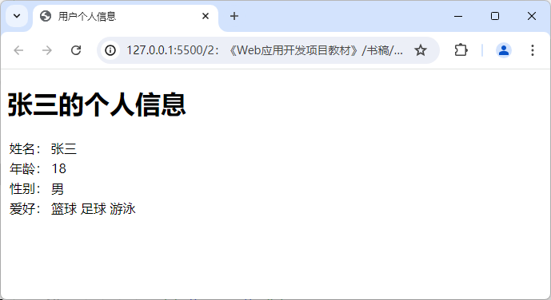

  **图5-1** 基于art-template的动态页面渲染

下面来具体讲解一下我们在上述示例中所做的操作。在基于art-template模板引擎执行动态页面渲的染任务时，首先需要做的是，在HTML文档中使用`<script type="text/html">`标记来定义一段HTML代码的模版，然后在其中用一套按既定规则编写的模板占位符来定义该模板最终要显示的页面元素。在art-template的模板编写规则中，模板占位符大致可分为“数据”和“指令”两大类。其中，数据类占位符的编写规则为：`{{ 数据标签 }}`，它的主要作用是将前端脚本所指定的数据直接输出在页面中。因此，我们在模板中使用的`数据标签`必须要与前端脚本中用于渲染模板的数据对象中的属性相对应，例如在上述示例中，模板中的占位符`{{ name }}`对应的是前端脚本中`data`对象的`name`属性。

如果我们在定义HTML模板的过程中，还希望进一步根据前端脚本提供的数据来动态生成对应的页面元素，就需要用指令类占位符来实现了。例如，当读者在HTML模板中需要基于某项数据来决定是否显示某个页面元素时，就要使用条件指令来对该数据的值进行判定，就像在上述示例中，我们就使用了`{{ if name }}`这个指令占位符，当`name`这项数据的值被判定为`null`时，这段模板代码就只会被渲染成一个带有“后端未能返回用户信息”字样的`<h1>`标记。在art-template的模板编写规则中，条件指令占位符主要有以下三种形式。

- **单分支条件指令**：用于只在某个条件满足时显示指定的HTML标记，具体编写规则如下。
  
  ```HTML
  {{ if [条件] }}
  <!-- 要显示的 HTML 标记 -->
  {{ /if }}
  ```

- **双分支条件指令**：用于根据某个条件在两组指定的HTML标记之间二选一，具体编写规则如下。
  
  ```HTML
  {{ if [条件] }}
  <!-- [条件]满足时要显示的 HTML 标记 -->
  {{ else }}
  <!-- [条件]不满足时要显示的 HTML 标记 -->
  {{ /if }}
  ```

- **多分支条件指令**：用于根据多个条件来选择要显示的HTML标记，具体编写规则如下。

  ```HTML
  {{ if [条件 1] }}
  <!--[条件 1]满足时要显示的 HTML 标记-->
  {{ else if [条件 2] }}
  <!--[条件 2]满足时要显示的 HTML 标记-->
  {{ else if [条件 3] }}
  <!--[条件 3]满足时要显示的 HTML 标记-->
  ....
  {{ else if [条件 n] }}
  <!--[条件 n]满足时要显示的 HTML 标记-->
  {{ /if }}
  ```

同样的，当读者在模板中需要通过迭代某项容器类对象来显示某些页面元素时，也可以使用迭代指令来实现。例如在上述示例中，`hobbies`数据是一个字符串类型的数组，所以我们需要通过迭代指令来显示其中的信息。在art-template模板引擎中，迭代指令的编写规则具体如下。

```HTML
{{ each [被迭代的数据] }}
    <[HTML标记]>{{ $index }} {{ $value }}</[HTML标记]>
{{ /each }}
```

在上述编写规则中，`[被遍历的数据]`应该是一个容器类型的数据对象，它应该是可被迭代的。`[HTML标签]`可以是任何一个可呈现内容的HTML标记。然后，`$index`是当前迭代项的索引值，通常是一个从0开始计数的正整数，而`$value`则是被迭代项的值。有时候，我们只需用到迭代项的索引值，有时候则只需用到它本身的值，这需要根据具体情况而定，但可以肯定的是，这两个值不必同时使用。另外，如果读者在使用条件或迭代指令的过程中还需对前端脚本所提供的数据进行更复杂的处理，art-template提供的指令占位符还容许我们设置模板变量，并执行简单的运算（甚至调用被引入的JavaScript函数），例如像下面这样。

```HTML
<script id="js_code" type="module">
    import "./node_modules/art-template/lib/template-web.js"
    const data = {
        name: "张三",
    };
    // 导出一个JavaScript函数
    template.defaults.imports.logout = console.log;
    const htmlcode = template('test', data);
    document.querySelector("#content").innerHTML = htmlcode;
</script>
<div id="content"></div>
<script id="test" type="text/html">
    <!-- 定义一个模板变量 -->
    {{ set isLogin = name!=null }}
    {{ if isLogin }}
        <h1>欢迎您，{{ name }}</h1>
    {{ else }}
        <h1>请先登录</h1>
    {{ /if }}
    <!-- 调用被导入的JavaScript函数 -->
    {{ $imports.logout("调用 console.log()方法") }}
</script>
```

总体而言，art-template的模版编写规则是相当简单的，虽然它也提供了一些用于设计HTML页面模板的，较为复杂一点的指令（例如与模板继承相关的指令），但基本上也只需要稍加学习就能上手，读者如果有兴趣的话可以查阅一下该模板引擎的官方文档，这里基于篇幅的局限，就不展开讨论了。

在完成了HTML页面的模板设计之后，接下来就可以在对应的前端脚本中对其进行该模板进行动态渲染了。该前端脚本的具体编写步骤如下。

- 首先，在确保已经成功下载到art-template的源码文件之后，使用ES6中的`import`关键字将该模板引擎以第三方扩展的方式加载到当前脚本文件中。
- 然后，我们需要调用art-templatem模板引擎提供的`template()`方法来将模版文件渲染成真正的页面。该方法可以接受两个参数。其中，第一个参数应该是一个字符串，接收的是模板标签所使用的id属性（例如上述示例中`id=‘demo’`的`<script>`标记），第二个参数应该是一个JSON格式的数据对象，用于渲染HTML页面中要填充的具体内容，因此该数据对象的每个属性名需要与模版中设置的变量占位符一一对应。
- 最后，我们就只需要用`document.querySelector(()`方法来获取到用于显示渲染结果的HTML标记，并调用其`innerHTML`属性来设置要显示的页面内容。

同样需要说明的是，我们在这里所介绍的这些只是art-template模板引擎在Web前端部分的基本使用方法，它足以应付本章项目的需要了。当然，除了这部分知识之外，该模板引擎同样也可以应用于Web后端部分，甚至可以搭配Express框架进行更为复杂的动态页面渲染。关于它的这些用法，读者可以自行去查阅该模板引擎的官方文档，这里基于篇幅方面的考虑就不再一一累述了。

### 知识点2：扫码认证功能的前端实现

在如今的Web应用开发中，在前端允许用户通过移动端设备扫描二维码的方式来完成某种需要安全认证的操作（例如用户登录，线上支付等），已经成为了一种非常流行且成熟的解决方案。该解决方案之所以被认为相对安全，主要是因为它是基于相对有公信力的认证平台发布的移动端软件来实现的。因此在开始实现扫码功能之前，读者需要先决定自己要基于哪一种第三方平台来实现它。由于在本章项目中，读者将被要求基于微信平台来模拟实现一个用于执行线上支付操作的Web UI，所以在正式开始项目之前，让我们先来介绍一下实现这类功能的基本步骤，具体如下。

- 首先，读者需要进入到微信公众平台所在的网站（如图5-2所示）中，然后使用自己的微信账号登录并申请创建一个微信小程序。当然，如果该小程序的开发仅用于教学演示或学习研究，出于节省时间和公共资源的考虑，我们在这里会建议读者向该平台申请一个可用于开发微信小程序的测试号即可。

  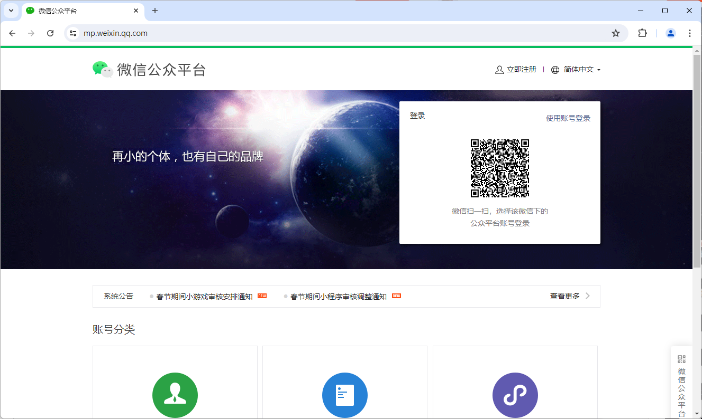

  **图5-2** 微信公众平台的官方网站

- 待微信公众平台通过上述申请之后，读者就可以进入到微信小程序的设置界面中，并获取到小程序的AppID和AppSecret了，如图5-3所示。
  
  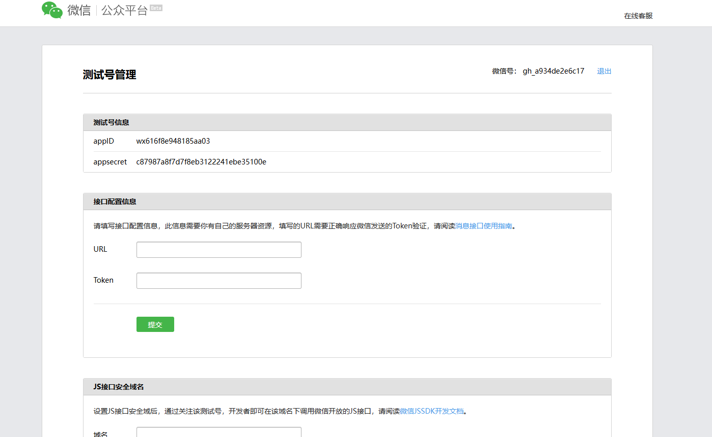

  **图5-3** 微信小程序的设置界面

- 现在，读者需要在上述界面中对这个小程序进行一些基本配置。其中最重要的配置主要有两项，首先是“接口配置信息”和“JS接口安全域名”。其中，前者配置的是我们在后端准备用于接收微信服务器返回信息的API（具体的值是该API所在的URL，以及用于访问该URL的Token）。后者配置的是我们前端脚本所在的域名，具体如图5-4所示。

  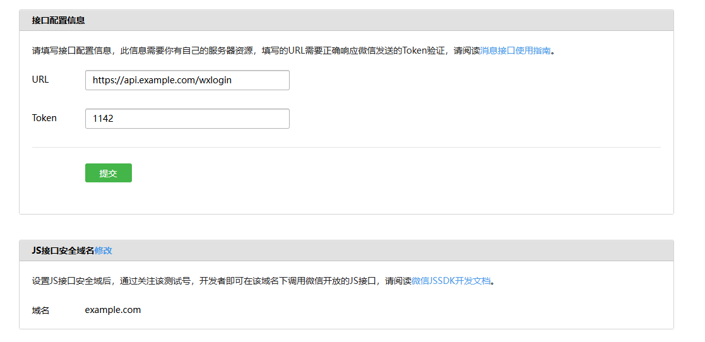

  **图5-4** 微信小程序的接口配置

  其次是"网页服务"这一项中的“网页授权获取用户基本信息”，这里配置的是用户扫码认证成功之后将访问的网页所在的域名（整理将其设置为`example.com`），如图5-5所示。

  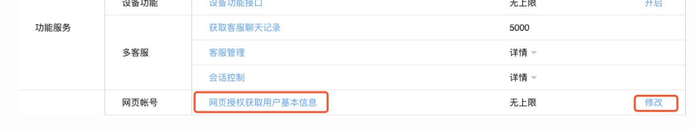

  **图5-5** 网页授权获取用户基本信息

- 在完成上述配置之后，读者就可以开始在自己的应用中实现扫码功能了。例如，我们可以在之前应用于创建示例项目的`Examples`目录下创建一个名为`04_wxappDemo`的目录，然后在该目录下创建一个名为`index.htm`的文件，并在其中输入如下代码。

    ```HTML
    <!DOCTYPE html>
    <html lang="zh_CN">
        <head>
            <meta charset="UTF-8">
            <script type="module" src="./script/showQRCode.js "></script>
            <title>实现扫码功能演示</title>
        </head>
        <body>
            <h1>实现扫码功能演示</h1>
            <button id="showQRCode">生成二维码</button>
            <div id="qrcodeContainer"></div>
        </body>
    </html>
    ```

- 接着，读者需要根据上述HTML文档中`<script>`标记指定的路径创建一个名为`showQCode.js`的前端脚本文件，并在其中输入如下代码。

    ```JavaScript
    import "https://res.wx.qq.com/connect/zh_CN/htmledition/js/wxLogin.js"

    window.addEventListener('load', function () {
        const btn = document.querySelector('#showQRCode');
        btn.addEventListener('click', getQRCode);
    });

    async function getQRCode() { 
        // 创建一个用于安全认证的二维码
        const obj = new WxLogin({
            id: "qrcodeContainer" ,  // 设置要加载二维码的容器
                                                // 这里指定的是id为qcodeContainer的div元素
            appid: "wx616f8e948185aa03",  // 设置微信小程序的AppID
                                                            // 这里使用的是微信公众平台的测试号
            scope: "snsapi_base,snsapi_userinfo",  // 设置授权范围
                        // 微信公众平台的测试号，设置为 snsapi_base 或者 snsapi_userinfo即可
                        // 如果是正式申请的小程序，需要设置为 snsapi_login
            state: "1203",  // 设置一个随机数，用于验证登录状态 
            redirect_uri: "https://example.com/wxMessage", 
                // 设置扫码认证成功之后要重定向的URL，
                // 这里使用的是一个示例地址，实际应用中需要替换为你的服务器地址
        });
        
        // 当扫码认证成功之后，向后端服务发送数据请求
        if(window.location.search.substring(6).split('&')[0]) {
            const url = 'http://example.com/data?code=' 
                           + window.location.search.substring(6).split('&')[0];
            try {
                const res = await fetch(url, { method: 'GET' });
                const data = await res.json();
                console.log(data);
            } catch (error) {
                console.error(error);
            }
        }
    }
    ```

- 在保存上述所有文件之后，读者就只需要用网页浏览器中打开由`index.htm`文件所定义的网页，并点击其中带有“生成二维码”字样的按钮即可看到我们在脚本中用`WxLogin`对象动态生成的二维码了，如图5-6所示。

  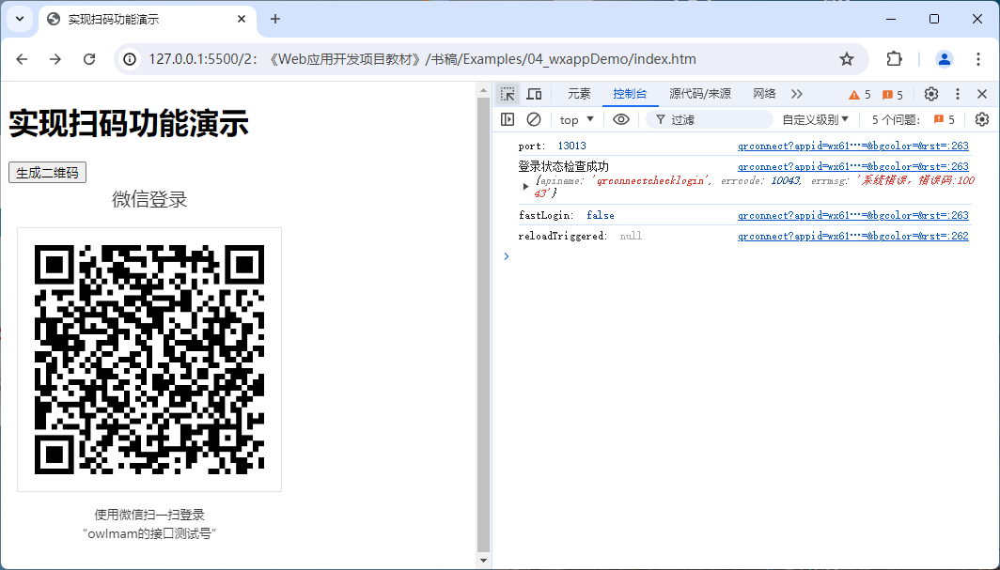

  **图5-6** 用于执行扫码认证的Web UI

当然，如果读者想让上述Web UI真正发挥它的功能，还需要在公共互联网中部署一个用于接收第三方认证信息的Web应用服务，并且其中要有一个后端API来处理微信服务器返回的认证信息，其整个工作流程如图5-7所示。

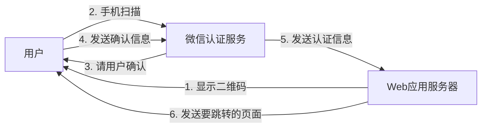

**图5-7** 微信扫码认证的工作流程

## 【工作实施和交付】

在完成了上述工作准备之后，读者现在就可以根据之前【任务书】中的要求来着手为凌雪冰熊网站实现用户线上购物功能的前端部分了，该项目的实施过程可以分为以下步骤来进行。

### 第1步：构建用于执行购物车功能的Web UI

在这一步骤中，软件工程师的主要任务是在用户个人信息页与产品展示页中创建进入购物车界面的链接，并利用之前介绍的art-template模板引擎来设计购物车界面的HTML页面模板。为此，读者需要执行以下操作。

### 第2步：构建用于执行线上支付功能的Web UI

在这一步骤中，软件工程师的主要任务是参照支付宝开放平台所提供的文档和示例，创建凌雪冰熊网站的线上支付界面。该界面要能对支付成功与否进行判断，并将相关的信息响应给用户。为此，读者需要执行以下操作。

### 第3步：构建用于执行用户订单管理的Web UI

在这一步骤中，软件工程师的主要任务是建立一个用于管理用户订单的界面，以便用户可以对已经完成的交易执行查阅或退款操作。为此，读者需要执行以下操作。

## 【拓展知识】

### 知识点1：Vue.js框架中的模板引擎

### 知识点2：申请并创建第三方支付服务

在本章项目中，我们在实现线上购物功能的过程中，是直接使用二维码支付的形式模拟了一个用于执行线上支付操作的界面。但在实际生产环境中，这项功能通常是基于支付宝或微信支付这样的第三方支付平台来实现的，它们往往需要开发者们先向这些平台申请使用许可，并在其中创建相应的线上应用，然后才能在自己的项目中以互联网服务的形式来使用这些应用所提供的API。幸运的是，中文互联网上主要使用的只有支付宝和微信这两大支付平台，它们在申请流程和使用方式是是大同小异的，读者只要掌握了其中一个支付平台的使用方法 ，另一个就只需要花点时间查看一下官方文档就能上手了。因此，我们接下来就以支付宝为例来介绍一下在这种第三方支付平台上申请并创建线上服务的基本流程。以便作为本章项目的补充。

- 首先，读者需要通过搜索引擎找到支付宝开放平台所在的网站（如图5-2所示），然后在该网站上注册一个开发者账号（可直接使用支付宝账号），并按照相关的教程完成该账号的实名认证。
  
  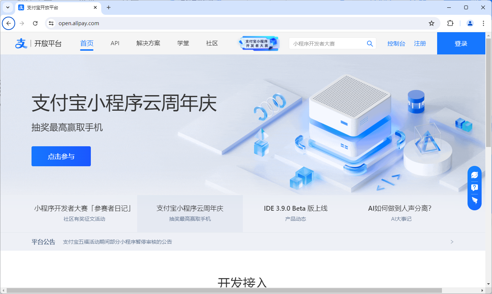

  **图5-2** 支付宝开放平台网站

- 在完成开发者账号的实名认证之后，读者需要在上述页面中单击右上角的“控制台”链接，打开该平台的控制台界面（如图5-3所示），并选择其中的“网页/移动端应用"选项卡，准备开始创建一个该类型的应用。

  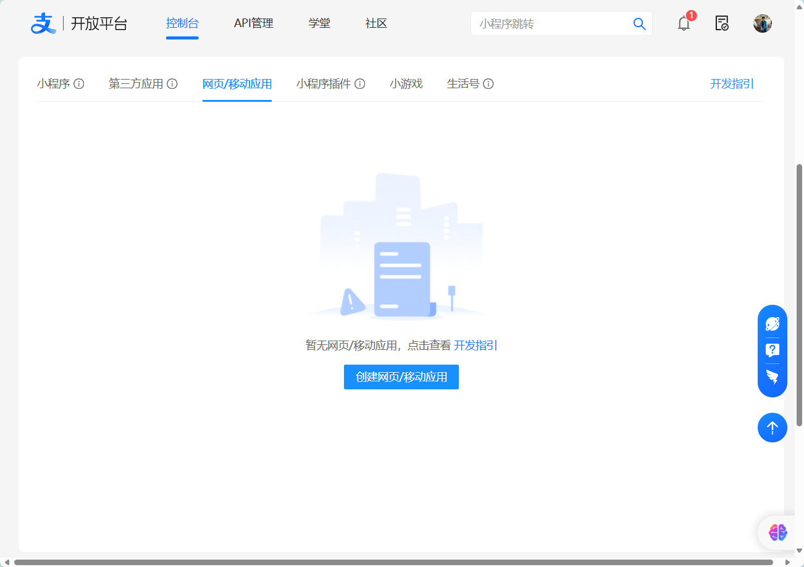

  **图5-3** 支付宝开放平台的控制台界面

- 在上述页面中单击“创建网页/移动端应用”按钮之后，读者就会看到一个用于创建应用的表单页面（如图5-4所示），在该页面中，开发者们需要填写一些当前应用的基本信息，例如应用的名称、Logo、关联的支付宝账号（最好是企业账号）等。在正确填写完这些信息之后，读者就可以通过单击“立即创建”按钮来完成应用的创建了。
  
  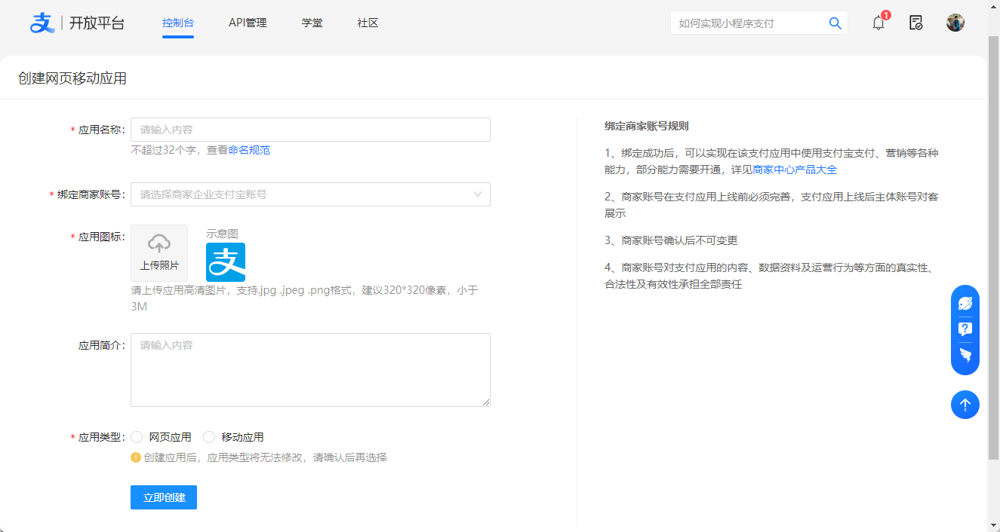

  **图5-4** 用于创建应用的表单页面

- 待应用成功创建之后，读者就会进入到该应用的配置页面（如图5-5所示），在该页面中，读者需要单击“开发设置”选项卡，并在其中对将要在Web应用的开发过程中要使用的APi进行配置。至于具体的配置内容，读者还需要根据该平台提供的官方文档。以及自己在Web应用开发过程中所使用的技术来决定，这里就不展开讨论了。
  
  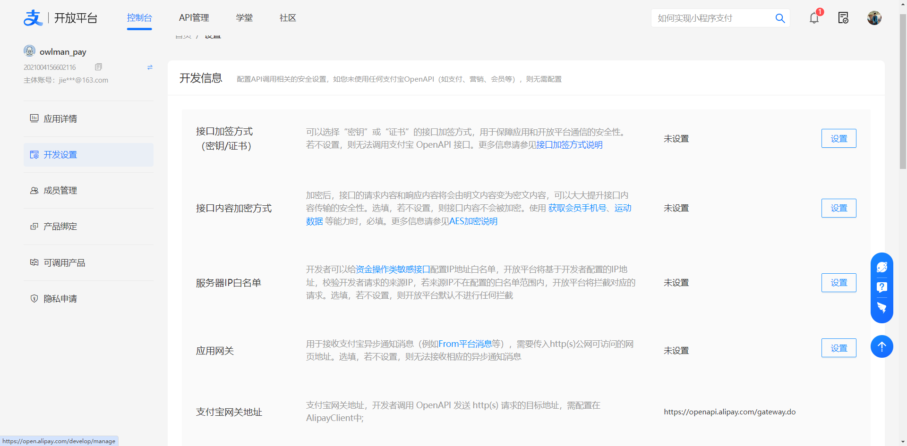

  **图5-5** 应用的配置页面

- 在完成了上述配置之后，读者需要回到该页面的“应用详情”选项卡，并单击其中的“提交审核”按钮来向支付宝官方申请使用应用的许可。一旦该申请被批准之后，读者就可以下载支付宝开放平台提供的SDK，并根据自己配置的API及其官方文档中的说明来在Web应用的后端实现中进行调用了，然后就可以在前端打开人们日常所熟悉的那个基于支付宝平台的线上支付界面了。至于支付宝SDk发具体使用方式， 开发者可以自行在Java、.Net、Python、NodeJS、PHP这几种后端实现技术中选择任意一种来学习，由于它们各自都涉及不小的代码量，出于篇幅方面的考虑，本教材就不在这里展开讨论了，读者可前往支付宝的文档中心，找到如图5-6所示的页面，然后查看它提供的SDK使用说明，并下载相关的示例Demo来自行学习。

  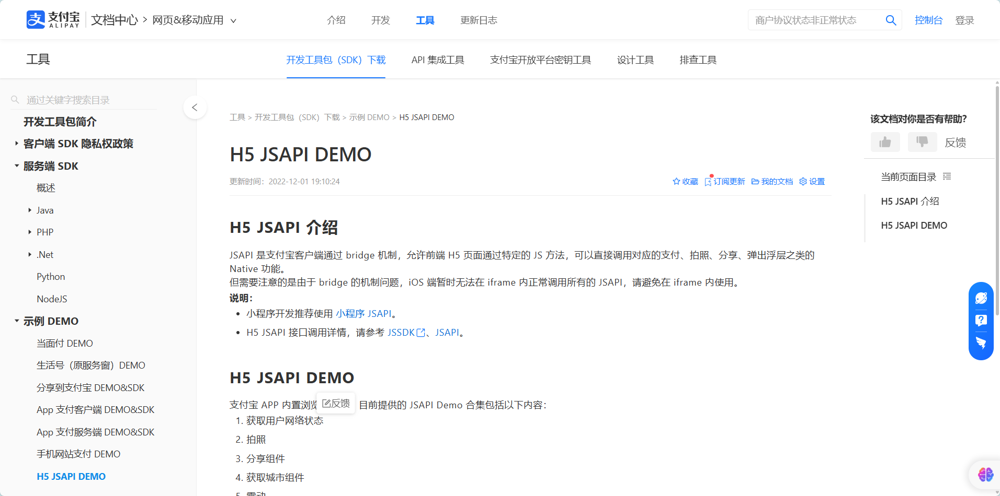
  
  **图5-6** 支付宝开放平台的文档中心

## 【作业】

## 【作业评价】
